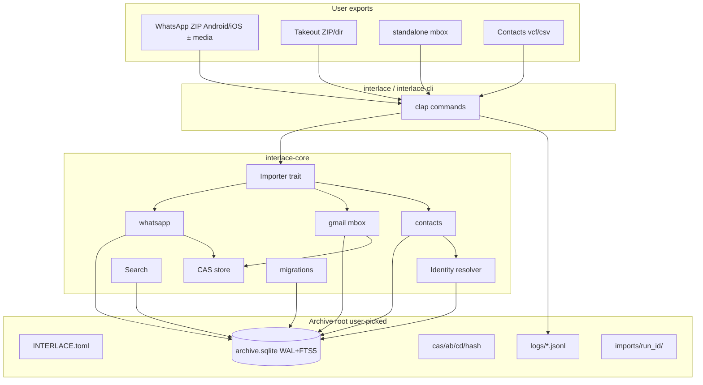
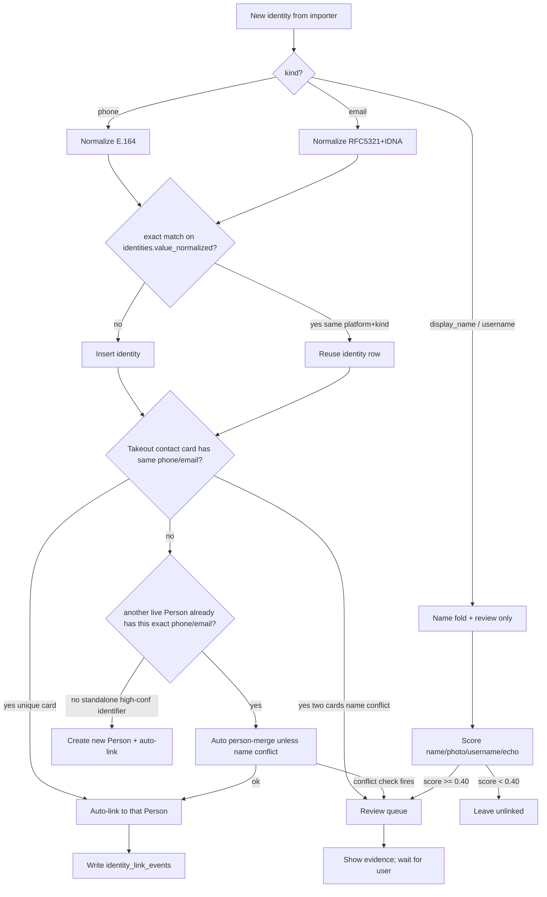

# Interlace Architecture Design

| Field | Value |
| --- | --- |
| Title | Interlace: local archive of your digital life |
| Author | Interlace design (draft) |
| Date | 2026-08-08 |
| Status | Draft |
| Audience | Senior engineers implementing the monorepo |
| License | MIT OR Apache-2.0 |
| Edition | Rust 2021 |
| Phase 1 OS | macOS only |

---

## Overview

Interlace is an offline, single-user, single-machine desktop archive. The user feeds official platform exports into one local store that survives account deletion, unifies the same human across channels on one timeline, and searches millions of messages in well under 200 ms.

Phase 1 sources (final):

- Google Takeout **Contacts** (identity bridge) + **Gmail mbox**
- WhatsApp **Android ZIP** and **iOS ZIP**, each **with media** and **without media**

This phase is design only. No application code, no commits, no crate publishes.

The product is not pretty single-platform rendering. Value is persistence, unification, and scale. Messages are never bound to a Person. The chain is always `Message → Identity (platform + identifier) → Person`. Matching is reversible; undoing a bad merge must not rewrite millions of message rows.

Real code will live in **one Cargo workspace**. The three already-published crates.io names stay the only published packages: `interlace`, `interlace-core`, `interlace-cli`. The three existing GitHub repos become **publish/name mirrors** (redirect READMEs + tagged source snapshots on release), not independent development trees. They are not archived on day one so crates.io `repository` links keep resolving; they may be archived after the first real publish updates those URLs to the monorepo.

Phase 1 ships a **usable macOS CLI** that can init an archive, import the v1 sources, auto-merge only high-confidence phone/email matches, park everything else in a review queue, and search. Tauri UI is Phase 2. That is a deliberate 2-week scope cut, not a product retreat.

---

## Background & Motivation

Platform lock-in is now a data-loss risk. Accounts get banned, companies shut down products, and exports rot as unzipped folders with incompatible date formats. No consumer product shows *all* communication with one human across WhatsApp + Gmail on one timeline. Desktop search tools that ingest mailboxes do not do identity resolution; chat viewers do not do mail; none of them are designed to be a 50 GB / 10 M message offline archive with reversible merges.

Current repo state (`/Users/mustafa/Desktop/interlace/`):

| Path | crates.io | GitHub | Reality |
| --- | --- | --- | --- |
| `interlace/interlace` | `interlace` 0.0.1 | https://github.com/nonamexishere/interlace | bin hello-world, edition 2021, MIT OR Apache-2.0 |
| `interlace/interlace-core` | `interlace-core` 0.0.1 | https://github.com/nonamexishere/interlace-core | lib `add()` scaffold |
| `interlace/interlace-cli` | `interlace-cli` 0.0.1 | https://github.com/nonamexishere/interlace-cli | bin hello-world |

Parent dir is **not** a git repo. Each child is its own git repo on `master`. Descriptions already say: "Local-first archive that unifies your conversations across platforms". These scaffolds exist only to hold names. Design the future workspace around them.

Pain points this design must absorb:

- WhatsApp `_chat.txt` / `chat.txt` is locale-sensitive (brackets vs dashes, `M/D/YY` vs `DD.MM.YYYY`, translated `<Media omitted>`).
- Gmail Takeout is mboxrd, split across multi-GB zip parts, with `X-GM-THRID` / `X-Gmail-Labels`.
- FTS5 `unicode61` mishandles Turkish `I/ı/İ/i`.
- "No network libraries in the dependency tree" collides with Tauri's `http` / optional `reqwest` crates.
- Wrong identity merge is the worst product bug.

---

## Goals & Non-Goals

### Goals

1. Local archive on one machine, one user, zero servers, zero accounts, zero sync.
2. Import WhatsApp Android/iOS ZIP (± media) and Takeout Contacts + Gmail mbox.
3. Streaming, resumable, idempotent import (same file twice → no dupes).
4. Scale envelope: up to 50 GB export input, up to 10 million messages, search p95 < 200 ms for typical queries returning ≤ 50 hits.
5. Identity layer with exact auto-merge rule; ambiguous cases go to a review queue; undo does not touch message rows.
6. Content-addressed attachment store on disk; SQLite + FTS5 for metadata and search.
7. The running app does not initiate network I/O. CI enforces a *crate-level* network ban with a documented, tight allowlist where Tauri makes a literal zero-HTTP tree impossible.
8. Agent pipeline that executes this design via files + deterministic gates, not LLM-on-LLM approval.
9. Phase 1 is a complete usable product in ≤ 2 weeks for one focused engineer, macOS only.

### Non-Goals (v1 / Phase 1)

- Windows / Linux support.
- Chat/Hangouts/Voice/Keep/Photos, iMessage, Telegram, Signal, Discord, Instagram, SMS.
- Pretty per-platform bubble UI fidelity (reactions as first-class UI, WhatsApp quotes rendering, HTML mail layout engine).
- Multi-user, sync, cloud backup, accounts.
- Automatic merge on name, photo, username, or behavioral hints.
- Bit-perfect raw rfc822 preservation of the entire mailbox in CAS (Phase 1 extracts text + attachments; raw preserve is an explicit later flag).
- Going to the network for geocoding, gravatar, link unfurling, auto-update, crash telemetry.
- Publishing a fourth crates.io name.
- Using real user exports in tests.

---

## Challenges to stated constraints

These constraints are accepted and designed within. Where they are wrong as *literally* stated, the enforceable version is named.

### 1. "No network libraries in the dependency tree"

**Challenge:** This is stricter than "app does not call home" and is **not literally achievable** for a Tauri binary.

Evidence from Tauri 2.11.5 `Cargo.toml.orig`:

- Hard deps include `http = "1"` (types only, no client) and `url = "2"`.
- `reqwest` is a **mobile-only** dependency (`cfg(android)` / non-macos Apple). macOS desktop Tauri does **not** pull `reqwest` unless updater/http plugin/`native-tls` features are enabled.
- `package.metadata.cargo-udeps.ignore.normal = ["reqwest"]` confirms reqwest is a latent feature, not a macOS necessity.
- wry/webkit will still let the *webview* request `https://` unless CSP + entitlements forbid it.

**Enforceable version (this design):**

| Layer | Rule |
| --- | --- |
| `interlace-core`, `interlace-cli`, `interlace` (CLI bin) | Literal ban: no `reqwest`, `hyper`, `ureq`, `attohttpc`, `minreq`, `curl`, `tungstenite`, and **no `tokio` crate at all** (Phase 1 is sync). Gate: `cargo deny check bans`. |
| `interlace-tauri` (unpublished) | Allowlist only: `http` (types), `url` (parser), `tokio` **without** the `net` feature if the Tauri stack requires it. Deny `reqwest`, `hyper`, tauri updater plugin, `tauri-plugin-http`. |
| Runtime | No sockets. macOS entitlements omit `com.apple.security.network.client`. WebView CSP `default-src 'self'; img-src 'self' asset: data:;`. |
| CI / build | `cargo deny` advisory fetch and `libsqlite3-sys` amalgamation download are **build-host** network, not app network. Allowed on the builder; irrelevant to the promise. |

**Decided marketing (OQ6):** use the **enforceable** sentence, including before any GUI:

> Interlace never phones home and contains no HTTP **client** capable of doing so. CI denies `reqwest` / `hyper` / updater plugins. A Tauri build may contain the `http` and `url` **type** crates; that is not a network client.

**False**, do not print: *"The dependency tree contains zero HTTP-related crates."*

`cargo-vet` is a second layer (supply-chain attestations), not the ban mechanism. Phase 1 uses **cargo-deny**. cargo-vet is optional Phase 3.

### 2. FTS5 unicode61 is weak for Turkish

Accepted as a first-class risk. unicode61 case-folds with Unicode 6.1 default mappings: ASCII `I → i`, not Turkish `I → ı`. Searching `ıslak` will miss `ISLAK`. Diacritic stripping (`remove_diacritics 2`) helps `İstanbul ≈ istanbul` for dotted İ but does **not** fix dotless I.

Phase 1 does **not** ship a custom C FTS5 tokenizer (FFI risk vs 2-week cap). Phase 1 ships unicode61 + app-side Turkish fold stored in a parallel `search_text` column + query expansion. Spike 1 validates recall. Phase 2 custom tokenizer if spike fails.

### 3. WhatsApp / Takeout locale sensitivity

Accepted. Synthetic generators **must** encode locale packs (en-US, en-GB, tr-TR, de-DE, pt-BR at minimum) with translated media-omitted markers and date shapes. A parser that only handles `[YYYY-MM-DD, HH:MM:SS]` is a bug, not an MVP cut.

### 4. Three published crate names constrain the split

Accepted. All library logic goes in `interlace-core` as modules (not a fourth published crate). Unpublished workspace crates (`interlace-tauri`, `interlace-fixtures`) are allowed.

### 5. Implicit pressure to ship Tauri in Phase 1

**Challenge:** A usable importer + identity + FTS + Tauri shell in ≤ 2 weeks is not honest. A hollow window that cannot import is not a product. Phase 1 is **CLI-first**. Tauri is Phase 2 and is still macOS only.

### 6. WhatsApp native export is truncated

Users observe ~40k recent messages on text-only export, less with media. We cannot fix WhatsApp. Product must surface the earliest timestamp and warn if the chat likely hit a ceiling. Not in scope: decrypting `msgstore.db.crypt14`.

---

## Key Decisions

| # | Decision | Choice | Rejected | Why | When rejected would win |
| --- | --- | --- | --- | --- | --- |
| D1 | Monorepo vs 3 repos | One Cargo workspace; GitHub `nonamexishere/interlace` becomes the monorepo | Keep 3 independent repos; or archive all 3 immediately | Agents and migrations cannot span 3 remotes; crates.io names still publish from workspace via `-p` | Independent repos would win only if crates had separate release cadences and separate teams (they do not) |
| D2 | Mirror vs archive existing remotes | **Publish/name mirrors**: redirect README now; keep remotes un-archived until first real publish updates `repository` URLs; then archive `interlace-core` + `interlace-cli` GitHub repos | Live code mirrors via subtree split | Subtree splits rot and agents will desync them; 0.0.1 repository URLs must not 404 | Subtree mirrors win if crates.io review/policy required per-crate source repos (not currently) |
| D3 | Published crate roles | `interlace-core` = all lib logic; `interlace` = primary CLI bin (`cargo install interlace`); `interlace-cli` = identical alias bin so the squat is not abandoned | `interlace` = Tauri app crate | `cargo install interlace` installing a GUI is hostile; shortest name should be the command users type in Phase 1 | Making `interlace` the Tauri package wins after a `.dmg` is the primary install path **and** CLI is renamed (do not do this in Phase 1) |
| D4 | Phase 1 UI | CLI-first (`interlace` / `interlace-cli`) | Tauri-first | 2-week cap; identity+import+search are the product | Tauri-first wins if the only acceptance demo is a screenshot of a timeline (it is not) |
| D5 | Archive root | **User-picked directory** with `INTERLACE.toml` marker. Default suggestion `~/Interlace`. `interlace init --path` required the first time; remembered in `~/Library/Application Support/Interlace/last-archive-path` (pointer only, not the data) | Always use Application Support; or hide the DB next to the app bundle | Persistence is a core value; App Support is easy to lose to iCloud Desktop confusion, Time Machine exclusions, and "delete app = delete data" folklore. User-owned folder can live on an external volume | App Support wins for users who never want to see files (add as `--portable=false` later, not default) |
| D6 | Gmail vs conversation model | A Gmail **thread** (`X-GM-THRID`, else `References`/`In-Reply-To` chain, else Message-ID) = one `conversations` row of `kind=email_thread`. Person timeline is a **query** across conversations via Identity→Person | Flatten all mail into one Inbox conversation; or treat each email as its own conversation | Inbox flattening destroys thread meaning; per-message conversations explode the sidebar and break "talk with X" | Per-message conversations win only for mailing-list forensic dumps (not v1) |
| D7 | Publish workflow | Tags `interlace-core-vX.Y.Z` / `interlace-cli-vX.Y.Z` / `interlace-vX.Y.Z`; CI `cargo publish -p …` from monorepo; mirror repos get a README bump commit only | git subtree split on each publish | Simplest thing that cannot desync source of truth | Subtree wins if a downstream packager cannot consume a workspace |
| D8 | Network enforcement | **Phase 1:** cargo-deny bans `reqwest`/`hyper`/**`tokio` crate entirely** on core+cli. **Phase 2 Tauri:** documented allowlist may add `tokio` without `net`; still deny `reqwest`/`hyper`/updater/http plugin. macOS sandbox omits network client entitlement. | Trust "we just won't call reqwest"; allow tokio-minus-net in Phase 1; refuse Tauri entirely | Sync CLI has no reason to pull tokio; §1 and deny.toml must say the same thing | tokio-minus-net in Phase 1 would win only if a sync crate forced it (Spike 3 fail-closed — replace that crate) |
| D9 | Search engine | SQLite FTS5 external-content table; unicode61 `remove_diacritics 2`; app-side Turkish fold + query expansion; prefix=`2 3` | Tantivy in-process; custom FTS5 tokenizer on day 1; trigram-only | Constraint is SQLite+FTS5; Tantivy doubles disk and still needs sync; custom tokenizer is C FFI | Tantivy wins if Spike 1 shows 200 ms is impossible at 10 M with FTS5 **or** Turkish recall is unacceptable and FFI tokenizer slips |
| D10 | Raw rfc822 in CAS | Phase 1: **no**. Store decoded text + attachments. Takeout zip remains the bit-perfect backup. `import gmail --preserve-raw` is a Phase 2 flag | Always store raw messages in CAS | 200k–500k mail × ~30 KB raw ≈ 6–15 GB extra, plus decoded attachments (near-double). Persistence of *meaning* is v1 | `--preserve-raw` wins when the user will delete Takeout after import (document this risk in CLI) |
| D11 | Attachment hashing | BLAKE3-256, hex, `cas/ab/cd/<64hex>` | SHA-256; store blobs in SQLite | BLAKE3 is faster on large media; DB must not hold 50 GB | SHA-256 wins if an external auditor demands a FIPS algorithm |
| D12 | Migration runner | Numbered SQL files + tiny runner in `interlace-core` (`migrations/0001_init.sql`) | sqlx offline macros; Diesel | sqlx needs a live DB at compile time; Diesel is heavier than the schema | sqlx wins when we want compile-time checked queries (Phase 3, after schema stabilizes) |
| D13 | Phone/email crates | Write small normalizers in-core; `phonenumber` crate **only if** `cargo tree` shows zero network crates (Spike 3). vCard: hand-rolled Takeout subset parser, not a full ical stack | Pull `icalendar` + `reqwest`-adjacent mail stacks | Smaller deny surface | Full ical crate wins when we add Calendar in a later source wave |
| D14 | Photo-hash signal | Nullable `photo_dhash` column exists; **do not** depend on `image` crate or compute dHash in Phase 1 (signal almost never fires: WA ZIP has no avatars; Gmail has none) | Pretend it is a v1 matcher; ship `image` in Phase 1 | Honest about source reality + deny/compile cost | Phase 4 when a source has profile photos on both sides |
| D15 | Import order / person auto-merge | Import order is **not** constrained. After every import run, resolver auto-**merges persons** when two live persons share an exact phone or email (confidence 0.99) unless the two-card name conflict check fires. Contacts-first is faster to a clean graph but not required. | Refuse WA/Gmail until Contacts imported; or send all cross-person identifier collisions to review | Contacts-as-bridge must work WA-first and Contacts-first; review-on-collision silently breaks unification | Review-on-collision wins if the user treats distinct vCards as sacred even when phones collide (wrong merge is worse than missed merge — but exact phone/email *is* the high-confidence rule we already accepted) |
| D16 | WhatsApp sender identity keying | DM counterpart = `kind=phone` iff chat title **or** sender token parses as E.164 with the archive’s required `default_phone_region`; else `kind=display_name`. Group senders = `display_name` unless the token itself is a number. **Never invent `whatsapp_jid` from ZIP** (`whatsapp_jid` is reserved, unused in v1 CHECK kept for wave-2). Name-only WA is review-queue-first by design. | Invent fake JIDs; parse all titles as phones; auto-merge on folded display name | ZIP has names, not JIDs; auto-merge stays phone/email only | Fake JIDs would win if we later ingest `msgstore.db` (out of scope) |
| D17 | FTS during import | **Do not DROP triggers.** Import writes `messages` (and attachments) **without** writing `search_doc` per row. After messages commit: one bulk `INSERT INTO search_doc SELECT … FROM messages WHERE import_run_id=?` then `INSERT INTO messages_fts(messages_fts) VALUES('rebuild')`. Triggers stay installed for interactive delete/update. `open_archive` / `migrate` / `doctor --rebuild-fts` run `CREATE TRIGGER IF NOT EXISTS` for ai/ad/au. Never `PRAGMA synchronous=OFF`. No `--fast-import`. | DROP TRIGGER around import; per-row FTS during 10 M import; sync=OFF | DROP is DB-global and not crash-safe (kill -9 after DROP desyncs every future open). Bulk insert+rebuild keeps the 10 M perf win | Per-row triggers win for tiny archives (<50k) where rebuild latency is more annoying than import time |
| D18 | Person timeline vs groups | Default timeline = messages where person is **sender** OR conversation is `dm`/`email_thread` and person is a participant. Groups included only with `--include-groups`. **Same predicate for FTS `--person`** (`SearchQuery.include_groups`; pick **(b)** not sender-only). Group detection: (a) ≥2 non-self senders OR (b) any group system template OR (c) locale title prefix indicates group; else DM. **C (#33):** if (a) alone would fire, exactly 2 human senders, one folded-equals `archive_meta.owner_display_name` or a self identity display_name (exact `name_fold_join`, no fuzzy), title/ZIP stem matches `title_prefixes_dm` (including iOS `WhatsApp Chat - `), and (b)(c) are false → `dm`; that sender is self (`role=me`, `self_identities` + `is_self` person via `self_declared`/`system`). Peer names still never auto-merge (D16). | ≥3 non-self senders; always include group traffic; FTS sender-only (a); treat every owner-name hit as self without the DM-title guard | Off-by-one classified me+2 as DM; dumping whole groups is not “talk with X”; FTS sender-only would miss “mail with X”; iOS 1:1 exports omit `you_tokens` and would hide from default timeline | Always-include-groups wins for forensic mode; sender-only FTS wins if join p95 blows the 200 ms budget (Spike 1 / nightly — then fall back to (a) and document); B (no title guard) wins if 2-person groups without system lines are rarer than false groups |
| D19 | Archive lock | Exclusive `flock` on `$ARCHIVE/INTERLACE.lock` for writers (`import`, `person merge/unlink/undo`, `review accept`, `doctor --gc-cas/--rebuild-fts`). Shared lock for `search`/`status`/`person list|show`/`review list|show`. Second writer exits 1 with pid. | Single-process assumption; rely on `busy_timeout` | Two imports or import+gc will corrupt checkpoints/CAS tmp | Single-process wins only if we later wrap everything in a daemon (Phase 2 Tauri can hold the lock for the session) |
| D20 | Default phone region | **Required at `interlace init`; no implicit default.** Stored in `settings.default_phone_region`. National-format numbers cannot auto-merge until it is set. | Silent default `TR` or `US` | Defaulting a country invents product geography; contradicts OQ1 | Default `TR` wins if the owner confirms this is a TR-first personal tool and never wants the prompt |
| D21 | Phase 1 must-pass scope | Happy-path CLI in ≤ 2 weeks: must-pass matrix **CAS1–CAS3, W1–W4, M1–M3, C1, I1–I6, I6b, S1–S3** + doctor smoke. Locale/corrupt/resume polish (W5–W9, M4–M6, C2–C3, S4) is **Phase 1.1**, same CLI, not a new product. PR CI uses 10k search proxy; 1 M / 10 M benches are **nightly**, not PR. | All W1–S4 + 1 M in PR CI as Phase 1 | 13 PRs × full matrix + 1 M index in PR is not one engineer × 10 days | Full matrix in Phase 1 wins if calendar expands to ~4 weeks |
| D22 | Zip streaming vs spill | WA `_chat.txt`: stream/decompress that entry from start; resume by `line_no` (not DEFLATE seek). Takeout **mbox-in-zip**: spill entry to `$ARCHIVE/imports/<run>/` then seek file offset. Standalone mbox: seek in place. Never claim seek-inside-DEFLATE. Extract-whole-zip to tmp rejected (50 GB, zip-slip surface). | True random-access inside deflate; always extract entire Takeout zip | DEFLATE is not seekable; 50 GB extract is hostile | Full extract wins on huge mbox-in-zip if disk is plentiful and we want simpler code (optional `--spill-all` later) |
| D23 | Zip-bomb vs mbox size caps | **Split caps.** Binary media / decoded MIME attachment parts ≤ **512 MiB** each (or remaining `--max-bytes`). **mbox / `_chat.txt` / csv / vcf** uncompressed entries ≤ **`--max-bytes` (default 60 GiB)**. Zip-bomb defense is per *binary media* entry, not per mailbox file. Total CAS+spill write per import ≤ `--max-bytes`. Entry count cap 2 M still applies. | One 512 MiB cap for every zip entry | A multi-GB Gmail mbox-in-zip is the primary Takeout path; 512 MiB would fatal it before `--max-bytes` | Uniform 512 MiB wins only if we require users to split mbox themselves (hostile; reject) |
| D24 | Docs are part of the product | Every implementation PR updates the matching `docs/user/*` or `docs/hacking/*` page in the same PR. README/CONTRIBUTING/SECURITY land in PR0–PR1. ADRs land with the decision they record (PR0 copies D1–D25 as `docs/design/adr/D01-….md`). Missing docs = same red as missing tests. | Docs-later / wiki-only | First-time OSS contributors have zero chat context; “well documented” = complete tree, not a pretty README | A separate docs repo would win if the product grew a website team (it has not) |
| D25 | Gmail local-part equivalence | For identities whose domain (IDNA ASCII lowercase) is `gmail.com` or `googlemail.com`: strip `+tag`, remove `.` from the local part, map `googlemail.com` → `gmail.com`, then auto-merge on that canonical value. Non-Gmail domains: exact local part after NFKC + Unicode lowercase; no `+`/`dot` folding. | Exact string only; or `+tag` xor dots | Gmail’s own mailbox identity; missed merges are common; collision with two humans sharing one Gmail is the same person | Exact-only wins for forensic “what was literally in the header”; `+tag` as a *different person* is almost always wrong on Gmail |

---

## Proposed Design

### High-level architecture



### Archive layout

```
$ARCHIVE_ROOT/                      # user-picked, e.g. ~/Interlace or /Volumes/SSD/Interlace
  INTERLACE.toml                    # marker + archive_id UUID + schema_version
  INTERLACE.lock                    # flock target (empty file created at init)
  archive.sqlite
  archive.sqlite-wal
  archive.sqlite-shm
  cas/
    ab/cd/<64 hex blake3>
  logs/
    interlace.jsonl                 # structured app log
  imports/
    <run_id>/
      warnings.jsonl
      rejected.jsonl
      progress.json                 # checkpoint mirror for crash forensics
      spill/                        # mbox spilled out of zip (wiped on success)
  tmp/                              # wiped on successful open
  exports/                          # Phase 2
```

`INTERLACE.toml`:

```toml
format = 1
archive_id = "9f3c0a1e-...."
created_at = "2026-08-08T12:00:00Z"
app_min_version = "0.0.1"
```

Open algorithm: if `--path` given, use it; else read last-path pointer; else error "run interlace init". Refuse to open a dir lacking `INTERLACE.toml`. Never create a DB in Application Support as the archive itself.

`init` creates the directory with mode `0700` and files `0600`. `open` warns (does not refuse) if the root mode is wider than `0700`. The archive folder **is** the backup unit — `init` prints: “Back up this entire directory; there is no separate `interlace backup` command in Phase 1.”

**Locking (D19):** before any DB open, acquire `flock(2)` on `INTERLACE.lock`. Writers (`import`, `person merge|unlink|undo`, `review accept|reject`, `doctor --gc-cas|--rebuild-fts|--integrity` that writes) take `LOCK_EX`. Readers (`search`, `status`, `person list|show`, `review list|show`, `log`) take `LOCK_SH`. If `LOCK_EX` would block, exit 1: `archive in use by pid <n> (<cmd>)`. Pid + cmd stored as a single line in the lock file after acquire (best-effort; flock is authoritative). Drop lock on process exit. `busy_timeout` remains as a WAL courtesy, not a substitute.

Pointer file (not the archive): `~/Library/Application Support/Interlace/config.toml`

```toml
last_archive_path = "/Users/mustafa/Interlace"
```

### Import sequence

```mermaid
sequenceDiagram
  participant U as User
  participant CLI as interlace CLI
  participant IMP as SourceImporter
  participant DB as SQLite
  participant CAS as CAS
  participant ID as IdentityResolver

  U->>CLI: import whatsapp chat.zip
  CLI->>CLI: flock EX INTERLACE.lock
  CLI->>IMP: probe(path)
  IMP-->>CLI: ProbeResult {kind, locale_guess, bytes}
  CLI->>DB: BEGIN; insert import_runs status=running heartbeat_at=now
  Note over CLI,DB: triggers stay installed; no search_doc writes in this loop
  loop streaming batches of 1000
    IMP->>CAS: put(bytes) -> hash (media/mime parts)
    IMP->>DB: persist_message (INSERT OR update attachments on dupe)
    IMP->>DB: upsert identities, conversation
    IMP->>DB: checkpoint + heartbeat_at
    IMP->>DB: COMMIT; BEGIN next batch
  end
  CLI->>ID: resolve_run(run_id)
  ID->>DB: auto-link + auto person-merge phone/email; enqueue review
  CLI->>DB: bulk INSERT search_doc for this run; FTS VALUES('rebuild')
  CLI->>DB: import_runs.status=done
  CLI-->>U: stats + review_queue_count
```

Probe runs **before** inserting `import_runs`. Probe/open failure: no run row (or if a row was created, mark `failed` immediately). Never leave a stray `running` row after a failed probe.

### Runtime pragmas (applied on every open)

```sql
PRAGMA foreign_keys = ON;
PRAGMA journal_mode = WAL;
PRAGMA synchronous = NORMAL;     -- never OFF (can corrupt the DB file on power loss)
PRAGMA temp_store = MEMORY;
PRAGMA cache_size = -200000;     -- 200 MiB
PRAGMA mmap_size = 1073741824;   -- 1 GiB
PRAGMA busy_timeout = 5000;
PRAGMA wal_autocheckpoint = 1000;
```

There is **no** `--fast-import`. Import uses `NORMAL` + batch commits of 1000 messages / 8 MiB CAS. Larger batches are not a pragma change.

---

## Data Model Changes

### Rationale (table by table)

Platform models disagree (reactions, edits, deletions, groups, threads, multi-attach). Normalization rule: **message row is the atomic deliverable unit**; everything platform-specific is a child table or a typed JSON `payload` that new sources may extend without `ALTER` on `messages`.

| Table | Why it exists | Why not folded into another table |
| --- | --- | --- |
| `schema_migrations` | Day-1 evolution | Ad-hoc user_version alone is not enough for multi-file SQL |
| `archive_meta` | Single-row archive identity, owner self-hints | Not settings (settings are user prefs) |
| `settings` | Key/value prefs | Avoids ALTER for every new flag |
| `sources` | One row per imported file/dir | A Takeout zip and a later incremental mbox are different sources |
| `import_runs` | Resumability + stats | Re-importing the same source is a new run against the same `sources` row |
| `import_checkpoints` | Byte/entry cursor | JSON blob on run is harder to query; separate rows allow multi-cursor (zip entry + mbox offset) |
| `import_warnings` | Partial corrupt / unknown rows | Must not abort the import; must be inspectable |
| `identities` | Platform+kind+normalized value | The only thing messages point at |
| `persons` | User-facing merge layer | Never referenced by `messages.sender_*` |
| `person_identities` | Reversible link | Undo = delete/move these rows |
| `identity_link_events` | Audit + undo log | Required so undo is exact |
| `merge_review_queue` | Ambiguous candidates | Automation is assistant, not decider |
| `merge_evidence` | Why we suggested a link | UI/CLI must show evidence |
| `contacts_raw` / `contact_channels` | Takeout bridge preserved | Need original card even after person edits |
| `conversations` | Channel-native container | Person timeline is a query, not a conversation |
| `conversation_participants` | DM/group/email members | Sender on a message is not the full membership set |
| `messages` | Atomic unit | See column rationale below |
| `message_recipients` | To/Cc/Bcc | Email has N recipients; WhatsApp DMs do not need this but schema must not break |
| `message_revisions` | Edits (future sources) | WhatsApp/Gmail exports usually lack history; table exists so adding Signal/iMessage does not break |
| `message_reactions` | Reactions (future) | Same |
| `attachments` | Link message ↔ CAS | Multi-attach, inline MIME CID |
| `cas_blobs` | Dedup index for GC | Filesystem is source of bytes; this table knows refcount |
| `labels` / `message_labels` | Gmail labels | WhatsApp has none; adding a source with tags reuses this |
| `search_doc` | Normalized text FTS indexes | Original body stays pristine for display |
| `messages_fts` | FTS5 virtual table | External content = `search_doc` |
| `self_identities` | Archive owner's phones/emails | Distinguishes "me" vs counterpart on DM timelines |

**Why messages do not have `person_id`:** fixing a bad merge would otherwise UPDATE millions of rows and poison backups/FTS. Person membership is always a join.

### Full SQL DDL (migration `0001_init.sql`)

```sql
-- Interlace schema v1
-- Apply via interlace_core::db::migrate. Never edit once shipped; add 0002_*.sql.

CREATE TABLE schema_migrations (
    version     INTEGER PRIMARY KEY,
    name        TEXT    NOT NULL,
    applied_at  TEXT    NOT NULL DEFAULT (strftime('%Y-%m-%dT%H:%M:%fZ','now'))
);

CREATE TABLE archive_meta (
    id                  INTEGER PRIMARY KEY CHECK (id = 1),
    archive_id          TEXT    NOT NULL,          -- UUID from INTERLACE.toml
    created_at          TEXT    NOT NULL,
    schema_epoch        INTEGER NOT NULL DEFAULT 1,
    owner_display_name  TEXT,                      -- optional, user-provided
    notes               TEXT
);

CREATE TABLE settings (
    key   TEXT PRIMARY KEY,
    value TEXT NOT NULL
);

CREATE TABLE sources (
    id              INTEGER PRIMARY KEY,
    kind            TEXT    NOT NULL
        CHECK (kind IN (
            'whatsapp_android_zip',
            'whatsapp_ios_zip',
            'takeout_zip',
            'takeout_dir',
            'gmail_mbox',
            'contacts_vcf',
            'contacts_csv'
        )),
    label           TEXT    NOT NULL,             -- user-visible, default = filename
    origin_path     TEXT    NOT NULL,             -- path as given at import time (may vanish)
    bytes           INTEGER,
    file_blake3     TEXT,                         -- hash of the import root file if regular file
    status          TEXT    NOT NULL DEFAULT 'active'
        CHECK (status IN ('active','retired')),
    created_at      TEXT    NOT NULL DEFAULT (strftime('%Y-%m-%dT%H:%M:%fZ','now'))
);

-- Source upsert key (application-enforced; SQLite UNIQUE cannot express
-- "blake3 OR path"):
--   if regular file: (kind, file_blake3)
--   else (dir / vanished file): (kind, canonical origin_path)
-- Re-import of the same bytes reuses the sources row; a new import_runs row is created.

CREATE TABLE import_runs (
    id              INTEGER PRIMARY KEY,
    source_id       INTEGER NOT NULL REFERENCES sources(id),
    started_at      TEXT    NOT NULL DEFAULT (strftime('%Y-%m-%dT%H:%M:%fZ','now')),
    finished_at     TEXT,
    heartbeat_at    TEXT    NOT NULL DEFAULT (strftime('%Y-%m-%dT%H:%M:%fZ','now')),
    status          TEXT    NOT NULL DEFAULT 'running'
        CHECK (status IN ('running','done','failed','interrupted')),
    stats_json      TEXT,                         -- counts: inserted, skipped_dup, warnings, rejected
    error           TEXT
);

CREATE TABLE import_checkpoints (
    import_run_id   INTEGER NOT NULL REFERENCES import_runs(id) ON DELETE CASCADE,
    cursor_kind     TEXT    NOT NULL,             -- 'wa_line' | 'mbox_file_offset' | 'zip_done_entries' | 'vcf_index' | 'spill_path'
    cursor_value    TEXT    NOT NULL,             -- JSON; see Checkpoint section (no seek-inside-DEFLATE)
    updated_at      TEXT    NOT NULL DEFAULT (strftime('%Y-%m-%dT%H:%M:%fZ','now')),
    PRIMARY KEY (import_run_id, cursor_kind)
);

CREATE TABLE import_warnings (
    id              INTEGER PRIMARY KEY,
    import_run_id   INTEGER NOT NULL REFERENCES import_runs(id) ON DELETE CASCADE,
    severity        TEXT    NOT NULL CHECK (severity IN ('warn','reject','unknown_row')),
    locator         TEXT    NOT NULL,             -- file:offset or zip entry:line
    kind            TEXT    NOT NULL,             -- 'parse','zip_slip','missing_media','mbox_corrupt',...
    detail          TEXT    NOT NULL,             -- human + machine
    raw_excerpt     TEXT                          -- truncated original line/headers, never huge blobs
);

-- Identities -----------------------------------------------------------------
-- value_normalized is the merge key within (platform, kind).
-- kind is closed for v1; new sources add kinds via 000N migration + CHECK replace.

CREATE TABLE identities (
    id                  INTEGER PRIMARY KEY,
    platform            TEXT    NOT NULL
        CHECK (platform IN ('whatsapp','gmail','contacts','owner')),
    kind                TEXT    NOT NULL
        CHECK (kind IN (
            'phone','email','whatsapp_jid','display_name',
            'google_contact_uid','username'
        )),
        -- whatsapp_jid is RESERVED unused in v1 (ZIP transcripts have no JIDs).
        -- Importers MUST NOT insert this kind until a future msgstore source.
    value_raw           TEXT    NOT NULL,
    value_normalized    TEXT    NOT NULL,
    display_name        TEXT,
    first_seen_at       TEXT,
    last_seen_at        TEXT,
    created_at          TEXT    NOT NULL DEFAULT (strftime('%Y-%m-%dT%H:%M:%fZ','now')),
    UNIQUE (platform, kind, value_normalized)
);

CREATE TABLE self_identities (
    identity_id INTEGER PRIMARY KEY REFERENCES identities(id)
);

CREATE TABLE persons (
    id              INTEGER PRIMARY KEY,
    display_name    TEXT    NOT NULL,
    notes           TEXT,
    is_self         INTEGER NOT NULL DEFAULT 0 CHECK (is_self IN (0,1)),
    tombstoned_at   TEXT,                         -- set when merged into another person
    merged_into     INTEGER REFERENCES persons(id),
    created_at      TEXT    NOT NULL DEFAULT (strftime('%Y-%m-%dT%H:%M:%fZ','now')),
    updated_at      TEXT    NOT NULL DEFAULT (strftime('%Y-%m-%dT%H:%M:%fZ','now'))
);

CREATE TABLE person_identities (
    person_id       INTEGER NOT NULL REFERENCES persons(id),
    identity_id     INTEGER NOT NULL REFERENCES identities(id),
    link_reason     TEXT    NOT NULL
        CHECK (link_reason IN (
            'takeout_vcard','auto_phone','auto_email','auto_person_merge',
            'manual','review_accepted','self_declared'
        )),
    confidence      REAL    NOT NULL CHECK (confidence >= 0 AND confidence <= 1),
    created_at      TEXT    NOT NULL DEFAULT (strftime('%Y-%m-%dT%H:%M:%fZ','now')),
    created_by      TEXT    NOT NULL CHECK (created_by IN ('system','user')),
    PRIMARY KEY (identity_id)                     -- an identity belongs to at most one live person
);

CREATE TABLE identity_link_events (
    id              INTEGER PRIMARY KEY,
    ts              TEXT    NOT NULL DEFAULT (strftime('%Y-%m-%dT%H:%M:%fZ','now')),
    actor           TEXT    NOT NULL CHECK (actor IN ('system','user')),
    op              TEXT    NOT NULL
        CHECK (op IN ('link','unlink','merge_persons','split_person','tombstone')),
    payload_json    TEXT    NOT NULL              -- enough to invert the op
);

CREATE TABLE merge_review_queue (
    id                  INTEGER PRIMARY KEY,
    status              TEXT    NOT NULL DEFAULT 'open'
        CHECK (status IN ('open','accepted','rejected','expired')),
    left_identity_id    INTEGER NOT NULL REFERENCES identities(id),
    right_person_id     INTEGER REFERENCES persons(id),
    right_identity_id   INTEGER REFERENCES identities(id),
    suggested_score     REAL    NOT NULL,
    reason_summary      TEXT    NOT NULL,
    created_at          TEXT    NOT NULL DEFAULT (strftime('%Y-%m-%dT%H:%M:%fZ','now')),
    resolved_at         TEXT,
    resolved_by         TEXT,
    CHECK (
        (right_person_id IS NOT NULL AND right_identity_id IS NULL)
        OR (right_person_id IS NULL AND right_identity_id IS NOT NULL)
        OR (right_person_id IS NOT NULL AND right_identity_id IS NOT NULL)
    )
);

-- One open suggestion per identity pair (NULL-safe via coalesced sentinels in app
-- + partial unique indexes):
CREATE UNIQUE INDEX idx_review_open_ii ON merge_review_queue(left_identity_id, right_identity_id)
    WHERE status = 'open' AND right_identity_id IS NOT NULL;
CREATE UNIQUE INDEX idx_review_open_ip ON merge_review_queue(left_identity_id, right_person_id)
    WHERE status = 'open' AND right_person_id IS NOT NULL AND right_identity_id IS NULL;

CREATE TABLE merge_evidence (
    id              INTEGER PRIMARY KEY,
    review_id       INTEGER NOT NULL REFERENCES merge_review_queue(id) ON DELETE CASCADE,
    evidence_type   TEXT    NOT NULL
        CHECK (evidence_type IN (
            'phone_e164','email_exact','takeout_vcard_group',
            'name_similarity','photo_phash','username_pattern',
            'behavioral_echo'
        )),
    score           REAL    NOT NULL,
    detail_json     TEXT    NOT NULL
);

CREATE TABLE contacts_raw (
    id              INTEGER PRIMARY KEY,
    source_id       INTEGER NOT NULL REFERENCES sources(id),
    uid             TEXT    NOT NULL,             -- vCard UID, else synthetic 'syn:'||blake3(fn||sorted channels)
    fn              TEXT,
    n_family        TEXT,
    n_given         TEXT,
    org             TEXT,
    photo_cas_hash  TEXT,
    photo_dhash     INTEGER,                      -- 64-bit dHash; NULL in Phase 1 (not computed)
    raw_excerpt     TEXT,                         -- first 8 KiB of vCard for debug
    UNIQUE (source_id, uid)
);

CREATE TABLE contact_channels (
    id              INTEGER PRIMARY KEY,
    contact_id      INTEGER NOT NULL REFERENCES contacts_raw(id) ON DELETE CASCADE,
    kind            TEXT    NOT NULL CHECK (kind IN ('phone','email')),
    value_raw       TEXT    NOT NULL,
    value_normalized TEXT   NOT NULL,
    pref            INTEGER NOT NULL DEFAULT 0,
    identity_id     INTEGER REFERENCES identities(id)
);

-- Conversations / messages ---------------------------------------------------

CREATE TABLE conversations (
    id              INTEGER PRIMARY KEY,
    platform        TEXT    NOT NULL CHECK (platform IN ('whatsapp','gmail')),
    kind            TEXT    NOT NULL
        CHECK (kind IN ('dm','group','email_thread')),
    source_id       INTEGER REFERENCES sources(id),
    native_id       TEXT    NOT NULL,             -- see idempotency section
    title           TEXT,
    -- kind='group' is the only group flag; do not add a parallel is_group column
    created_at      TEXT,
    last_message_at TEXT,
    extra_json      TEXT,                         -- e.g. {"join_cutoff":true}
    UNIQUE (platform, native_id)
);

CREATE TABLE conversation_participants (
    conversation_id INTEGER NOT NULL REFERENCES conversations(id) ON DELETE CASCADE,
    identity_id     INTEGER NOT NULL REFERENCES identities(id),
    role            TEXT    NOT NULL DEFAULT 'member'
        CHECK (role IN ('member','owner','me')),
    PRIMARY KEY (conversation_id, identity_id)
);

CREATE TABLE messages (
    id                      INTEGER PRIMARY KEY,
    conversation_id         INTEGER NOT NULL REFERENCES conversations(id),
    source_id               INTEGER NOT NULL REFERENCES sources(id),
    import_run_id           INTEGER NOT NULL REFERENCES import_runs(id),
    sender_identity_id      INTEGER REFERENCES identities(id),   -- NULL = system/unknown
    sent_at                 TEXT,                                -- RFC3339 UTC; NULL iff precision='unknown'
    sent_at_precision       TEXT    NOT NULL DEFAULT 'second'
        CHECK (sent_at_precision IN ('second','minute','unknown')),
    CHECK (
        (sent_at_precision = 'unknown' AND sent_at IS NULL)
        OR (sent_at_precision <> 'unknown' AND sent_at IS NOT NULL)
    ),
    imported_at             TEXT    NOT NULL DEFAULT (strftime('%Y-%m-%dT%H:%M:%fZ','now')),
    kind                    TEXT    NOT NULL DEFAULT 'text'
        CHECK (kind IN (
            'text','media','mixed','system','email','unknown','tombstone'
        )),
    subject                 TEXT,                                -- email only
    body_text               TEXT,                                -- plain display text
    body_html               TEXT,                                -- email HTML if present
    native_id               TEXT,                                -- Message-ID or wa fingerprint aux
    idempotency_key         TEXT    NOT NULL,                    -- global unique
    thread_parent_id        INTEGER REFERENCES messages(id),     -- in-reply-to message if resolved
    gm_thrid                TEXT,                                -- X-GM-THRID decimal string
    in_reply_to             TEXT,
    edit_state              TEXT    NOT NULL DEFAULT 'original'
        CHECK (edit_state IN ('original','edited','deleted')),
    tombstone               INTEGER NOT NULL DEFAULT 0,
    payload_json            TEXT,                                -- platform extras (labels copy, forwarded flag)
    UNIQUE (idempotency_key)
);

CREATE TABLE message_recipients (
    message_id      INTEGER NOT NULL REFERENCES messages(id) ON DELETE CASCADE,
    identity_id     INTEGER NOT NULL REFERENCES identities(id),
    role            TEXT    NOT NULL CHECK (role IN ('to','cc','bcc')),
    PRIMARY KEY (message_id, identity_id, role)
);

CREATE TABLE message_revisions (
    id              INTEGER PRIMARY KEY,
    message_id      INTEGER NOT NULL REFERENCES messages(id) ON DELETE CASCADE,
    rev_no          INTEGER NOT NULL,
    body_text       TEXT,
    edited_at       TEXT,
    UNIQUE (message_id, rev_no)
);

CREATE TABLE message_reactions (
    id              INTEGER PRIMARY KEY,
    message_id      INTEGER NOT NULL REFERENCES messages(id) ON DELETE CASCADE,
    actor_identity_id INTEGER NOT NULL REFERENCES identities(id),
    emoji           TEXT    NOT NULL,
    reacted_at      TEXT,
    UNIQUE (message_id, actor_identity_id, emoji)
);

CREATE TABLE labels (
    id              INTEGER PRIMARY KEY,
    platform        TEXT    NOT NULL,
    name            TEXT    NOT NULL,
    UNIQUE (platform, name)
);

CREATE TABLE message_labels (
    message_id  INTEGER NOT NULL REFERENCES messages(id) ON DELETE CASCADE,
    label_id    INTEGER NOT NULL REFERENCES labels(id),
    PRIMARY KEY (message_id, label_id)
);

-- Attachments + CAS ----------------------------------------------------------

CREATE TABLE cas_blobs (
    hash            TEXT PRIMARY KEY,            -- blake3 hex lowercase 64
    size            INTEGER NOT NULL,
    mime_hint       TEXT,
    -- refcount is a cache only. CASCADE delete of attachments does NOT maintain it.
    -- Application inc/dec on cas_put / unlink. doctor --gc-cas treats filesystem
    -- + `NOT EXISTS (SELECT 1 FROM attachments WHERE cas_hash=…)` as source of truth
    -- and repairs refcount. Do not GC from refcount==0 alone.
    refcount        INTEGER NOT NULL DEFAULT 0,
    created_at      TEXT NOT NULL DEFAULT (strftime('%Y-%m-%dT%H:%M:%fZ','now'))
);

CREATE TABLE attachments (
    id              INTEGER PRIMARY KEY,
    message_id      INTEGER NOT NULL REFERENCES messages(id) ON DELETE CASCADE,
    cas_hash        TEXT REFERENCES cas_blobs(hash),   -- NULL if omitted/missing
    filename        TEXT,
    mime            TEXT,
    size            INTEGER,
    kind            TEXT NOT NULL DEFAULT 'file'
        CHECK (kind IN ('file','inline','voice','image','video','sticker','vcf')),
    content_id      TEXT,                        -- MIME Content-ID
    part_index      INTEGER,                     -- MIME part order
    omitted         INTEGER NOT NULL DEFAULT 0,  -- WhatsApp <Media omitted>
    missing         INTEGER NOT NULL DEFAULT 0   -- referenced but not in ZIP
);

-- Search ---------------------------------------------------------------------

CREATE TABLE search_doc (
    message_id      INTEGER PRIMARY KEY REFERENCES messages(id) ON DELETE CASCADE,
    sent_at         TEXT,                        -- NULL if message.sent_at is NULL
    platform        TEXT    NOT NULL,
    conversation_id INTEGER NOT NULL,
    sender_identity_id INTEGER,
    search_text     TEXT    NOT NULL             -- Turkish-folded + subject + filenames
);

CREATE VIRTUAL TABLE messages_fts USING fts5 (
    search_text,
    content='search_doc',
    content_rowid='message_id',
    tokenize = "unicode61 remove_diacritics 2",
    prefix = '2 3'
);

-- FTS sync policy (D17):
-- * Triggers stay INSTALLED always. Never DROP them (not crash-safe; DB-global).
-- * Import writes messages/attachments only. After the run commits:
--     INSERT INTO search_doc (message_id, sent_at, platform, conversation_id,
--                             sender_identity_id, search_text)
--       SELECT m.id, m.sent_at, c.platform, m.conversation_id, m.sender_identity_id, ...
--       FROM messages m JOIN conversations c ON c.id = m.conversation_id
--       WHERE m.import_run_id = ?;
--     INSERT INTO messages_fts(messages_fts) VALUES('rebuild');
--   The bulk search_doc INSERT will fire search_doc_ai per row; for 10 M that is
--   still cheaper than mixing FTS with message+CAS txns. If Spike 1 shows the
--   bulk insert+trigger is too slow, wrap THAT insert by temporarily dropping
--   search_doc_ai INSIDE the same transaction and recreating it before COMMIT,
--   then rebuild — but open_archive must still CREATE TRIGGER IF NOT EXISTS.
-- * open_archive / migrate / doctor --rebuild-fts: CREATE TRIGGER IF NOT EXISTS
--   for ai/ad/au (idempotent), then rebuild if doctor asked.
-- * Do NOT incrementally insert into messages_fts from importer code.

CREATE TRIGGER search_doc_ai AFTER INSERT ON search_doc BEGIN
    INSERT INTO messages_fts(rowid, search_text) VALUES (new.message_id, new.search_text);
END;
CREATE TRIGGER search_doc_ad AFTER DELETE ON search_doc BEGIN
    INSERT INTO messages_fts(messages_fts, rowid, search_text)
        VALUES ('delete', old.message_id, old.search_text);
END;
CREATE TRIGGER search_doc_au AFTER UPDATE ON search_doc BEGIN
    INSERT INTO messages_fts(messages_fts, rowid, search_text)
        VALUES ('delete', old.message_id, old.search_text);
    INSERT INTO messages_fts(rowid, search_text) VALUES (new.message_id, new.search_text);
END;

-- Indexes --------------------------------------------------------------------

CREATE INDEX idx_identities_norm ON identities(kind, value_normalized);
CREATE INDEX idx_identities_platform_kind ON identities(platform, kind);
CREATE INDEX idx_person_identities_person ON person_identities(person_id);
CREATE INDEX idx_review_open ON merge_review_queue(status, suggested_score DESC);
CREATE INDEX idx_messages_conv_sent ON messages(conversation_id, sent_at);
CREATE INDEX idx_messages_sent ON messages(sent_at);
CREATE INDEX idx_messages_sender_sent ON messages(sender_identity_id, sent_at);
CREATE INDEX idx_messages_source ON messages(source_id);
CREATE INDEX idx_messages_native ON messages(native_id);
CREATE INDEX idx_messages_gm_thrid ON messages(gm_thrid);
CREATE INDEX idx_attachments_hash ON attachments(cas_hash);
CREATE INDEX idx_attachments_msg ON attachments(message_id);
CREATE INDEX idx_search_doc_sent ON search_doc(sent_at);
CREATE INDEX idx_search_doc_platform ON search_doc(platform, sent_at);
CREATE INDEX idx_search_doc_conv ON search_doc(conversation_id, sent_at);
CREATE INDEX idx_search_doc_sender ON search_doc(sender_identity_id, sent_at);
CREATE INDEX idx_conv_last ON conversations(last_message_at);
CREATE INDEX idx_contact_channels_norm ON contact_channels(kind, value_normalized);
CREATE INDEX idx_warnings_run ON import_warnings(import_run_id, severity);
CREATE INDEX idx_import_runs_heartbeat ON import_runs(status, heartbeat_at);
CREATE INDEX idx_sources_blake3 ON sources(kind, file_blake3);
CREATE INDEX idx_sources_path ON sources(kind, origin_path);

-- Bootstrap FTS rank
INSERT INTO messages_fts(messages_fts, rank) VALUES('rank', 'bm25(10.0)');
```

### Migration story

1. `interlace-core/migrations/0001_init.sql` is the only file at ship.
2. Runner table `schema_migrations`. On open: apply any file whose version > MAX(version).
3. Migrations are **expand-only** for at least one release: add tables/columns nullable, backfill, then a later migration may add CHECK/NOT NULL.
4. Never `DROP` FTS in place without a rebuild command (`interlace doctor --rebuild-fts`).
5. App stores `user_version` = latest applied as a belt-and-suspenders check vs `schema_migrations`.
6. Incompatible epoch (`archive_meta.schema_epoch`): refuse to open and print "upgrade Interlace" or "this build is too old".
7. Test: every migration applied from empty; every migration applied stepwise; `PRAGMA integrity_check`; open with previous binary fixture (when we have one).

Adding a new source (e.g. Telegram) should require:

- New `sources.kind` value via `000N_telegram.sql` (SQLite cannot alter CHECK easily — **v1 CHECK lists are a known pain**).

**Decision on CHECK lists:** keep CHECKs in v1 for safety. When adding a source, migration 000N is:

```sql
-- SQLite cannot drop CHECK; recreate table is the official path.
-- For sources.kind we instead relax in 0002:
-- CREATE TABLE sources_new (... kind TEXT NOT NULL ...);
-- and copy. Do this once when the second wave of sources lands.
-- Until then, unknown kind = import_warnings reject, do not insert.
```

Alternative considered: no CHECK, enforce in Rust. Rejected for v1 because agents will insert garbage; SQL is the last gate. Recreate-table migration is acceptable when source wave 2 lands.

### Attachment CAS layout

```
cas / <hash[0..2]> / <hash[2..4]> / <hash>
```

- Hash = BLAKE3-256 of **decoded bytes** (not base64, not zip local-header).
- Hex lowercase, 64 chars.
- Write: `tmp/<uuid>` → fsync → rename into final path (atomic on APFS).
- Application increments `cas_blobs.refcount` on `cas_put` when a new `attachments` row points at the hash, and decrements on explicit unlink. CASCADE delete of `attachments` does **not** update refcount. `doctor --gc-cas` source of truth = filesystem ∩ hashes not referenced by any `attachments`/`contacts_raw.photo_cas_hash` row; it deletes unreferenced blobs and repairs `refcount`. Never GC solely because `refcount=0`.
- Empty files hashed normally; 0-byte blob is allowed.

**Gmail MIME map:**

| MIME part | SQLite | CAS |
| --- | --- | --- |
| `text/plain` | `messages.body_text` (best charset-decoded part) | no |
| `text/html` | `messages.body_html` | no |
| `multipart/*` | walked, not stored as a blob | no |
| `attachment` disposition or filename present | `attachments` row | yes, decoded |
| `inline` image with Content-ID | `attachments.kind='inline'` | yes |
| calendar/vcard parts | `attachments.kind='vcf'` | yes |

Do not store the entire rfc822 in CAS in Phase 1 (D10).

**WhatsApp media map:**

| Transcript token | attachments |
| --- | --- |
| `IMG-YYYYMMDD-WA####.jpg (file attached)` / locale equivalent | `kind=image`, look up zip entry by exact filename (case-insensitive) |
| `PTT-*.opus` | `kind=voice` |
| `VID-*.mp4` | `kind=video` |
| `STK-*` / webp stickers | `kind=sticker` |
| `<Media omitted>` and translations | `omitted=1`, `cas_hash=NULL` |
| filename referenced, not in ZIP | `missing=1` |

Zip-slip: reject any entry whose decoded path is absolute, contains `..`, starts with `~`, or would escape the intended extract prefix. Never extract the whole zip to disk; stream entries.

### Storage estimates (10 M messages, mixed)

| Component | Estimate | Notes |
| --- | --- | --- |
| `messages` + indexes | 4–7 GB | ~400–700 B/row |
| `search_doc` text (dual fold) | 3–5 GB | 10 M × ~200 B × ~2 copies in one column |
| FTS5 index + prefix=`2 3` | 4–8 GB | ~1.0–1.5× `search_doc` then +20–40% prefix |
| `identities` / persons / links | < 50 MB | tens to low hundreds of k rows |
| `cas_blobs` metadata | small | |
| CAS file bytes | ≤ input media size | dedup helps screenshots/memes |
| WAL during import | hundreds of MB | checkpoint after each batch |
| **Total DB without CAS** | **~11–20 GB** | dual-fold + prefix; fits laptop SSD |
| **Total with 50 GB input** | **~55–70 GB** | CAS dominates |

Dual-fold inflates BM25 TF (see Search). Spike 1 must record `du -sh archive.sqlite*` vs this table. Prefix indexes `2 3` stay; accepted for `isl*` search.

---

## Identity resolution architecture



Import order is not constrained (D15). WA-then-Contacts and Contacts-then-WA must yield the same live person for an exact E.164/email.

### Exact auto-merge rule (normative)

Two operations, both automatic, both 0.99, both reversible via `identity_link_events`. No other signal may auto-merge.

**A. Auto-link identity `I` to person `P`** iff all of:

1. `I.kind` ∈ {`phone`, `email`}.
2. Normalized values are **byte-identical**:
   - phone: E.164 with `+` and country code, no spaces. Region for national-format numbers comes from `settings.default_phone_region`, which **`interlace init` requires** (ISO 3166-1 alpha-2). **No implicit default** (D20). If the setting is missing (corrupt archive) or parse fails, leave un-normalized and **do not auto-merge**.
   - email: NFKC → Unicode lowercase local part; domain = IDNA ASCII lowercase.
     **Gmail canonicalization (D25):** if domain is `gmail.com` or `googlemail.com`, then (1) map `googlemail.com` → `gmail.com`, (2) drop `+` and everything after it in the local part, (3) delete all `.` from the local part. `a+x@gmail.com`, `a.b@gmail.com`, and `ab@googlemail.com` share `value_normalized=ab@gmail.com` and **auto-merge**. Non-Gmail domains do **not** fold `+` or dots (`a+x@corp.com` ≠ `a@corp.com`).
3. There exists either:
   - **(3a)** a `contacts_raw` card already bound to `P` whose `contact_channels` contains the same `(kind, value_normalized)`, or
   - **(3b)** an existing identity already linked to `P` with the same `(kind, value_normalized)` across platforms (WhatsApp phone ↔ Contacts phone; Gmail email ↔ Contacts email). Cross-kind (phone vs email) never auto-merges.
4. **Conflict check:** there do **not** exist two distinct non-tombstoned `contacts_raw` rows that both contain this identifier and have **different** normalized `fn` after `name_fold` (see below) with diacritic-insensitive ratio < 0.85. If they do → review queue, no auto-link and no person-merge.
5. Confidence recorded as `0.99`, `link_reason` = `auto_phone` | `auto_email`, `created_by` = `system`.

**B. Auto person-merge** (the WA-first / Gmail-first path):

After linking or when ingesting a new vCard: if two **non-tombstoned** persons `P1` and `P2` each have a linked identity with the same `(kind ∈ {phone,email}, value_normalized)`, **auto-merge persons** (survivor = lower id unless user later `person undo`). `link_reason` on moved rows = `auto_person_merge`, confidence `0.99`, `op=merge_persons` in `identity_link_events`. **Unless** conflict check (A.4) fires → review queue, no merge.

This is the same high-confidence rule as A; it just also collapses the extra Person that rule M created before the matching card arrived.

**C. Takeout vCard ingest:** `persist_contact` creates one `persons` row per card and links all of that card's phones/emails with `link_reason=takeout_vcard`, `confidence=1.0`, `created_by=system`. It does **not** merge with other persons. **`resolve_run` (only)** then runs A+B so a card matching an existing WA/Gmail phone person merges rather than leaving two persons + a review row.

**Never auto-merge** on: display name, username, photo perceptual hash, behavioral echo, WhatsApp group sender that is only a name, Gmail `From` display-name without address.

**Thresholds (non-auto):**

| Score S | Action |
| --- | --- |
| S ≥ 0.95 **and** evidence_type ∈ {phone_e164, email_exact, takeout_vcard_group} | auto (already covered) |
| 0.40 ≤ S < 0.95 | review queue |
| S < 0.40 | no suggestion |

Scoring for review-only signals (sum capped at 0.94):

| Evidence | Score contribution | Notes |
| --- | --- | --- |
| name_similarity | 0.40–0.70 | see algorithm |
| photo_phash Hamming ≤ 8 on 64-bit dHash | 0.70 | rare in v1 |
| username_pattern | 0.30–0.55 | email local part == wa display token |
| behavioral_echo | 0.20–0.45 | same text, two platforms, ≤ 120 s; Phase 2 to compute |

### Undo merge

- `person merge A B` → surviving id = min(A,B) unless user passes `--keep`; loser `tombstoned_at` set, `merged_into` set; all `person_identities` of loser updated to survivor; **zero `messages` rows touched**.
- Payload in `identity_link_events` lists moved identity ids.
- `person undo <event_id>` inverts the payload: recreate loser if tombstoned by this event, move identities back.
- `person unlink <identity_id>` deletes `person_identities` row; identity remains; messages still point at it.
- Review `reject` writes status and suppresses an identical pair for this archive (unique index not used; matcher skips `rejected` pairs).

### Review-queue data model

Already in DDL. CLI:

```
interlace review list
interlace review show <id>
interlace review accept <id>
interlace review reject <id>
```

Show prints both display names, all identifiers, each evidence line, and 3 sample messages per identity.

### Turkish (and general) name normalization

Used for **name similarity only**, never as an auto-merge key.

```
fn name_fold(s: &str) -> NameTokens:
    # 1. Unicode NFKC
    t = nfkc(s)
    # 2. Strip Cf (LRM U+200E, RLM, ZWSP) — WhatsApp injects U+200E constantly
    t = strip_cf(t)
    # 3. Turkish letter map BEFORE generic lowercasing
    t = t.replace('İ','i').replace('I','ı')
    # 4. lowercase with Unicode simple lowercase (now i/ı already correct)
    t = unicode_lower(t)
    # 5. strip punctuation except hyphen inside tokens (Jean-Luc)
    # 6. split whitespace
    tokens = split(t)
    # 7. drop honorifics / noise
    drop = {tr: mr, mrs, ms, dr, prof, sayın, sn, bey, hanım, hanim,
            av, mühendis, muhendis}
    tokens = [x for x in tokens if x not in drop and len(x) > 1]
    # 8. expand abbreviations via small table
    expand = {mhmt: mehmet, mehmet: mehmet, mustafa: mustafa, mstf: mustafa,
              ahmet: ahmet, ahmt: ahmet, muhammed: muhammed,
              mehmed: mehmet, ali: ali}
    # NOTE: do NOT map "md" → mehmet (collides with MD/doctor).
    tokens = [expand.get(x, x) for x in tokens]
    # 9. sort tokens so "Yılmaz Ahmet" == "Ahmet Yılmaz"
    return sorted(tokens)
```

Similarity:

```
fn name_score(a, b) -> f64:
    ta, tb = name_fold(a), name_fold(b)
    if ta == tb and ta non-empty: return 0.70
    if ta subset tb or tb subset ta:
        # "Ahmet Yılmaz" vs "Ahmet"
        if min_len == 1 and max_len >= 2: return 0.45   # weak; review
        return 0.60
    # token-level Levenshtein on the rarer token pairs
    jw = jaro_winkler(join(ta), join(tb))
    return clamp(jw * 0.70, 0.0, 0.68)
```

**Test-case table** (fixtures crate; these are the lock tests):

| # | Input A | Input B | Fold equal? | Score band | Auto? |
| --- | --- | --- | --- | --- | --- |
| N1 | Ahmet Yılmaz | Yılmaz Ahmet | yes | 0.70 | no |
| N2 | AHMET YILMAZ | ahmet yilmaz | yes (İ/I handled via diacritic fold on â/ı? `ı` stays) | see note | no |
| N3 | İstanbul | istanbul | name_fold maps İ→i → equal | 0.70 | no |
| N4 | ISLAK | ıslak | I→ı → equal | 0.70 | no |
| N5 | Mehmet Ali | Mhmt Ali | expand mhmt | 0.70 | no |
| N6 | Sayın Dr. Ahmet Yılmaz | Ahmet Yılmaz | drop honorifics | 0.70 | no |
| N7 | ‎Ahmet Yılmaz (U+200E) | Ahmet Yılmaz | CF stripped | 0.70 | no |
| N8 | Ali | Ali Veli Yılmaz | subset | 0.45 | no |
| N9 | Ayşe | Ayse | diacritic: ş vs s — name_fold does **not** strip diacritics (only İ/I map). Score ~0.60 via Jaro if we also apply a diacritic-insensitive compare. **Do both:** primary fold keeps diacritics; scorer also computes a diacritic-stripped secondary and takes max ≤ 0.68. | 0.60–0.68 | no |
| N10 | John Smith | James Smith | no | < 0.40 likely | no |
| N11 | +905321112233 vs same on contact card | — | phone exact | 0.99 | **yes** |
| N12 | a@x.com vs a@x.com on two cards named "Bank" and "Ali Bankası" with name_fold ratio < 0.85 | — | conflict | review | no |
| I5 | WA-first phone person, then Contacts vCard same E.164, names compatible | — | auto person-merge | 0.99 | **yes** (zero review rows) |
| I6 | Gmail `a+x@gmail.com` vs Contacts `a.b@gmail.com` vs `ab@googlemail.com` | — | D25 canon `ab@gmail.com` | 0.99 | **yes** (one person) |
| I6b | `a+x@corp.com` vs `a@corp.com` | — | non-Gmail exact | — | **no** auto (separate identities) |

Note N2: `YILMAZ` → after I→ı → `yılmaz` which is **not** equal to `yilmaz`. Scorer diacritic-insensitive path must make N2 pass at ≥ 0.60. Lock this; it is the Turkish-dotless-I trap in names.

### Self / owner

`interlace init` asks (CLI prompts):

- Your name (empty allowed)
- Your emails (repeatable, empty allowed)
- Your phones (repeatable, empty allowed)
- **`default_phone_region`** (ISO 3166-1 alpha-2, **required**, no default)

These become `identities` platform=`owner` + `self_identities` + a `persons` row `is_self=1` (created even with zero emails/phones — OQ8 confirmed in spec as yes). `init --name` writes **`archive_meta.owner_display_name` only** (not a `settings` key). Gmail `From` matching a self email marks participant role `me`.

WhatsApp self tokens are **primarily** `you_tokens` in the five shipped locale packs (`en-US`, `en-GB`, `tr-TR`, `de-DE`, `pt-BR` — see Parser grammar). **D18-C:** on a DM-shaped 2-sender chat, a sender whose `name_fold_join` equals `owner_display_name` or a self identity display_name is also self. Unknown sender → `kind=display_name` identity (never auto-merge). **OQ2 decided:** no further languages in 0.1.0; do not add fr/es packs or hardcode `Yo`/`Tu`/`Vous`.

---

## Public API (normative, freeze before test-author)

Pipeline stage **02b-api** writes these types + `unimplemented!()` bodies in `interlace-core` **before** blinded tests. Test-author receives these signatures (not impl files). Implementors must not rename fields.

```rust
// crates/interlace-core/src/lib.rs
pub mod cas;
pub mod db;
pub mod import;
pub mod identity;
pub mod model;
pub mod search;

pub use db::{open_archive, migrate, Archive};
pub use import::{ImportContext, SourceImporter, ImporterRegistry};
pub use identity::resolve_run;
pub use search::{search, SearchQuery, SearchHit};
pub use model::*;

// crates/interlace-core/src/model.rs
use serde::{Deserialize, Serialize};

#[derive(Debug, Clone, Copy, PartialEq, Eq, Serialize, Deserialize)]
pub enum SourceKind {
    WhatsappAndroidZip,
    WhatsappIosZip,
    TakeoutZip,
    TakeoutDir,
    GmailMbox,
    ContactsVcf,
    ContactsCsv,
}

#[derive(Debug, Clone, Copy, PartialEq, Eq)]
pub enum IdentityKind {
    Phone,
    Email,
    WhatsappJid,    // reserved; v1 importers must not emit
    DisplayName,
    GoogleContactUid,
    Username,
}

#[derive(Debug, Clone, Copy, PartialEq, Eq)]
pub enum Platform { Whatsapp, Gmail, Contacts, Owner }

#[derive(Debug, Clone, Copy, PartialEq, Eq)]
pub enum ConversationKind { Dm, Group, EmailThread }

#[derive(Debug, Clone, Copy, PartialEq, Eq)]
pub enum MessageKind { Text, Media, Mixed, System, Email, Unknown, Tombstone }

#[derive(Debug, Clone, Copy, PartialEq, Eq)]
pub enum SentAtPrecision { Second, Minute, Unknown }

#[derive(Debug, Clone, Copy, PartialEq, Eq)]
pub enum AttachmentKind { File, Inline, Voice, Image, Video, Sticker, Vcf }

#[derive(Debug, Clone, Copy, PartialEq, Eq)]
pub enum RecipientRole { To, Cc, Bcc }

#[derive(Debug, Clone, Copy, PartialEq, Eq)]
pub enum Severity { Warn, Reject, UnknownRow }

#[derive(Debug, thiserror::Error)]
pub enum CoreError {
    #[error("io: {0}")] Io(#[from] std::io::Error),
    #[error("sqlite: {0}")] Sqlite(String),
    #[error("parse: {0}")] Parse(String),
    #[error("zip-slip: {0}")] ZipSlip(String),
    #[error("probe: {0}")] Probe(String),
    #[error("lock: archive in use by pid {pid} ({cmd})")] Lock { pid: u32, cmd: String },
    #[error("config: {0}")] Config(String),
    #[error("unsupported takeout layout: {0}")] TakeoutLayout(String),
    #[error("fatal: {0}")] Fatal(String),
}

#[derive(Debug, Clone)]
pub struct NewIdentity {
    pub platform: Platform,
    pub kind: IdentityKind,
    pub value_raw: String,
    pub value_normalized: String,
    pub display_name: Option<String>,
}

#[derive(Debug, Clone)]
pub struct NewConversation {
    pub platform: Platform,
    pub kind: ConversationKind,
    pub native_id: String,
    pub title: Option<String>,
    pub extra_json: Option<String>,
}

#[derive(Debug, Clone)]
pub struct NewMessage {
    pub conversation_id: i64,
    pub sender_identity_id: Option<i64>,
    pub sent_at: Option<String>,            // None ⇔ precision Unknown
    pub sent_at_precision: SentAtPrecision,
    pub kind: MessageKind,
    pub subject: Option<String>,
    pub body_text: Option<String>,
    pub body_html: Option<String>,
    pub native_id: Option<String>,
    pub idempotency_key: String,
    pub gm_thrid: Option<String>,
    pub in_reply_to: Option<String>,
    pub payload_json: Option<String>,
    pub recipients: Vec<(i64, RecipientRole)>,  // identity_id, role
    pub labels: Vec<String>,                    // Gmail label names; empty for WA
}

#[derive(Debug, Clone)]
pub struct NewAttachment {
    pub message_id: i64,
    pub filename: Option<String>,
    pub mime: Option<String>,
    pub size: Option<i64>,
    pub kind: AttachmentKind,
    pub content_id: Option<String>,
    pub part_index: Option<i32>,
    pub omitted: bool,
    pub missing: bool,
}

#[derive(Debug, Clone)]
pub struct NewContact {
    pub uid: String,                 // real UID or "syn:"||hex
    pub fn_: Option<String>,
    pub n_family: Option<String>,
    pub n_given: Option<String>,
    pub org: Option<String>,
    pub photo_bytes: Option<Vec<u8>>,
    pub channels: Vec<ContactChannelIn>,
    pub raw_excerpt: Option<String>,
}

#[derive(Debug, Clone)]
pub struct ContactChannelIn {
    pub kind: IdentityKind,          // Phone or Email only
    pub value_raw: String,
    pub value_normalized: String,
    pub pref: bool,
}

#[derive(Debug)]
pub enum PersistOutcome {
    Inserted { message_id: i64 },
    /// Same idempotency_key already present. `message_id` is the existing row.
    /// Caller MAY attach richer media / union labels via persist_attachment / persist_labels.
    Duplicate { message_id: i64 },
}

#[derive(Debug, Clone)]
pub struct ProbeResult {
    pub kind: SourceKind,
    pub label: String,
    pub bytes: Option<u64>,
    pub file_blake3: Option<String>,
    pub locale_guess: Option<String>,
    pub notes: Vec<String>,
}

#[derive(Debug, Default, Clone)]
pub struct ImportStats {
    pub inserted_messages: u64,
    pub skipped_dupes: u64,
    pub upgraded_attachments: u64,   // Duplicate + newly stored CAS
    pub inserted_identities: u64,
    pub attachments_stored: u64,
    pub attachments_omitted: u64,
    pub attachments_missing: u64,
    pub warnings: u64,
    pub rejected: u64,
    pub auto_person_merges: u64,
    pub review_enqueued: u64,
}

#[derive(Debug, Clone)]
pub struct Checkpoint {
    pub cursor_kind: String,
    pub cursor_value: serde_json::Value,
}

#[derive(Debug, Clone)]
pub struct Warning {
    pub severity: Severity,
    pub locator: String,
    pub kind: String,
    pub detail: String,
    pub raw_excerpt: Option<String>,
}

#[derive(Debug, Clone)]
pub struct SearchQuery {
    pub q: String,
    pub person_id: Option<i64>,
    pub from: Option<String>,
    pub to: Option<String>,
    pub platform: Option<Platform>,
    pub conversation_id: Option<i64>,
    pub include_groups: bool,        // default false (D18)
    pub limit: u32,                  // default 50, max 200
}

#[derive(Debug, Clone)]
pub struct SearchHit {
    pub message_id: i64,
    pub sent_at: Option<String>,
    pub conversation_id: i64,
    pub subject: Option<String>,
    pub snippet: String,
    pub score: f64,
}

#[derive(Debug, Clone)]
pub struct OpenOptions {
    pub path: std::path::PathBuf,
    pub create: bool,
}

// crates/interlace-core/src/db.rs
pub fn open_archive(opts: &OpenOptions) -> Result<Archive, CoreError>;
pub fn migrate(conn: &rusqlite::Connection) -> Result<(), CoreError>;

#[derive(Debug, Clone)]
pub struct ImportOpts {
    pub locale: Option<String>,
    pub resume_run_id: Option<i64>,
    pub conversation_name: Option<String>,
    pub max_bytes: u64,                 // default 60 * 1024^3
}

#[derive(Debug, Clone, Copy)]
pub struct PersonMergeOpts {
    pub keep: Option<i64>,              // surviving id; default min(a,b)
}

impl Archive {
    pub fn status(&self) -> Result<serde_json::Value, CoreError>;
    pub fn doctor(&self, rebuild_fts: bool, gc_cas: bool, integrity: bool) -> Result<(), CoreError>;
    /// Probe → insert import_runs → importer → resolve_run → bulk search_doc + FTS rebuild.
    /// Caller already holds LOCK_EX. Never DROP triggers.
    pub fn run_import(&mut self, kind: SourceKind, path: &std::path::Path, opts: &ImportOpts)
        -> Result<ImportStats, CoreError>;
}

// crates/interlace-core/src/search.rs
pub fn search(archive: &Archive, q: &SearchQuery) -> Result<Vec<SearchHit>, CoreError>;
/// Person timeline (no FTS). Same D18 predicate as SearchQuery.include_groups.
pub fn person_timeline(archive: &Archive, person_id: i64, include_groups: bool, limit: u32)
    -> Result<Vec<SearchHit>, CoreError>;

// crates/interlace-core/src/identity.rs
/// ONLY place that auto-links phone/email and auto person-merges (rule B).
/// Run after an import_run commits messages/contacts.
pub fn resolve_run(archive: &mut Archive, run_id: i64) -> Result<ImportStats, CoreError>;
pub fn person_merge(archive: &mut Archive, a: i64, b: i64, opts: PersonMergeOpts) -> Result<i64, CoreError>;
pub fn person_unlink(archive: &mut Archive, identity_id: i64) -> Result<(), CoreError>;
/// Invert identity_link_events.id. I4: messages.sender_identity_id unchanged.
pub fn person_undo(archive: &mut Archive, event_id: i64) -> Result<(), CoreError>;
pub fn review_resolve(archive: &mut Archive, review_id: i64, accept: bool) -> Result<(), CoreError>;
```

`persist_contact` writes `contacts_raw` + `contact_channels` + identities + `person_identities` with `link_reason=takeout_vcard` **only** (one person per card, that card’s own phones/emails). It does **not** call rule A/B. **Only `resolve_run`** performs auto-link and auto person-merge B (and enqueue review). `run_import` always calls `resolve_run` once after the importer returns.

`open_archive` after migrate must `CREATE TRIGGER IF NOT EXISTS` for `search_doc_ai` / `search_doc_ad` / `search_doc_au`. `doctor(..., rebuild_fts=true)` recreates those triggers then `VALUES('rebuild')`.

## Importer plugin interface

### Trait (normative)

```rust
// crates/interlace-core/src/import/mod.rs
use std::path::Path;
use crate::model::*;

pub trait ImportContext {
    fn run_id(&self) -> i64;
    fn source_id(&self) -> i64;
    fn archive_root(&self) -> &Path;

    fn persist_identity(&mut self, rec: NewIdentity) -> Result<i64, CoreError>;
    fn persist_conversation(&mut self, rec: NewConversation) -> Result<i64, CoreError>;
    /// INSERT or, on idempotency hit, return Duplicate { message_id }.
    /// On Duplicate, `labels` in `rec` are still unioned (see persist_labels).
    fn persist_message(&mut self, rec: NewMessage) -> Result<PersistOutcome, CoreError>;
    /// Union Gmail labels onto an existing message (insert-or-ignore into message_labels).
    fn persist_labels(&mut self, message_id: i64, labels: &[String]) -> Result<(), CoreError>;
    /// Insert attachment row; if `bytes` is Some, cas_put first.
    /// Safe to call after Duplicate to fill omitted→real media (W9).
    fn persist_attachment(&mut self, rec: NewAttachment, bytes: Option<&[u8]>) -> Result<(), CoreError>;
    /// Writes contacts_raw + channels + identities + takeout_vcard person links only.
    /// Does NOT auto-merge across cards; resolve_run does that.
    fn persist_contact(&mut self, rec: NewContact) -> Result<i64, CoreError>;

    fn warn(&mut self, w: Warning) -> Result<(), CoreError>;
    fn checkpoint(&mut self, c: Checkpoint) -> Result<(), CoreError>;
    fn load_checkpoint(&self, cursor_kind: &str) -> Result<Option<Checkpoint>, CoreError>;
    fn heartbeat(&mut self) -> Result<(), CoreError>; // UPDATE import_runs.heartbeat_at = now
    fn maybe_commit(&mut self) -> Result<(), CoreError>;
    fn cas_put(&mut self, bytes: &[u8], mime_hint: Option<&str>) -> Result<String, CoreError>;
}

pub trait SourceImporter: Send + Sync {
    fn id(&self) -> SourceKind;
    fn probe(&self, path: &Path) -> Result<ProbeResult, CoreError>;
    fn import(&self, path: &Path, ctx: &mut dyn ImportContext) -> Result<ImportStats, CoreError>;
}

pub struct ImporterRegistry;
impl ImporterRegistry {
    pub fn detect(path: &Path) -> Result<SourceKind, CoreError>;
}
```

Registry `detect(path)` tries probe in order: Takeout zip/dir (looks for `Takeout/Mail` or `Takeout/Contacts`), WhatsApp zip (`_chat.txt` or `*.txt` + optional media names), raw `.mbox`, `.vcf`, `.csv`. Ambiguous → error, user must pass subcommand.

`persist_message` on Duplicate **must** still call the label-union path when `rec.labels` is non-empty (Gmail same Message-ID across label mboxes). That is the only non-insert-only import write besides attachment upgrade.

### Partial corrupt / unknown rows policy

| Situation | Severity | Behavior |
| --- | --- | --- |
| Unreadable file (not zip, truncated zip CD) | fatal | import_runs=failed, no partial claim of success |
| Single `_chat.txt` line fails all locale parsers | `reject` | skip line, continue |
| Line parses as system message | insert `kind=system`, sender NULL | not a warning |
| Line unknown but timestamp-shaped | `unknown_row` + insert `kind=unknown` with raw in `payload_json` | searchable later |
| Media filename not in zip | `warn`, attachment `missing=1` | continue |
| Zip entry path escapes | `reject` that entry, **do not** write | continue other entries |
| mbox message missing headers / unparseable MIME | `reject` that message | continue at next `From ` |
| mbox `From ` false positive | mitigated by mboxrd + blank-line-before-From rule | if still wrong, may split a body — `warn` |
| vCard missing FN and N | `warn`, display_name = first email/phone or `"Unnamed contact"` | still create person |
| Duplicate Message-ID in same mbox | second is `skipped_dupes` | |
| UTF-8 invalid in chat.txt | decode as UTF-8 lossy **after** trying UTF-8; if high replacement ratio (>2%) try UTF-16LE (some iOS exports); else `warn` and lossy | |

Fatal only when the container cannot be opened. One bad line never aborts.

### Idempotency keys

```
whatsapp message =
  blake3("wa-v1" || native_conversation_id || "\0" || sent_at_or_empty || "\0"
         || sender_normalized || "\0" || body_without_media_token || "\0"
         || seq_within_same_timestamp)
```

**Do not include `media_filename`.** Text-only then +media re-export is a common path; the media token (`<Media omitted>` / `IMG-… (file attached)` / locale equivalents) is stripped from `body_without_media_token` before hashing. On `PersistOutcome::Duplicate`, a richer import **updates** attachments: if existing row has `omitted=1` or `cas_hash IS NULL` and new bytes exist, `persist_attachment` stores CAS and clears `omitted`. Fixture **W9** (Phase 1.1 must-pass; implement in PR6 even if CI matrix is Phase 1.1): no-media then with-media → same `messages.id`, attachments filled, `upgraded_attachments ≥ 1`.

`sender_normalized` = `identities.value_normalized` of the sender row created by D16 (E.164 or folded display name). System lines use empty sender string.

`native_conversation_id` = `whatsapp:<folded_title>` after stripping locale prefixes (`WhatsApp Chat with `, `WhatsApp Sohbeti: `, … — list in locale packs). If two genuinely different chats share a title, user passes `--conversation-name`. Do **not** include source file blake3 (that would duplicate on re-import).

**Group vs DM (D18):** `kind=group` if any of:
- (a) ≥ **2** distinct non-self, non-system senders, OR
- (b) any group system template matches (created group / added / subject change / you were added), OR
- (c) locale title prefix indicates group (`WhatsApp Chat with` is NOT a group prefix; packs list explicit group prefixes if any).
Else `kind=dm`. Silent members do not increment (a); (b) covers “me + 2 others who never spoke”.

`seq_within_same_timestamp` handles burst messages with identical stripped body. Computed per conversation during parse.

```
gmail message = "gmail:" || lowercase(Message-ID header)
if Message-ID missing: "gmail-hash:" || blake3(raw rfc822 bytes after mboxrd unescape)
```

Contacts:

```
contact identity phone = platform=contacts, kind=phone, value_normalized=e164
contact identity email = platform=contacts, kind=email, value_normalized=email
google_contact_uid identity if UID present
```

Re-import same file: `INSERT OR IGNORE` on `idempotency_key`; attachments not duplicated (`cas_blobs` unique hash). Import run still recorded.

### Checkpoint (no seek-inside-DEFLATE — D22)

ZIP entries are typically DEFLATE. **Never** seek to a logical byte offset inside a compressed entry.

**WhatsApp `_chat.txt` / `*.txt`:** decompress that entry from the start on every resume. Source of truth is `line_no`. `byte_offset` if stored is forensic only and must not be seeked.

```json
{"entry": "_chat.txt", "line_no": 9000, "seq_bucket": "2020-01-01T10:15:00Z", "seq": 3}
```

Skip already-done **other** zip entries (media) via checkpoint kind `zip_done_entries` listing filenames whose CAS put finished. Re-hashing a done media file is idempotent (same blake3) but skip for speed.

**Takeout mbox inside a zip:** spill the entry to `$ARCHIVE/imports/<run_id>/spill/<safe_basename>.mbox` (fsync, no zip-slip in dest name), then checkpoint a real filesystem offset:

```json
{"spill": "imports/42/spill/All mail Including Spam and Trash.mbox", "byte_offset": 999999}
```

Offset points at the next `From ` line. Wipe `imports/<run_id>/spill/` on `status=done`. On interrupt, resume from spill file (do not re-decompress the zip entry if spill exists and size matches).

**Standalone mbox file:** seek `byte_offset` in place; no spill.

**Contacts vcf/csv:** `{"index": 123}` (card or row number).

### WhatsApp parser (Android + iOS, locale packs)

Probe:

- ZIP contains `_chat.txt` (iOS common) **or** exactly one `*.txt` at root / one level down (Android often `WhatsApp Chat with X.txt`).
- Presence of `IMG-|PTT-|VID-|AUD-` entries ⇒ media included.
- Sample first 50 message lines against locale regexes; pick best hit count.

**Sender identity keying (D16) — normative:**

1. Strip CF (U+200E) from sender token and from chat title.
2. If sender token is in the active pack’s `you_tokens` → self identity (`role=me` on conversation_participants). Not a hardcoded multilingual list. **D18-C:** if the chat is classified DM via the owner-name rule, that matching sender is also self (`role=me` + link to `persons.is_self`).
3. If sender token parses as a phone with `default_phone_region` → `NewIdentity { platform: Whatsapp, kind: Phone, value_normalized: e164, display_name: None }`.
4. Else if this is a **DM** (see group heuristic) and the **chat title** (after locale prefix strip) parses as E.164 → the counterpart identity is that phone even when per-line senders are `"You"` / a saved name. Per-line saved name is stored as `display_name` on that same phone identity (does not create a second identity).
5. Else `kind: DisplayName`, `value_normalized = name_fold(token).join(" ")`. These **never** auto-merge.
6. **Never** emit `IdentityKind::WhatsappJid` from ZIP exports.

Fixtures: title `+90532…` + Contacts same E.164 → auto-merge (I1/I5). Title `Ahmet Yılmaz` → display_name only, never auto-merge (I2).

Line shapes to accept (fixtures lock these):

| Family | Example |
| --- | --- |
| iOS bracket ISO | `[2024-03-15, 14:32:18] John Doe: Hello` |
| iOS bracket US | `[3/15/24, 2:32:18 PM] John Doe: Hello` |
| iOS bracket EU | `[15.03.2024, 14:32:18] John Doe: Hello` |
| iOS bracket TR | `[15.03.2024 14:32:18] John Doe: Merhaba` |
| iOS bracket TR unpadded day | `[3.08.2025, 02:31:13] John Doe: Merhaba` |
| Android dash US | `3/15/24, 2:32 PM - John Doe: Hello` |
| Android dash EU | `15/03/2024, 14:32 - John Doe: Hello` |
| Android dash TR | `15.03.2024 14:32 - John Doe: Merhaba` |
| Android dash comma-time | `15.03.2024, 14:32 - John: x` |

Date parse: try locale pack list in probe-ranked order; require **one pack for the whole file** after the first 50 lines vote. Day/month tokens are `%-d` / `%-m` (1–2 digits; iOS TR emits `3.08.2025` and `26.03.2025`). If datetime scores tie (typical: `tr-TR` vs `de-DE` on comma-time), score **pack-unique** language tokens on the same sample (native encryption banner, unique media/you/system strings — not shared English fallbacks). Still tied → abort with "pass `--locale`".

Multiline: a line that does **not** match a header continues the previous message body.

System lines: header matches but no `: sender` split, or sender empty → `kind=system`.

Forwarded: strip leading U+200E and tokens `Forwarded` / `İletildi` / `Weitergeleitet`.

Media omitted dictionary (non-exhaustive; full list lives in `interlace-fixtures/locale/*.toml`):

```
<Media omitted>
<Medya dahil edilmedi>
<Medien weggelassen>
<Mídia omitida>
image omitted
video omitted
audio omitted
sticker omitted
GIF omitted
<attached: FILENAME>
FILENAME (file attached)
FILENAME (dosya ekli)
FILENAME (Datei angehängt)
```

Encryption banner (first lines) → system messages, not warnings.

Group: "X added Y", "X created group", subject changes — system.

**Known limit:** export may start later than chat birth; set `conversations.extra_json.join_cutoff` hint if first message is a join system line; CLI prints earliest `sent_at`.

### Gmail mbox + Takeout

Probe Takeout: directory or zip with `Takeout/Mail/*.mbox` and/or `Takeout/Contacts/`.

**Multi-part Takeout (Spike 4 decides; until then this is the implementable probe):**

1. User may pass a **directory** containing `takeout-*-NNN.zip` and/or already-extracted `Takeout/` trees, or a single zip, or a spanned set `foo.zip`+`foo.z01` (spanned zip = **fatal probe** `CoreError::TakeoutLayout("spanned zip not supported; extract then pass the Takeout/ dir")`).
2. Open each independent zip; list `Takeout/Mail/*.mbox` and `Takeout/Contacts/**`.
3. If the **same logical path** appears in more than one zip:
   - If both entries are mbox and Spike 4 classified the layout as “file-split mbox fragments” → spill each in order and **concatenate bytes into one spill file** (mbox is concatenative). Do **not** concatenate zip files.
   - Otherwise **fatal probe**: `same path in multiple zips; extract and merge directories, then import takeout <dir>`.
4. Preferred happy path: user extracts all parts into one `Takeout/` tree and passes that directory. CLI `--help` says so.
5. Unsupported layouts fail closed (fatal), never silent bad parse.

mboxrd:

- Record separator: beginning of file or `\n` then `From ` (space, no colon) at column 0.
- Unescape body lines `>From` → `From` only when reading body.
- Open as **binary**; charset per MIME part via `mailparse` or equivalent zero-network MIME crate (Spike 3 must `cargo tree` it). If the crate pulls `reqwest`/`hyper`, write our own base64 + quoted-printable + charset via `encoding_rs`.

Gmail headers used:

| Header | Use |
| --- | --- |
| `Message-ID` | idempotency + native_id |
| `X-GM-THRID` | conversation native_id `gmail-thrid:<id>` |
| `X-Gmail-Labels` | `labels` / `message_labels` (split on comma, unescape `\Inbox`) |
| `In-Reply-To`, `References` | fallback thread if no THRID; `thread_parent_id` resolution pass after import |
| `From` `To` `Cc` `Bcc` | identities + recipients |
| `Subject` `Date` | subject, sent_at (fallback to mbox From_ date) |

Thread fallback without THRID: walk `References` last-id grouping. Isolated message → conversation of one.

Duplicate messages across labels: same Message-ID → `PersistOutcome::Duplicate` + `persist_labels` union. This is the only non-insert-only metadata write besides W9 attachment upgrade.

### Contacts vCard / CSV

vCard 2.1/3.0 as Takeout emits:

- `FN`, `N`, `TEL;type=…`, `EMAIL;type=…`, `UID`, `PHOTO;ENCODING=b;TYPE=JPEG:...`, `ORG`
- Folded lines (continuation with leading space)

CSV: Google CSV headers (`First Name`, `Middle Name`, `Last Name`, `E-mail 1 - Value`, `Phone 1 - Value`, …) and Outlook-style. Probe by header row.

One `contacts_raw` + N `contact_channels` + 1 `persons` + identities + `person_identities` takeout_vcard.

PHOTO bytes may be stored in CAS (`photo_cas_hash`) for display. **Do not compute `photo_dhash` and do not add the `image` crate in Phase 1** (D14). Column stays NULL.

UID-less cards: `uid = "syn:" || blake3_hex(fn || "\0" || sorted(kind+normalized channels))`. Re-import of the same file hits `UNIQUE (source_id, uid)` and does not create a second person. Sources row reuse uses the upsert key in Issue/D note: `(kind, file_blake3)` else `(kind, origin_path)`.

### Streaming / resume / batch

- Transaction every 1000 persisted messages **or** 8 MiB CAS, whichever first.
- `maybe_commit` updates checkpoint **and** `import_runs.heartbeat_at` in the same transaction (`ImportContext::heartbeat`).
- Interrupt (SIGINT): Drop guard sets `status=interrupted`, `finished_at=now`. Kill -9: status stays `running`; `interlace doctor` (and `import` resume) treat `status='running' AND heartbeat_at < now()-15 minutes` as `interrupted`.
- Probe/open failure: do not insert `import_runs`; if a row exists, mark `failed`.
- Resume: `--resume <run_id>` or auto-detect latest `interrupted` for that source.

---

## Search architecture

### Setup

- FTS5 external content table `messages_fts` → `search_doc`.
- Tokenizer: `unicode61 remove_diacritics 2` (correct multi-diacritic Latin; still not Turkish I).
- Prefix index `2 3` for short-prefix queries.
- Rank: `bm25` with default; `ORDER BY rank` then `sent_at DESC` as tiebreak.
- Display body always from `messages.body_text`, never from folded `search_text`.
- Snippets: `snippet(messages_fts, 0, '«', '»', '…', 12)` joined back to `messages`.

### Multilingual / Turkish strategy

**Index time** (`search_text` builder):

```
search_text =
    turkish_fold(subject) + " " +
    turkish_fold(body_text) + " " +
    turkish_fold(attachment filenames) + " " +
    extra_ascii_fold(body_text)   # second copy with default Unicode lower so English I works
```

```
fn turkish_fold(s):
    s = strip_cf(nfkc(s))
    s = s.replace('İ','i').replace('I','ı')
    return unicode_lower(s)

fn extra_ascii_fold(s):
    # default Unicode lower WITHOUT Turkish I map, so query "ISLAK" as English
    # still hits something? We already store turkish_fold which maps ISLAK → ıslak.
    # extra copy: Unicode lower I→i so "islak" also matches ISLAK.
    return unicode_lower(nfkc(s))
```

Storing **both** folds in one document makes:

- query `ıslak` match turkish_fold copy
- query `islak` match ascii_fold copy
- query `İstanbul` / `istanbul` match via remove_diacritics + İ→i

**Ranking caveat:** most tokens appear twice → BM25 TF is inflated vs a single-fold index. Relative ranking across similarly dual-folded docs is still usable; do not compare scores to a hypothetical single-fold corpus. If a custom tokenizer lands (Phase 2), emit colocated tokens instead of a second copy and drop the ascii concat. Spike 1 records index size vs the 4–8 GB FTS estimate.

**Query time expansion:**

```
fn expand_query(user: &str) -> String:
    # If user uses FTS operators (AND OR NOT NEAR quotes), do not rewrite except
    # wrap each bare token with OR of variants.
    for token in lex_bare_tokens(user):
        variants = {token, turkish_fold(token), unicode_lower(token)}
        replace token with "(" + variants.join(" OR ") + ")"
```

This is honest: unicode61 will not stem Turkish suffixes (`gidiyorum` ≠ `gitmek`). We do **not** ship a stemmer. Phrase search still works on folded tokens.

**Alternatives:**

| Option | Pros | Cons | Verdict |
| --- | --- | --- | --- |
| A. unicode61 only | simple | Turkish I broken | reject as sole strategy |
| B. unicode61 + dual fold + query expand (chosen) | no FFI; good enough recall | index +20–40% text; no suffix stemming | **Phase 1** |
| C. Custom FTS5 tokenizer (C) emitting colocated tokens | correct, one copy | FFI + rusqlite tokenizer registration; 2-week risk | Phase 2 if Spike 1 fails |
| D. trigram tokenizer | substring / suffix | 3–5× FTS size; worse ranking; <3 char queries fail | reject as primary |
| E. Tantivy in-process | best ranking, custom tokenizers in Rust | second store to keep in sync; disk; constraint is SQLite+FTS5; tantivy itself is not a network client (does **not** violate no-HTTP) | Phase 2+ **only if** Spike 1 proves FTS5 cannot hit 200 ms or Turkish recall < 90% on the fixture table |

Tantivy does **not** violate the network constraint. It **does** violate the storage constraint as stated ("Storage: SQLite + FTS5"). We do not add it in Phase 1.

### Filter + rank query (200 ms target)

```sql
SELECT
    m.id,
    m.sent_at,
    m.conversation_id,
    m.subject,
    snippet(messages_fts, 0, '«', '»', '…', 12) AS snip,
    bm25(messages_fts) AS score
FROM messages_fts
JOIN search_doc d ON d.message_id = messages_fts.rowid
JOIN messages m   ON m.id = d.message_id
WHERE messages_fts MATCH $query
  AND d.sent_at BETWEEN $from AND $to          -- optional
  AND d.platform = $platform                   -- optional
  AND d.conversation_id = $conv                -- optional
  -- optional --person (D18 option b): SAME predicate as person_timeline
  AND (
        $person IS NULL
     OR d.sender_identity_id IN (SELECT identity_id FROM person_identities WHERE person_id = $person)
     OR d.conversation_id IN (
            SELECT cp.conversation_id
            FROM conversation_participants cp
            JOIN person_identities pi ON pi.identity_id = cp.identity_id
            JOIN conversations c2 ON c2.id = cp.conversation_id
            WHERE pi.person_id = $person
              AND ($include_groups = 1 OR c2.kind IN ('dm','email_thread'))
        )
      )
ORDER BY score, m.sent_at DESC
LIMIT 50;
```

`$include_groups` is 1 iff `SearchQuery.include_groups` / CLI `--include-groups`. FTS `--person` is **not** sender-only.

Person timeline **without** text query (must be fast, no FTS). Default **excludes groups** (D18):

```sql
-- default (--include-groups absent / include_groups=false)
SELECT m.*
FROM messages m
JOIN conversations c ON c.id = m.conversation_id
WHERE (
        m.sender_identity_id IN (SELECT identity_id FROM person_identities WHERE person_id = ?)
     OR (
            c.kind IN ('dm','email_thread')
        AND m.conversation_id IN (
              SELECT cp.conversation_id
              FROM conversation_participants cp
              JOIN person_identities pi ON pi.identity_id = cp.identity_id
              WHERE pi.person_id = ?
            )
        )
      )
ORDER BY m.sent_at DESC
LIMIT 100;
```

With `--include-groups` / `SearchQuery.include_groups=true`, drop the `c.kind IN ('dm','email_thread')` conjunct so group membership is included. NULL `sent_at` sorts last (`ORDER BY m.sent_at IS NULL, m.sent_at DESC`).

Index `messages(sender_identity_id, sent_at)` + participants PK makes this a lookup, not a scan.

**200 ms honesty:**

- Warm cache, prefix or 1–2 term queries, LIMIT 50: **should** be < 50 ms at 10 M on SSD (FTS inverted index).
- Cold start after reboot with 12 GB DB: first query may exceed 200 ms due to mmap fault-in. Acceptable; document. Measure p95 after a warmup query in the bench gate.
- Heavy `NOT` / large `OR` expansions / unanchored `*` prefixes: may miss 200 ms. Gate tests the **product query set**, not adversarial FTS.
- Person+date+FTS join: risk if the IN list is huge (a person with 20 identities is fine; do not expand to message ids).

### CLI search surface

```
interlace search "fatura" \
  --person 42 \
  --from 2019-01-01 --to 2021-01-01 \
  --platform whatsapp \
  --include-groups \
  --limit 50 \
  --json
```

`--json` without `--verbose` **redacts** `body_text`/`body_html` to a 160-char snippet (same as `SearchHit.snippet`). `--verbose --json` includes full bodies. Warns that JSON on a TTY may land in shell history.

---

## Module / crate split

### Monorepo layout

`https://github.com/nonamexishere/interlace` becomes the **only development remote**. Locally, replace the three sibling clones with one workspace (move old clones aside).

```
interlace/                          # NEW workspace root (this GitHub repo)
  Cargo.toml                        # virtual workspace
  Cargo.lock
  deny.toml
  rust-toolchain.toml               # pin stable
  .github/workflows/ci.yml
  .github/workflows/publish.yml
  LICENSE-MIT
  LICENSE-APACHE
  README.md                         # product + monorepo map
  crates/
    interlace-core/                 # PUBLISHED lib
      Cargo.toml                    # name = "interlace-core"
      src/
        lib.rs
        db/{mod.rs, migrate.rs, open.rs}
        cas.rs
        import/{mod.rs, ctx.rs, whatsapp.rs, gmail.rs, contacts.rs, takeout.rs}
        identity/{mod.rs, normalize.rs, score.rs, resolve.rs}
        search.rs
        model.rs                    # NewMessage etc.
        log.rs
      migrations/0001_init.sql
    interlace/                      # PUBLISHED bin, command name `interlace`
      Cargo.toml                    # name = "interlace", bin name interlace
      src/main.rs                   # thin: clap → interlace_core + shared cli lib
    interlace-cli/                  # PUBLISHED bin alias, command `interlace-cli`
      Cargo.toml                    # depends on same code path
      src/main.rs                   # `interlace_cli_common::run()` identical
    interlace-cli-common/           # UNPUBLISHED (not a 4th crates.io name)
      src/lib.rs                    # clap schema, once
    interlace-tauri/                # UNPUBLISHED, Phase 2
      src-tauri/
      ui/
    interlace-fixtures/             # UNPUBLISHED
      src/lib.rs                    # generators
      locale/*.toml
      golden/
  pipeline/                         # agent pipeline contracts (see below)
  docs/
    DESIGN.md                       # this document, copied into repo later
```

**Why `interlace-cli-common` is not a fourth published name:** `[workspace.dependencies]` path crate, `publish = false`. Both bins depend on it. Justification for not publishing: zero public API; publishing would only create a fourth squat we were told not to invent.

Alternative: duplicate `main.rs` in both bins. Rejected (drift). Alternative: `interlace-cli` depends on the `interlace` package as a lib — but `interlace` is a bin. Could add `lib.rs` to `interlace`. Rejected: bin+lib in the product crate confuses `cargo install`. Unpublished common crate is cleaner.

Workspace `Cargo.toml`:

```toml
[workspace]
resolver = "2"
members = [
  "crates/interlace-core",
  "crates/interlace",
  "crates/interlace-cli",
  "crates/interlace-cli-common",
  "crates/interlace-fixtures",
  # "crates/interlace-tauri"  # added Phase 2, default-members exclude it
]
default-members = [
  "crates/interlace-core",
  "crates/interlace",
  "crates/interlace-cli",
  "crates/interlace-cli-common",
  "crates/interlace-fixtures",
]

[workspace.package]
edition = "2021"
license = "MIT OR Apache-2.0"
repository = "https://github.com/nonamexishere/interlace"
rust-version = "1.80"

[workspace.dependencies]
interlace-core = { path = "crates/interlace-core", version = "0.0.1" }
```

`interlace-core` features:

```toml
[features]
default = ["bundled-sqlite"]
bundled-sqlite = ["rusqlite/bundled"]
```

rusqlite: `features = ["bundled", "blob", "backup", "hooks"]`. Compile sqlite with FTS5: `libsqlite3-sys` bundled enables FTS5 by default in recent rusqlite — **gate must assert** `PRAGMA compile_options` contains `ENABLE_FTS5`.

### Mirror / publish workflow

1. Development: only monorepo.
2. Day 0 after monorepo push: replace README of `nonamexishere/interlace-core` and `interlace-cli` with "development moved to https://github.com/nonamexishere/interlace". Do **not** archive yet.
3. First real crates.io publish (`0.1.0`): set each package `repository` to the monorepo URL; `publish.yml` runs `cargo publish -p interlace-core && cargo publish -p interlace-cli && cargo publish -p interlace` in that order (bins depend on core version).
4. After crates.io shows new repository URLs: archive the two satellite GitHub repos (or leave as redirect forever). **Recommendation:** leave un-archived redirects for 6 months, then archive.
5. Do **not** git-subtree-split. Mirrors are not source-of-truth.

`interlace` GitHub repo history starts as the hello-world bin; force-adding workspace is fine on `master` (0.0.1 has no users).

### Core module map (not extra crates)

```
interlace_core::db
interlace_core::cas
interlace_core::import::{whatsapp,gmail,contacts,takeout}
interlace_core::identity
interlace_core::search
interlace_core::model
```

---

## API / Interface Changes

### CLI (Phase 1 contract)

```
interlace init --path <DIR> --phone-region CC [--name NAME] [--email E]... [--phone P]...
interlace open --path <DIR>          # sets last-archive-path pointer; shared flock
interlace status                     # counts, last import, review open N
interlace import whatsapp <PATH> [--locale LOC] [--resume RUN] [--conversation-name N] [--max-bytes N]
interlace import takeout <PATH> [--max-bytes N]
interlace import gmail <PATH> [--max-bytes N]
interlace import contacts <PATH>
interlace search <QUERY> [--person ID] [--from] [--to] [--platform] [--include-groups] [--limit] [--json] [--verbose]
interlace person list [--json]
interlace person show <ID> [--include-groups] [--json]
interlace person merge <ID> <ID> [--keep ID]
interlace person unlink <IDENTITY_ID>
interlace person undo <EVENT_ID>
interlace review list|show|accept|reject
interlace doctor [--rebuild-fts] [--gc-cas] [--integrity]
interlace log [--tail]
```

Exit codes: `0` ok, `1` user error, `2` fatal/corrupt, `3` gate-style invariant failure (`doctor`).

`--json` on read commands for agent/pipeline tests.

### Tauri commands (Phase 2; same shapes)

```rust
#[tauri::command] fn archive_status() -> StatusDto;
#[tauri::command] fn import_start(kind: String, path: String) -> i64; // run_id
#[tauri::command] fn import_progress(run_id: i64) -> ProgressDto;
#[tauri::command] fn search(q: SearchQuery) -> Vec<HitDto>;
#[tauri::command] fn person_timeline(person_id: i64, cursor: Option<String>) -> TimelineDto;
#[tauri::command] fn review_list() -> Vec<ReviewDto>;
#[tauri::command] fn review_resolve(id: i64, accept: bool) -> ();
```

No command may take a URL and fetch it. File paths only via `rfd` native dialog (local).

### `deny.toml` (literal)

```toml
[graph]
all-features = false
no-default-features = false

[advisories]
yanked = "deny"

[licenses]
allow = ["MIT", "Apache-2.0", "Apache-2.0 WITH LLVM-exception", "BSD-3-Clause",
         "BSD-2-Clause", "0BSD", "Unicode-DFS-2016", "ISC", "Unicode-3.0",
         "Zlib", "CC0-1.0", "MPL-2.0"]
# 0BSD: mailparse. Unicode-DFS-2016: older unicode-ident. Do not add "ANY".
confidence-threshold = 0.93

[bans]
multiple-versions = "warn"
wildcards = "deny"
# Phase 1 CLI is sync: ban tokio entirely until Tauri (Phase 2).
deny = [
  { crate = "reqwest", wrappers = [] },
  { crate = "hyper" },
  { crate = "hyper-util" },
  { crate = "hyper-tls" },
  { crate = "hyper-rustls" },
  { crate = "h2" },
  { crate = "h3" },
  { crate = "ureq" },
  { crate = "attohttpc" },
  { crate = "minreq" },
  { crate = "ehttp" },
  { crate = "isahc" },
  { crate = "surf" },
  { crate = "awc" },
  { crate = "curl" },
  { crate = "tungstenite" },
  { crate = "tokio-tungstenite" },
  { crate = "async-tungstenite" },
  { crate = "tokio" },
]

[sources]
unknown-registry = "deny"
unknown-git = "deny"
allow-registry = ["https://github.com/rust-lang/crates.io-index"]
```

Committed lock: `pipeline/testdata/deny_bans.sha256` is SHA-256 of the sorted crate names in `[bans].deny` (one name per line: `async-tungstenite`, `attohttpc`, `awc`, `curl`, `ehttp`, `h2`, `h3`, `hyper`, `hyper-rustls`, `hyper-tls`, `hyper-util`, `isahc`, `minreq`, `reqwest`, `surf`, `tokio`, `tokio-tungstenite`, `tungstenite`, `ureq`). `pipeline/tools/deny_toml_lock.py` fails if the hash mismatches.

Phase 2 Tauri package gets its own deny.toml that **allows** `tokio` (without `net` if possible) but still denies `reqwest`/`hyper`.

Phase 2 `crates/interlace-tauri/deny.toml` (or `deny.toml` with `[bans.skip]` scoped via `--manifest-path` + wrapper exception):

```toml
# additional allows vs root:
# crate "http"   # types only, pulled by tauri
# crate "url"
# still DENY reqwest, hyper, tauri-plugin-http, tauri-plugin-updater
```

Root CI:

```
cargo deny check --manifest-path crates/interlace-core/Cargo.toml
cargo deny check --manifest-path crates/interlace/Cargo.toml
cargo deny check --manifest-path crates/interlace-cli/Cargo.toml
```

Do **not** run the strict file against the Tauri package.

---

## Synthetic test data strategy

Real exports are forbidden (PII, license, non-determinism). All parser/identity/search tests use `interlace-fixtures`.

### Generator API

```rust
// unpublished interlace-fixtures
pub struct WaGenConfig {
    pub locale: &'static str,          // "en-US" | "en-GB" | "tr-TR" | "de-DE" | "pt-BR"
    pub ios: bool,
    pub with_media: bool,
    pub n_messages: usize,
    pub n_participants: usize,         // 2 = DM; >=3 people ⇒ ≥2 non-self senders = group (D18)
    pub corrupt_line_every: Option<usize>,
    pub missing_media_every: Option<usize>,
    pub multiline_ratio: f32,
    pub system_every: Option<usize>,
    pub seed: u64,
}

pub fn write_whatsapp_zip(dir: &Path, cfg: &WaGenConfig) -> PathBuf;
pub fn write_mbox(path: &Path, cfg: &MboxGenConfig) -> u64; // returns count
pub fn write_takeout_tree(dir: &Path, cfg: &TakeoutGenConfig) -> PathBuf;
pub fn write_contacts_vcf(path: &Path, cfg: &ContactsGenConfig);
pub fn write_contacts_csv(path: &Path, cfg: &ContactsGenConfig);
```

### Locale packs (`locale/tr-TR.toml` etc.)

Must encode:

- date/time format string
- header regex family (ios_bracket vs android_dash)
- media omitted strings
- file attached suffix
- "You" token
- system message templates (added, created group, encryption banner)
- forwarded token

### Variant matrix (CI must run all cells marked `gate`)

**Phase 1 must-pass (D21):** CAS1–CAS3, W1–W4, M1–M3, C1, I1–I6, I6b, S1–S3 + doctor smoke.  
**Phase 1.1** (same CLI, next PRs): W5–W9, M4–M6, C2–C3, S4.  
**Nightly only:** W8, 1 M / 10 M bench.

| ID | Variant | Gate |
| --- | --- | --- |
| CAS1 | cas_put/get same bytes → same hash; second put is idempotent | Phase 1 |
| CAS2 | zip-slip paths (`../`, absolute, symlink) rejected; no write outside CAS | Phase 1 |
| CAS3 | doctor --gc-cas deletes blob iff NOT EXISTS attachments/photo_cas_hash | Phase 1 |
| W1 | iOS, en-US, no media, 200 msgs DM | Phase 1 |
| W2 | iOS, tr-TR, with media, group 8, 500 msgs | Phase 1 |
| W3 | Android, de-DE, media, 200 | Phase 1 |
| W4 | Android, pt-BR, no media, multiline + system | Phase 1 |
| W5 | Android, en-GB, corrupt every 17th line | Phase 1.1 |
| W6 | iOS, tr-TR, missing media files referenced | Phase 1.1 |
| W7 | UTF-8 BOM + U+200E on every sender | Phase 1.1 |
| W8 | 40_001 messages (ceiling warning path) | nightly |
| W9 | import no-media then with-media → same ids, attachments filled | Phase 1.1 |
| M1 | mboxrd with `From ` in body escaped | Phase 1 |
| M2 | missing Message-ID | Phase 1 |
| M3 | mixed charsets UTF-8 + ISO-8859-9 + windows-1254 | Phase 1 |
| M4 | 20 MB base64 attachment | Phase 1.1 |
| M4b | 600 MiB synthetic mbox-in-zip accepted (under 60 GiB cap, over 512 MiB) | Phase 1.1 |
| M5 | independent multi-zip Takeout (Spike 4 layout) | Phase 1.1 |
| M6 | duplicate Message-ID across two labels | Phase 1.1 |
| C1 | vCard 3.0 multi TEL/EMAIL + PHOTO + UID | Phase 1 |
| C2 | vCard empty FN | Phase 1.1 |
| C3 | Google CSV + Outlook CSV | Phase 1.1 |
| I1 | same E.164 on WA + Contacts → auto-merge | Phase 1 |
| I2 | same display name only → review, not auto | Phase 1 |
| I3 | same phone two cards different names → review | Phase 1 |
| I4 | undo merge leaves message.sender_identity_id unchanged | Phase 1 |
| I5 | WA-then-Contacts same E.164 → one person, zero review rows | Phase 1 |
| I6 | Gmail +tag / dots / googlemail → one person (D25) | Phase 1 |
| I6b | corp.com +tag does **not** auto-merge | Phase 1 |
| S1 | search istanbul hits İstanbul | Phase 1 |
| S2 | search ıslak hits ISLAK | Phase 1 |
| S3 | search islak hits ISLAK (ascii fold) | Phase 1 |
| S4 | 10k fixture search p95 < 50 ms | Phase 1.1 / PR CI proxy |

Seeds fixed. Golden `_chat.txt` snippets committed under `golden/` for the 7 locale×family combos (small). Large zips generated into `target/fixtures/` and gitignored.

Identity + search lock tests live in `interlace-core` and are **authored blindly** after stage 02b-api. Tests for the **current phase must-pass set are not `#[ignore]`**. Impl may add `#[ignore = "TODO(spec-gap): SPEC_GAP:<id>"]` only when the spec is silent; those IDs must appear in `impl_report.open_gaps` **and** a human `APPROVED_GAPS` file. Impl must never delete tests. Phase 1.1 tests may live in the same files gated with `#[cfg(feature = "phase1_1")]` or a `PHASE=1.1` env that the Phase 1 gate does not enable — **not** silent `#[ignore]` that makes `cargo test` green without product logic.

---

## Phased roadmap

Every phase is a usable product alone.

### Phase 1 — macOS CLI archive (≤ 2 weeks, 1 engineer)

Usable: init archive (with required phone region), import WA ± media + Takeout contacts + Gmail mbox, auto-link + auto person-merge on exact phone/email, review queue CLI, search, doctor. Must-pass matrix D21 only.

Days (indicative, after **PR-S spikes**):

| Day | Output |
| --- | --- |
| 0 | Spikes 1–4 (PR-S). Spike 3 fail-closed. Spike 1 fail-open with caveats. |
| 1 | workspace 0.0.1, deny.toml, CI, migrations, open/init, flock, CAS |
| 2–3 | WhatsApp importer + locale packs + W1–W4 |
| 4 | Gmail mbox happy path + M1–M3 + Contacts C1 |
| 5 | identity auto/review/undo + I1–I6 + I6b |
| 6 | FTS search S1–S3 + status/doctor |
| 7–8 | fix loop (max 3 turns **per impl stage**), docs README |
| 9–10 | buffer for deny surprises / resume |

**Out of Phase 1 (→ 1.1 or later):** W5–W9, M4–M6, C2–C3, S4-as-must, 1 M PR bench, Tauri, Windows, photo/behavioral matchers, `--preserve-raw`, custom tokenizer, `--fast-import` (deleted).

### Phase 2 — macOS Tauri timeline

Person timeline UI, review queue with evidence, import progress, attachment viewer via `asset:` protocol **without** `protocol-asset` remote. Strict deny exception file. Still no network entitlement.

### Phase 3 — export + more sources + Windows/Linux

Export filtered hits to mbox/zip/jsonl. Relax `sources.kind` CHECK via table rebuild. iMessage/Telegram as new importers. OS ports.

### Phase 4 — smarter identity + search

Behavioral echo job, photo pHash when sources allow, custom FTS5 tokenizer or Tantivy if still needed, `--preserve-raw`.

---

## Top 3 riskiest unknowns + one-day spikes

### Spike 1 — FTS5 Turkish + 200 ms @ scale (P0)

**Unknown:** Does unicode61 + dual fold hit Turkish recall and 200 ms at 10 M?

**Experiment (one day):**

1. Generate 10 M synthetic messages (50% tr, 50% en), avg 180 B, into a throwaway archive.
2. Build FTS as specified.
3. Run 30 queries: `istanbul`, `ıslak`, `islak`, `Yılmaz`, 2-term AND, prefix `meh*`, person+date filter.
4. Record p50/p95 after 3 warmup queries; recall vs known planted ids.
5. `du -sh archive.sqlite*`.

**Pass:** p95 < 200 ms on the product query set; S1–S3 recall 100% on planted rows. Record `du -sh` vs storage table.  
**Fail path (fail-open for pipeline stage 01):** write `pass=false` and `caveats[]` in the spike report; **do not block** the pipeline. Still ship Phase 1 with documented Turkish / latency caveats. If latency fail → try `detail=column`, drop prefix 2, or mmap tuning on a follow-up half-day. If recall fail → schedule custom tokenizer for Phase 2. Only a `blocked: true` field (human) stops the train.

### Spike 2 — WhatsApp locale pack coverage (P0)

**Unknown:** How many real header shapes exist beyond the table? (We cannot use real user chats; we **can** scrape public parser tests / oss whatsapp-parser fixtures if licenses allow.)

**Experiment (one day):**

1. Collect **public** sample lines from OSS parsers (chat-miner, whatstk, slack-exports blog posts) — only published examples, record URL+license.
2. Add each as a golden line to fixtures.
3. Run probe voter; count how many need a new locale pack.
4. Implement missing packs until ≥ 95% of collected public lines parse.

**Pass:** all collected public lines parse or are explicitly listed as unsupported with a warning path.  
**Fail path:** if a major family (e.g. 24h vs AM/PM mixed in one file) appears, add `--locale` mandatory override and do not guess mid-file.

### Spike 3 — deny tree of MIME/zip/sqlite/image (P0)

**Unknown:** Will `mailparse` / `zip` / `rusqlite` / `image` / `phonenumber` pull `reqwest`/`hyper`/`h2`?

**Experiment (one day):**

```
cd /tmp/il-spike
cargo new --lib spike && cd spike
# add rusqlite bundled, zip, blake3, mailparse, encoding_rs,
# clap, serde, serde_json, thiserror, chrono
# do NOT add image (Phase 4) or tokio
# phonenumber only if tree is clean
cp /path/to/deny.toml .
cargo deny check bans
cargo deny check licenses
cargo tree -i reqwest || true
cargo tree -i hyper || true
cargo tree -i tokio || true
```

**Pass:** deny bans + licenses green (0BSD must be allowed). If a crate fails, replace it (hand-roll E.164; hand-roll MIME via `encoding_rs` + quoted-printable).  
**Fail path (fail-closed):** any irreplaceable crate that pulls hyper/reqwest/tokio → escalate to human; stage 01 `blocked=true`.

### Spike 4 — Takeout multi-part layout (P0, half-day)

**Unknown:** Are Takeout splits independent zips, spanned `.zip`+`.z01`, or file-split mbox fragments with the same basename?

**Experiment:** Read Google Takeout public help + OSS takeout unpackers (no real user dumps). Synthesize three layouts in fixtures: (1) two independent zips, disjoint paths; (2) two zips, same `Takeout/Mail/All mail.mbox` path; (3) spanned zip dummy. Run the probe algorithm. Document which layouts we support.

**Pass:** probe errors fatally on spanned zip; independent disjoint zips merge; same-path mbox either concatenates after spill **or** fatals with extract-then-dir instructions — pick one in the spike report and update M5.  
**Fail-open:** if docs are ambiguous, default to “extract all parts into one `Takeout/` dir” as the only supported path; M5 becomes Phase 1.1.

---

## Security & Privacy Considerations

Single-user local archive. Threat model is not "remote attacker on our server" (there is none). It is **malicious export files**, **local malware reading the archive**, **operator error**, and **backup leakage**.

| Threat | Sev | Mitigation |
| --- | --- | --- |
| Zip-slip / absolute paths in WA or Takeout zip | High | Reject `..`, absolute, symlink entries; never extract whole zip; stream read |
| Zip bomb (1 TB claimed) | High | **D23 split caps:** binary media / decoded MIME attachment ≤ 512 MiB each; **mbox/`_chat.txt`/csv/vcf** uncompressed entry ≤ `--max-bytes` (default 60 GiB). Total CAS+spill write per import ≤ `--max-bytes`. Entry count cap 2 M. A 600 MiB synthetic mbox-in-zip must be accepted (Phase 1.1 fixture M4b). |
| Malicious mbox huge line / header | Med | Cap header block 1 MiB; cap **decoded MIME attachment part** 512 MiB (not the mbox file itself) |
| SQLite corruption | High | WAL + `interlace doctor --integrity` (`PRAGMA integrity_check`, `quick_check`, FTS `integrity-check`); refuse open if marker vs db `archive_id` mismatch |
| SQL injection via FTS MATCH | Med | Bind parameters; wrap user query through a lexer that escapes `"` and rejects unknown punctuation except FTS operators |
| Accidental deanonymization via bad merge | **Critical product** | Auto only phone/email; review queue; undo without touching messages; show evidence |
| Archive copied to iCloud/Dropbox unintentionally | High | Document; `INTERLACE.toml` note; doctor warns if path is inside `Library/Mobile Documents` or `Dropbox/` |
| World-readable archive dir | Med | `init` mkdir 0700 / files 0600; `open` warns if mode > 0700 |
| Concurrent writers corrupt checkpoints | High | Exclusive flock (D19) |
| `--json` bodies in shell history | Low | redact bodies unless `--verbose` |
| Backup leakage (Time Machine, unencrypted disk) | High | Phase 1 **and Phase 2: no SQLCipher / at-rest encryption** (OQ4 decided). Warn only. Folder + FileVault / disk encryption is the control. Do not claim "we're encrypted". Revisit only in Phase 3+ if the maintainer asks. |
| WebView XSS reading `asset:` files (Phase 2) | High | CSP; no `eval`; disable Tauri HTTP plugin; no `dangerousRemoteDomainIpcAccess` |
| Dependency supply chain | Med | cargo-deny licenses + advisories + bans; lockfile committed; no git deps |
| Prompt injection via message body in UI | Med | Treat all body text as text nodes, never innerHTML without sanitizer (Phase 2) |
| Self-identity mis-set exposing "me" as someone else | Med | `is_self` only from init/manual; never inferred from frequency |

No telemetry. Logs stay in `logs/interlace.jsonl` inside the archive. Do not log full message bodies at info level (debug only, behind `--verbose`).

---

## Observability

Offline app: no SaaS APM.

- **Structured JSONL logs** (`ts`, `level`, `event`, `run_id`, `fields`). Events: `import.start`, `import.batch`, `import.done`, `search`, `merge.auto`, `merge.review`, `doctor`.
- **Import progress:** `progress.json` rewritten each checkpoint: `{processed_bytes, total_bytes?, messages, rate}`. CLI prints a TTY bar; `--json` emits progress lines.
- **Integrity:** `interlace doctor` → exit 3 on fail. Checks: file marker, `PRAGMA integrity_check`, FTS `'integrity-check'`, cas vs `NOT EXISTS attachments`, orphan identities, **`status='running' AND heartbeat_at < now-15m` → set `interrupted`**, **`CREATE TRIGGER IF NOT EXISTS` for search_doc_ai/ad/au** (then `--rebuild-fts` if asked). `open_archive` does the same trigger ensure.
- **Metrics (local only):** `settings` keys **`stat.last_search_ms`** and **`stat.last_import_msgs_per_s`** updated after operations. `status --json` prints those exact names plus `archive_meta.owner_display_name` (not a settings key).
- No crash reporter that uploads. Panic hook writes `logs/panic-<ts>.txt`.

---

## Rollout Plan

- Phase 1: keep crates.io at **0.0.1** until PR12; then publish **0.1.0** + GitHub Release unsigned macOS binary (codesign later). Feature flags are **CLI flags**, not remote:
  - `--locale`
  - `--max-bytes`
  - `--include-groups`
  - `--resume`
  - future `--preserve-raw`
  - **no** `--fast-import`
- Staged: dogfood on synthetic 1 M then 10 M; then the owner's real exports (never committed).
- Rollback: archives are forward-migrated; keep previous `.dmg`/binary. If migration is expand-only, old binary may still read (may fail on unknown CHECK — hence epoch).
- Tauri Phase 2: Sparkle/updater **disabled** (network). Manual download.

---

## Development pipeline design

Agents communicate **via files only**. No shared chat. One input path, one output path, schema-validated JSON. Producer ≠ verifier. Gates are deterministic commands. Max 3 fix turns then escalate. Agents must not spawn agents. Raw outputs logged to disk.

### Directory layout

```
pipeline/
  README.md
  contracts/                    # JSON Schema drafts
    stage_result.schema.json
    test_plan.schema.json
    impl_report.schema.json
    review_notes.schema.json    # if used later
    spike_report.schema.json
  prompts/
    bootstrap.md
    schema-author.md
    test-author.md
    fixture-author.md
    impl-core.md
    impl-cli.md
    bench-author.md
    deny-author.md
    fixer.md
    escalator.md
  stages/
    00-bootstrap/
    01-spikes/
    02-schema/
    02b-api/                    # frozen public API, unimplemented! bodies
    03-test-author/             # blinded; sees 02b signatures not impl
    04-fixtures/
    05a-cas/
    05b-whatsapp/
    05c-mail-contacts/
    05d-identity/
    05e-search/
    06-impl-cli/
    07-bench/
    08-deny-ci/
    09-fixloop/
    10-human-gate/
  logs/                         # copies of every raw stdout/stderr
  state/
    CURRENT_STAGE
    FIX_TURN                    # 0..3
```

Each stage directory:

```
pipeline/stages/NN-name/
  IN.md                 # or IN.json — pointer + copied spec excerpts
  OUT.json              # schema-validated
  DONE                  # empty marker file; presence = skip
  cmd.sh                # exact gate
  logs/stdout.txt
  logs/stderr.txt
```

Skip rule: if `DONE` exists and `OUT.json` validates and gate command exit 0 is recorded in `logs/gate.exit`, skip.

### Output schema (`contracts/stage_result.schema.json`)

```json
{
  "$schema": "https://json-schema.org/draft/2020-12/schema",
  "title": "StageResult",
  "type": "object",
  "required": ["stage", "status", "artifacts", "gate_command", "gate_exit", "notes"],
  "additionalProperties": false,
  "properties": {
    "stage": { "type": "string" },
    "status": { "enum": ["ok", "fail", "blocked", "skipped"] },
    "artifacts": { "type": "array", "items": { "type": "string" } },
    "gate_command": { "type": "string" },
    "gate_exit": { "type": "integer" },
    "notes": { "type": "string" },
    "fix_turn": { "type": "integer", "minimum": 0, "maximum": 3 }
  }
}
```

Orchestrator (human or a **non-LLM** shell script `pipeline/run.sh`) is the only thing that sequences stages. Subagents never call other subagents.

### Stage list

All gates are `python3 pipeline/tools/<name>.py …` so quoting/`grep -c` cannot silently pass. Tool contracts live in `pipeline/README.md` (pass = exit 0, fail = exit 1 + stderr).

| Stage | Agent role | Input | Output | Output schema | Gate command (literal) |
| --- | --- | --- | --- | --- | --- |
| 00-bootstrap | bootstrap | this design + empty repo path | workspace files, CI yml, deny.toml @ 0.0.1 | StageResult | `python3 pipeline/tools/gate_bootstrap.py` |
| 01-spikes | spike-runner | spike sections | `01-spikes/OUT.json` + per-spike reports | spike_report.schema.json | `python3 pipeline/tools/gate_spikes.py` |
| 02-schema | schema-author | design DDL | `0001_init.sql` + `src/db/migrate.rs` + **`tests/migrate.rs::migrate_empty`** | StageResult | `python3 pipeline/tools/gate_schema.py` |
| 02b-api | api-author | Public API section | `src/model.rs`, traits with `unimplemented!()` bodies, `src/lib.rs` exports | StageResult | `python3 pipeline/tools/gate_api.py` |
| 03-test-author | **test-author (blinded)** | spec excerpts + **02b signature files only** (no impl). Must not receive `src/**` impl bodies. | `tests/{whatsapp,gmail,contacts,identity,search,idempotency,cas}.rs` + `test_plan.json` | test_plan.schema.json | `python3 pipeline/tools/gate_tests.py` |
| 04-fixtures | fixture-author | locale matrix | `crates/interlace-fixtures/**` | StageResult | `python3 pipeline/tools/gate_fixtures.py` |
| 05a-cas | impl-cas | spec + CAS tests | `src/cas.rs` + db open/lock | impl_report | `python3 pipeline/tools/gate_impl.py --stage 05a --must CAS1,CAS2,CAS3` |
| 05b-whatsapp | impl-wa | spec + W tests | `src/import/whatsapp.rs` | impl_report | `python3 pipeline/tools/gate_impl.py --stage 05b --must W1,W2,W3,W4` |
| 05c-mail-contacts | impl-mail | spec + M/C tests | `gmail.rs` `contacts.rs` `takeout.rs` | impl_report | `python3 pipeline/tools/gate_impl.py --stage 05c --must M1,M2,M3,C1` |
| 05d-identity | impl-id | spec + I tests | `src/identity/*` | impl_report | `python3 pipeline/tools/gate_impl.py --stage 05d --must I1,I2,I3,I4,I5,I6,I6b` |
| 05e-search | impl-search | spec + S tests | `src/search.rs` | impl_report | `python3 pipeline/tools/gate_impl.py --stage 05e --must S1,S2,S3` |
| 06-impl-cli | impl-cli | CLI contract | bins + common | StageResult | `python3 pipeline/tools/gate_cli.py` |
| 07-bench | bench-author | search SLA | bench + OUT.json | StageResult | `python3 pipeline/tools/gate_bench.py` |
| 08-deny-ci | deny-author | deny.toml | CI job | StageResult | `python3 pipeline/tools/gate_deny.py` |
| 09-fixloop | fixer | last gate stderr + OUT.json | patches | StageResult | re-run **that stage's gate only**; increment `pipeline/state/FIX_TURN_<stage>`; if ==3 and still red → no DONE; go 10 |
| 10-human-gate | escalator | assembled IN.md | wait for `APPROVED` | n/a | `python3 pipeline/tools/gate_human.py` |

**Tool contracts (normative):**

| Tool | Pass iff |
| --- | --- |
| `gate_bootstrap.py` | `Cargo.toml` workspace exists; `crates/{interlace,interlace-core,interlace-cli}/Cargo.toml` version `0.0.1`; `cargo check -p interlace-core`; `deny.toml` present; `deny_toml_lock.py` hash matches `pipeline/testdata/deny_bans.sha256`. (Empty dep tree is OK **only if** the lock file’s crate list is still encoded in deny.toml — bootstrap copies the full deny.toml from the spec, not a stub.) |
| `gate_spikes.py` | OUT.json schema-valid; `blocked != true`; Spike 3 `pass==true`; Spike 1 may have `pass==false` if `caveats` is a non-empty array. Spike 4 report present. |
| `gate_schema.py` | `sqlite3 :memory:` applies `0001_init.sql` exit 0; `sql_lint.py` exit 0; `cargo test -p interlace-core migrate_empty -- --exact` exit 0. |
| `gate_api.py` | `cargo check -p interlace-core`; rustdoc-hidden test that `NewMessage`, `PersistOutcome::Duplicate`, `persist_labels`, `resolve_run`, `search`, `open_archive`, `run_import`, `person_merge`, `person_undo`, `person_unlink`, `review_resolve`, `person_timeline` exist; bodies may be `unimplemented!()`. |
| `gate_tests.py` | `test_plan.json` schema-valid; every Phase 1 must-pass ID (CAS1–CAS3, W1–W4, M1–M3, C1, I1–I6, I6b, S1–S3) appears; `cargo test -p interlace-core --tests --no-run`; `assert_no_todo.py crates/interlace-core/tests` (ripgrep `-F` for `todo!` and `unimplemented!` in tests, count via Python, fail if >0). |
| `gate_fixtures.py` | `cargo test -p interlace-fixtures`; `locale_pack_lint.py` exit 0. |
| `gate_impl.py` | `cargo test -p interlace-core <filter>`; `cargo clippy -p interlace-core -- -D warnings`; `cargo fmt --check`; `assert_no_test_edits.py`; `assert_matrix_not_ignored.py --must <IDs>` (fails if any must-ID test is `#[ignore]` unless listed in `open_gaps` **and** `pipeline/stages/10-human-gate/APPROVED_GAPS` exists). |
| `gate_cli.py` | `cargo test --workspace --exclude interlace-tauri --exclude interlace-fixtures`; clippy same; `./target/debug/interlace --help` exit 0. |
| `gate_bench.py` | Reads OUT.json; PR mode: 10k fixture p95_ms ≤ 50 (S4 proxy). Nightly env `INTERLACE_BENCH=1M` or `10M`: p95_ms ≤ 200. **PR CI does not generate 1 M.** |
| `gate_deny.py` | `cargo deny check bans --manifest-path crates/interlace-core/Cargo.toml` (and interlace, interlace-cli); `cargo deny check licenses` same three; `deny_toml_lock.py`; `assert_no_crate.py reqwest hyper tokio` via `cargo tree -p interlace-core -i <name>` expected fail. |
| `gate_human.py` | `APPROVED` file exists. |

`spike_report.schema.json` required: `{ "spikes": { "1": {"pass": bool, "caveats": [str]}, "2": {"pass": bool, "caveats": [str]}, "3": {"pass": bool, "caveats": [str]}, "4": {"pass": bool, "caveats": [str]} }, "blocked": bool }`.

`test_plan.schema.json` required: `cases` array of `{id, file, asserts, source_spec_section}`.

`impl_report.schema.json` required: `tests_edited` (must be `[]`), `modules_added`, `open_gaps`.

Each of 05a–05e has its **own** `FIX_TURN` counter (max 3 then human). Drop `continue-on-error` as a CI option.

### Draft system prompts (per role)

Orchestrator writes the prompt file + `IN.md` into the stage dir; the agent reads only those paths.

**bootstrap**

```
You are the Interlace bootstrap agent. Read pipeline/stages/00-bootstrap/IN.md only.
Create the virtual Cargo workspace, deny.toml, CI, crate stubs matching published names.
Do not implement importers. Do not spawn agents. Write OUT.json per
pipeline/contracts/stage_result.schema.json. Run the gate command; put exit code in OUT.json.
If gate fails, status=fail. Log stdout/stderr under pipeline/stages/00-bootstrap/logs/.
```

**schema-author**

```
You implement SQL migrations exactly as specified in IN.md (DDL excerpt).
Do not "improve" CHECKs or drop columns. Include photo_dhash INTEGER (unused in Phase 1),
heartbeat_at, sent_at NULL+CHECK, contacts uid NOT NULL, no is_group column.
Write migrate.rs AND tests/migrate.rs::migrate_empty (apply 0001 on :memory:,
assert PRAGMA compile_options contains ENABLE_FTS5). Do not spawn agents.
```

**api-author**

```
Write src/model.rs, import traits, db/search/identity signatures exactly as the
Public API section. Bodies are unimplemented!() or empty migrate/open stubs needed
to compile. Do not implement WhatsApp/Gmail. Do not spawn agents.
```

**test-author (blinded)**

```
You write Rust integration tests from IN.md + the frozen signature files copied
into your jail as api/model.rs and api/import_mod.rs (signatures only, unimplemented
bodies stripped to comments). You do not have impl bodies. Do not mention
crates/interlace-core/src/** paths. If IN.md is silent, fail with SPEC_GAP:<id>;
do not invent policy. Phase 1 must-pass IDs (including CAS1–CAS3, I4 via person_undo)
must be non-ignored. Phase 1.1 IDs use #[cfg(feature="phase1_1")].
Do not spawn agents. Emit test_plan.json and tests/*.rs. Never weaken a test.
```

**fixture-author**

```
Implement locale packs and generators per IN.md. Seeds must be deterministic.
Do not copy real exports. Do not spawn agents.
```

**impl-cas / impl-wa / impl-mail / impl-id / impl-search**

```
You implement ONLY this stage's modules (see IN.md). Make gate_impl.py --must IDs pass.
You may read tests and spec. You must not modify tests. You must not #[ignore] a must-ID.
Do not add network crates or tokio or image. Do not spawn agents.
Each stage has its own 3-turn fix loop. After 3 local compile cycles, stop and fail.
```

**impl-cli**

```
Implement clap surface exactly as the CLI contract (including --phone-region,
--include-groups, --verbose, --max-bytes). No extra subcommands. Wire to
run_import / search / person_* / review_resolve. Do not spawn agents.
```

**bench-author**

```
Write a bench that by default generates 10_000 msgs (S4 proxy), runs the product
query set, writes p50/p95 to OUT.json. Optional env INTERLACE_BENCH=1M|10M for nightly.
Do not make PR CI generate 1 M. Do not spawn agents.
```

**deny-author**

```
Keep deny.toml matching the spec allowlist. Add CI job. Do not weaken bans to pass.
If a dep violates, replace the dep, do not skip. Do not spawn agents.
```

**fixer**

```
You receive only: failed gate command, stderr, and the stage's OUT.json.
Make the smallest change to turn the gate green. Do not edit pipeline contracts.
Do not spawn agents. fix_turn is provided; if it is 3, write status=blocked and stop.
```

**escalator**

```
Write pipeline/stages/10-human-gate/IN.md summarizing the failed gate, last 3 fixer diffs
(paths only + unified diff in logs), and the exact question for the human.
Do not propose that another agent continue. Do not spawn agents.
```

### Failure scenarios

**1. Agent emits schema-invalid OUT.json**

`run.sh` runs `check_schema.py` first. Invalid → stage status fail, do not write DONE, enter fixloop with stderr "schema invalid: <ajv message>". Fixer sees schema + file. After 3 fails → human. **No LLM "looks fine to me."**

**2. Gate stays red** (tests fail)

Fixer gets stderr. Impl may not delete tests. After 3 turns → human with failing test names. Blinded test-author is **not** invoked to soften tests unless human writes `pipeline/stages/10-human-gate/APPROVED_REWRITE_TESTS` (explicit).

**3. Stage interrupted mid-way** (killed)

No DONE file. Partial files remain. Re-run is idempotent: bootstrap uses `test -f`; schema runner is replay-safe; impl continues from tree state. `run.sh` deletes incomplete `OUT.json` if `gate.exit` missing. Logs kept with `.partial` suffix rename.

**4. Blindness violated**

`test-author` sandbox: orchestrator copies frozen signatures into the jail as `api/model.rs` and `api/import_mod.rs` (no function bodies that import whatsapp/gmail/identity impl). CI: `pipeline/tools/assert_blind.py` fails if `03-test-author/IN.md` or any test file references `crates/interlace-core/src/**`, `whatsapp.rs`, `gmail.rs`, `resolve.rs`, `search.rs` impl paths, or `include_str!` to those. **IN.md may mention `api/*.rs`.** F4 uses the new rule.

**5. Agent tries to spawn agents**

Prompt forbids it. `run.sh` does not provide a spawn tool. If using an environment with tools, orchestrator strips them. Violation is a human escalate (cannot fully technically prevent a rogue prompt; contract + no tool is the control).

### How to test the pipeline itself

Injectable faults (checked in `pipeline/selftest/`):

| Fault | Setup | Expected |
| --- | --- | --- |
| F1 invalid OUT.json | copy broken JSON into 00-bootstrap/OUT.json, run check_schema | exit ≠ 0, no DONE |
| F2 red gate | commit a test `assert_eq!(1,2)` in a fixture repo snapshot | **05a–05e** `gate_impl.py` red; fixer 3× on that stage; escalator IN.md created; no APPROVED |
| F3 mid-interrupt | `kill -9` during `cargo test` after creating half a file | rerun does not skip; DONE absent |
| F4 test-author blindness | IN.md mentions `api/model.rs` (must **pass**); IN.md or a test contains `crates/interlace-core/src/identity/resolve.rs` or `include_str!("../../src/import/whatsapp.rs")` (must **fail**) | `assert_blind.py` enforces the split |
| F5 deny skip attempt | fixer patch that comments out reqwest ban | `gate_deny.py` fails: `deny_toml_lock.py` hashes the exact sorted crate-name list committed at `pipeline/testdata/deny_bans.sha256`; `cargo tree -i reqwest` is a second independent check once deps exist |
| F6 tests edited by impl | impl deletes a test | `git diff -- crates/interlace-core/tests` non-empty → gate fail (`pipeline/tools/assert_no_test_edits.py`) |

`pipeline/selftest/run.sh` applies each fault on a **throwaway copy** of the repo and asserts expected exits. This is the pipeline's own deterministic gate.

---

## Alternatives Considered (summary of remaining)

Already paired with decisions D1–D22. Two more that did not get a D-number:

**A. Store person_id on messages with a covering index, update on merge.**  
Faster person timeline. Rejected: undo/merge at 10 M is a multi-minute write and the worst bug becomes unrecoverable if killed mid-update. Would win for read-only archives that never merge.

**B. Keep Takeout mbox as external content and only index offsets (no body in SQLite).**  
Saves GB. Rejected: user will delete Takeout; persistence is the product. Bodies in SQLite (text) is the right default. Would win for "index-only" power users — maybe `--index-only` later.

Import/identity mechanics now in the D-table: D15 person auto-merge vs review-on-collision; D16 WA identity keying; D17 FTS rebuild vs per-row triggers / no sync=OFF; D18 timeline vs groups; D19 flock vs single-process; D22 spill vs seek-inside-DEFLATE vs extract-whole-zip. MIME: `mailparse` (0BSD) vs hand-roll — Spike 3 decides; deny allowlist already includes 0BSD so mailparse is not rejected for the wrong reason.

---

## Open Questions

All former open questions are **decided** (maintainer 2026-08-08). Do not re-litigate in implementation PRs.

1. ~~Default phone region~~ **Decided (D20):** required at `init`, no implicit default.
2. ~~Localized "You" tokens~~ **Decided:** 0.1.0 ships **only** the five packs (`en-US`, `en-GB`, `tr-TR`, `de-DE`, `pt-BR`). No fr/es/… packs. Unknown token → `display_name`.
3. ~~Gmail `+tag` / dots~~ **Decided (D25):** auto-merge via Gmail canonicalization (`gmail.com` / `googlemail.com` only).
4. ~~SQLCipher~~ **Decided:** no at-rest encryption in Phase 1 or Phase 2. Warn only. Phase 3+ only if asked.
5. ~~`--preserve-raw` / Takeout delete~~ **Decided:** Phase 1 prints a **non-blocking** warning at the end of Takeout/Gmail import (Takeout remains the bit-perfect backup; deleting it loses raw rfc822). No yes/no confirm. `--preserve-raw` stays Phase 2, default off.
6. ~~Marketing vs Tauri~~ **Decided:** enforceable wording (no HTTP **client**; `http`/`url` types ok in Tauri). Literal “zero HTTP-related crates” is forbidden copy.
7. ~~crates.io 0.1.0 timing~~ **Decided:** keep **0.0.1** until PR12; publish 0.1.0 only after Phase 1 gates green.
8. ~~Self person at init~~ **Decided:** yes, `is_self=1` person is created at `init` even with zero contacts/emails/phones.
9. ~~WA title prefixes~~ **Decided:** only prefixes listed in the five locale TOML packs. Do not invent more. Further OS languages = Phase 1.1 if the maintainer supplies a list.
10. ~~`interlace-cli` warning~~ **Decided:** silent twins in Phase 1 (no stderr nag).

---

## Observability note for agents

All pipeline raw outputs: `pipeline/stages/*/logs/`. Application logs: `$ARCHIVE_ROOT/logs/interlace.jsonl`. Never mix.

---

## References

- Existing scaffolds: `/Users/mustafa/Desktop/interlace/{interlace,interlace-core,interlace-cli}` (0.0.1 hello-world, MIT OR Apache-2.0, edition 2021).
- crates.io: `interlace`, `interlace-core`, `interlace-cli`.
- GitHub: `nonamexishere/interlace`, `…/interlace-core`, `…/interlace-cli`.
- SQLite FTS5: https://www.sqlite.org/fts5.html (unicode61, remove_diacritics 2, prefix, external content, bm25, custom tokenizers).
- Tauri 2.11.5 Cargo.toml.orig: `http`/`url` hard deps; `reqwest` mobile-only.
- WhatsApp export shapes: locale-dependent `_chat.txt` / chat txt; media `IMG-|PTT-|VID-`; ~40k history ceiling (observed, unofficial).
- Gmail Takeout: mboxrd, `From ` separator, `X-GM-THRID`, `X-Gmail-Labels`; multi-part layout per Spike 4 (do not assume concat-zip).
- cargo-deny bans: https://embarkstudios.github.io/cargo-deny/

---

## Open-source documentation tree

Normative. English only. A first-time contributor with zero chat history must be able to init an archive, import fixtures, search, and add a source by reading these files. D24: missing matching docs in an impl PR fails review the same as missing tests.

Copy this spec into the repo as `docs/design/DESIGN.md` (do not fork it). If the living spec and ADRs ever disagree, **this design + later ADRs win**; open a PR to reconcile.

### Tree

```
README.md
CONTRIBUTING.md
SECURITY.md
CODE_OF_CONDUCT.md
CHANGELOG.md
LICENSE-MIT
LICENSE-APACHE
GOVERNANCE.md
docs/design/DESIGN.md
docs/design/adr/README.md
docs/design/adr/D01-monorepo.md
… through D24-docs-in-every-pr.md
docs/user/import-whatsapp.md
docs/user/import-takeout.md
docs/user/search.md
docs/user/identity-and-review.md
docs/user/doctor.md
docs/user/backup.md
docs/hacking/add-a-source.md
docs/hacking/pipeline.md
crates/interlace-core/src/lib.rs   # rustdoc //! crate-level
```

### README.md (full draft)

```markdown
# Interlace

Local archive of your digital life.

Interlace is an **offline**, single-user, single-machine archive. You feed official
platform exports into one searchable store that survives account deletion, unifies
the same human across channels, and searches millions of messages locally.

**Phase 1 (macOS CLI):** WhatsApp Android/iOS ZIP (with or without media) +
Google Takeout Contacts + Gmail mbox.

The app does not phone home. There is no account, no sync, no updater.

## Install

```bash
# after 0.1.0 (PR12); until then build from this repo
cargo install interlace --locked
# alias package (silent twin): cargo install interlace-cli --locked
```

macOS only in Phase 1. Unsupported elsewhere.

## Quick start

```bash
interlace init --path ~/Interlace --phone-region TR --name "Your Name"
interlace import takeout ~/Downloads/takeout.zip
interlace import whatsapp ~/Downloads/WhatsApp\ Chat\ with\ +\ 90\ 532\ ….zip
interlace review list
interlace search "fatura" --person 2
interlace doctor --integrity
```

`--phone-region` is **required** (ISO 3166-1 alpha-2). There is no default country.

The directory you pass to `init` **is** the archive and **is** the backup unit.
Copy the whole folder. See [docs/user/backup.md](docs/user/backup.md).

## What Interlace is not

- Not a WhatsApp/Gmail client. It does not connect to those networks.
- Not pretty bubble-for-bubble rendering. Value is persistence, unification, scale.
- Not a merge oracle. Only exact phone/email auto-merge. Everything else is a review queue.
  A wrong merge is the worst product bug; undo never rewrites message rows.

## Docs

| I want to… | Read |
| --- | --- |
| Import WhatsApp | [docs/user/import-whatsapp.md](docs/user/import-whatsapp.md) |
| Import Takeout / Gmail / Contacts | [docs/user/import-takeout.md](docs/user/import-takeout.md) |
| Search and filter | [docs/user/search.md](docs/user/search.md) |
| People, review queue, undo | [docs/user/identity-and-review.md](docs/user/identity-and-review.md) |
| Integrity / stuck lock / resume | [docs/user/doctor.md](docs/user/doctor.md) |
| Back up or move the archive | [docs/user/backup.md](docs/user/backup.md) |
| Add a new source | [docs/hacking/add-a-source.md](docs/hacking/add-a-source.md) |
| Run the agent pipeline | [docs/hacking/pipeline.md](docs/hacking/pipeline.md) |
| Architecture | [docs/design/DESIGN.md](docs/design/DESIGN.md) |

## Crate layout

| crates.io name | Role |
| --- | --- |
| `interlace-core` | library (schema, import, identity, search, CAS) |
| `interlace` | primary CLI |
| `interlace-cli` | silent alias binary |

Development is this monorepo. Satellite GitHub repos are name/publish mirrors.

## License

MIT OR Apache-2.0. See `LICENSE-MIT` and `LICENSE-APACHE`.

## Security

See [SECURITY.md](SECURITY.md). Do not file zip-slip or archive-disclosure bugs publicly
until coordinated.

## Contributing

See [CONTRIBUTING.md](CONTRIBUTING.md). Please read the design before proposing a fourth
published crates.io name or a network dependency.
```

### CONTRIBUTING.md (full draft)

```markdown
# Contributing to Interlace

## Before you write code

1. Read `docs/design/DESIGN.md` (normative). Key Decisions D1–D24 are not reopened in drive-by PRs.
2. Read `docs/hacking/add-a-source.md` if you are adding a parser.
3. Do not send real personal exports. Tests use `interlace-fixtures` only.

## Dev setup (macOS)

```bash
git clone https://github.com/nonamexishere/interlace
cd interlace
rustup show   # rust-toolchain.toml pins stable
cargo test --workspace --exclude interlace-tauri
cargo deny check --manifest-path crates/interlace-core/Cargo.toml
```

Phase 1 target is macOS. Other OSes may compile; they are unsupported.

## PR rules

- One concern per PR. Follow the PR plan in DESIGN.md when possible.
- **Docs in the same PR** as the behavior (D24). User-facing CLI change → update
  `docs/user/*.md` and README quick start if needed.
- Tests: Phase 1 must-pass IDs cannot be `#[ignore]`.
- No `reqwest`, `hyper`, `tokio` in `interlace-core` / `interlace` / `interlace-cli`.
- Do not invent product policy. Open Questions 1–10 are decided in DESIGN.md;
  follow those decisions (five locale packs, D25 Gmail fold, no SQLCipher in
  Phase 1–2, non-blocking Takeout warning, enforceable no-client marketing).
- `cargo fmt`, `clippy -D warnings`, `cargo deny check bans` + `licenses` must pass.

## Agent / pipeline contributors

Humans may run `pipeline/run.sh`. Subagents communicate via files only. See
`docs/hacking/pipeline.md`. Do not give agents a spawn-agent tool.

## Commit messages

Conventional, present tense: `feat(core): whatsapp locale voter`, `docs(user): resume flock`.

## Code of conduct

[CODE_OF_CONDUCT.md](CODE_OF_CONDUCT.md).
```

### SECURITY.md (full draft)

```markdown
# Security policy

Interlace stores the user's private correspondence on disk, unencrypted at rest
in Phase 1 or Phase 2 (OQ4 decided: no SQLCipher; do not claim encryption).

## Supported versions

| Version | Supported |
| --- | --- |
| 0.0.1 name-squat | no (hello-world) |
| 0.1.x (first real CLI, after PR12) | yes |
| git `master` | best effort |

## What to report

Please report privately (GitHub Security Advisory on `nonamexishere/interlace`):

- Zip-slip / path traversal in ZIP/Takeout import
- SQLite corruption via malicious mbox/chat lines
- FTS `MATCH` injection that executes unintended SQL
- Ability of the binary to open a network socket / ship an HTTP client
- Lock bypass allowing concurrent writers
- Identity auto-merge that fires on name-only evidence (product + security)

## What not to report as a vuln

- “I merged the wrong people” after accepting a review item — use `person undo`
- WhatsApp native export truncating history (~40k) — platform limit
- World-readable archive after the user `chmod 777` — `open` warns; not a remote vuln

## Threat model (summary)

Single-user local archive. Assume a malicious export file. Assume local malware
can read the folder if modes allow. We mitigate zip-slip, zip-bombs (D23 caps),
FTS lexer escaping, exclusive flock, mode 0700 on init. We do **not** mitigate
a root user reading `~/Interlace`.

## Disclosure

90 days unless a fix ships earlier. No bounty program in Phase 1.
```

### CODE_OF_CONDUCT.md (pointer)

```markdown
# Code of conduct

This project adopts the [Contributor Covenant](https://www.contributor-covenant.org/version/2/1/code_of_conduct/)
version 2.1.

Reports: maintainer email listed in GOVERNANCE.md (single maintainer, Phase 1).
```

Do not vendor the full Covenant text here in DESIGN.md; the repo file must contain
the standard 2.1 body plus the pointer. Enforcement: warning → temporary ban →
permanent ban; maintainer decides.

### CHANGELOG.md

Keep a Changelog + SemVer. Unreleased section always first. Categories: Added,
Changed, Deprecated, Fixed, Security. 0.0.1 entry: “name squat / hello world.”
0.1.0 (PR12): first usable CLI. Every user-visible PR adds a bullet under Unreleased.

### LICENSE-MIT / LICENSE-APACHE

Standard texts. Dual license MIT OR Apache-2.0 as already declared on crates.io 0.0.1.

### GOVERNANCE.md (mandatory paragraphs)

Headings: **Maintainer**, **Decision process**, **Crates.io publishing**, **Archive of satellites**.

Must state:

- Single maintainer: GitHub `nonamexishere` until a second owner is named in this file.
- Design changes that touch Key Decisions require an ADR + DESIGN.md edit in the same PR.
- Open Questions 1–10 are decided in the Open Questions section; contributors
  implement those decisions, they do not re-open them.
- `cargo publish` only from annotated tags via `.github/workflows/publish.yml`.
- Satellite repos `interlace-core` / `interlace-cli` are redirects, not contribution targets.

### docs/design/DESIGN.md

This document. Keep in sync when copying into the repo (PR0 or PR1).

### docs/design/adr/D01-….md

One short ADR per Key Decision D1–D24. Template:

```markdown
# Dxx: <title>

- Status: Accepted
- Date: 2026-08-08
- DESIGN.md: Key Decisions table

## Context
<2–4 sentences from DESIGN.md, not a new policy>

## Decision
<the Choice column, verbatim enough that an implementer can act>

## Consequences
<Why + when rejected would win, compressed>
```

`docs/design/adr/README.md` lists D1–D24 with one-line summaries. ADRs **must not**
contradict DESIGN.md. New decisions = D25+ here and in the Key Decisions table.

### User docs (outline + mandatory paragraphs)

**docs/user/import-whatsapp.md**

Headings: Supported files, Locale detection, `--locale`, With vs without media,
Identity keying (phone from title), Groups vs DM, Resume, Ceiling warning, Limits.

Must state: Android and iOS ZIP; `_chat.txt` or one `*.txt`; D16 phone-from-title;
never invents JIDs; text-then-media re-import upgrades attachments (W9); ~40k
history is WhatsApp’s limit; `--resume`; D23 size caps.

**docs/user/import-takeout.md**

Headings: Preferred path (extract to `Takeout/` dir), Contacts, Gmail mbox,
Multi-zip probe, Spill files, Labels union, `--preserve-raw` (Phase 2, default
off). Phase 1: **non-blocking** end-of-import warning that deleting Takeout
loses bit-perfect raw rfc822 (OQ5 decided; no yes/no confirm).

Must state: spanned `.z01` is fatal; same-path mbox concat only if Spike 4 said so;
Contacts is the identity bridge; `persist_contact` does not merge across cards;
`resolve_run` does.

**docs/user/search.md**

Headings: Query syntax, Filters, `--person` and `--include-groups`, Ranking,
Turkish I/ı, JSON redaction, Performance.

Must state: D18(b) FTS person join; `--json` redacts bodies unless `--verbose`;
unicode61 + dual fold; no Turkish stemmer; 200 ms warm p95 target; FTS lexer
rejects unknown punctuation (see Perf section).

**docs/user/identity-and-review.md**

Headings: Chain Message→Identity→Person, Auto-merge rule, Review queue,
`review show` evidence, Undo, Self person.

Must state: auto only exact E.164/email; name-only WA → review; I5 WA-then-Contacts;
`person undo` does not touch `messages.sender_identity_id`; Gmail `+tag` and
dots **auto-merge** after D25 canonicalization (`a+x@gmail.com` ≡ `a.b@gmail.com`
≡ `ab@gmail.com`). Non-Gmail domains stay exact.

**docs/user/doctor.md**

Headings: Checks, Exit 3, Stuck flock, Interrupted import, Rebuild FTS, GC CAS.

Must include the operator runbook tables from this DESIGN.md (copy, do not contradict).

**docs/user/backup.md**

Must state: the archive folder is the backup unit; copy `INTERLACE.toml`,
`archive.sqlite*`, `cas/`, `logs/`; do not copy `tmp/` or stale `imports/*/spill/`
after a successful import; Time Machine / iCloud warnings; Phase 1 and Phase 2
are **not** encrypted at rest (OQ4 decided; FileVault / disk encryption only).

### Hacking docs

**docs/hacking/add-a-source.md**

Headings: Importer trait, Probe, Idempotency, Checkpoint, Identity kinds,
Migration for `sources.kind` CHECK, Fixtures locale pack, Tests matrix ID,
Docs page to add.

Must state: do not add a fourth published crate; put the parser in `interlace-core`
`src/import/`; follow `SourceImporter`; never bind `person_id` on messages;
CHECK relaxation is a recreate-table migration (Phase 3 pre-design).

**docs/hacking/pipeline.md**

Headings: File-only comms, Stage list, `run.sh`, Gates, Blindness jail `api/`,
Fix loop ≤3, Selftest F1–F6, No agent spawning.

Point at `pipeline/README.md` + this DESIGN.md pipeline sections.

### rustdoc

`interlace-core` crate-level `//!` must summarize: offline archive, Message→Identity→Person,
no network, link to `docs/design/DESIGN.md`.

Every **public** item in the frozen API (`open_archive`, `run_import`, `resolve_run`,
`search`, `person_merge`, `person_undo`, `person_unlink`, `review_resolve`,
`person_timeline`, `SourceImporter`, `ImportContext`, `CoreError`, `SearchQuery`)
must have `///` docs with at least one example or a “see DESIGN.md §…” pointer.
`cargo doc -p interlace-core --no-deps` is a CI gate from PR2b onward
(`pipeline/tools/gate_api.py` already checks names; add `RUSTDOCFLAGS='-D warnings'`).

`interlace` / `interlace-cli` bins: clap `about`/`long_about` must match the
man-page catalog below. Drift is a bug.

### PR plan note (D24)

The PR table below is unchanged in grouping. **Additional invariant:** PRs that
change behavior also change the matching docs page in the same diff. PR0 adds the
empty docs tree + README/CONTRIBUTING/SECURITY drafts. PR1 adds pipeline.md.
PR6 updates `import-whatsapp.md`, PR7 `import-takeout.md`, PR8 `identity-and-review.md`,
PR9 `search.md`, PR10 `doctor.md` + `backup.md` + man-page accuracy.

---

## Worked example: Ahmet Yılmaz

Fictional. No real PII. Archive `default_phone_region=TR`. Owner self person id=1
(`is_self=1`), owner email `me@example.com` (identity id=10, kind=email).

### Inputs

1. **WhatsApp DM ZIP** title after prefix strip: `+90 532 111 22 33`.
   Transcript senders: `You` (locale en-US pack) and `Ahmet Yılmaz` on some lines
   (saved name). Bodies include `Yarın görüşelim`.
2. **WhatsApp group ZIP** title `Project X`. Senders: `Ahmet Yılmaz`, `Mehmet Ali`,
   `You`. No numbers. System line: `Ahmet Yılmaz created group "Project X"`.
3. **Gmail** one thread, `X-GM-THRID=999`, `From: Ahmet Yılmaz <ahmet@ornek.tld>`,
   `To: me@example.com`, `Message-ID: <m1@mail>`.
4. **Takeout vCard:** `FN:Ahmet Yılmaz`, `TEL:+90 532 111 22 33`, `EMAIL:ahmet@ornek.tld`,
   `UID:vcard-ahmet-1`.

IDs below are illustrative (real DBs allocate sequentially).

### After WA+Gmail import, **before** `resolve_run`

| identities.id | platform | kind | value_normalized | display_name |
| --- | --- | --- | --- | --- |
| 10 | owner | email | me@example.com | (self) |
| 20 | whatsapp | phone | +905321112233 | Ahmet Yılmaz |
| 21 | whatsapp | display_name | ahmet yılmaz | Ahmet Yılmaz |
| 22 | whatsapp | display_name | mehmet ali | Mehmet Ali |
| 30 | gmail | email | ahmet@ornek.tld | Ahmet Yılmaz |

| persons.id | display_name | note |
| --- | --- | --- |
| 1 | (owner) | is_self=1 |
| 2 | Ahmet Yılmaz | created for WA phone (rule M standalone) |
| 3 | ahmet yılmaz | display_name-only group sender — **unlinked** or own weak person? **Spec:** display_name identities are **not** auto-linked; they may exist with **no** `person_identities` row until review. Person 3 is **not** created automatically. |
| 4 | Mehmet Ali | same — no person yet |
| 5 | Ahmet Yılmaz | created for Gmail email standalone |

| person_identities | |
| --- | --- |
| person 1 ↔ id 10 | self_declared |
| person 2 ↔ id 20 | auto_phone (standalone high-conf phone → new person) |
| person 5 ↔ id 30 | auto_email (standalone) |

Review queue: possibly name_similarity id 21 ↔ person 2 (0.70) — **open**, not auto.
id 21 must **not** auto-merge.

Messages: DM messages from the counterpart use `sender_identity_id=20` (phone; D16
title parsed). Group lines from “Ahmet Yılmaz” use `sender_identity_id=21`.
Gmail from uses `30`. `messages.sender_identity_id` never equals a person id.

### `resolve_run` after Contacts vCard (`persist_contact` then resolve)

`persist_contact` creates:

- `contacts_raw` uid=`vcard-ahmet-1`
- identities 40 phone `+905321112233` platform=contacts; 41 email `ahmet@ornek.tld`
- person **6** “Ahmet Yılmaz” with takeout_vcard links to 40 and 41

Then `resolve_run` rule A/B:

- id 20 (WA phone) and id 40 share E.164 → person-merge **2 and 6** (and 5 via email 30↔41).
- Survivor = min id → person **2**. Persons 5 and 6 tombstoned, `merged_into=2`.
- id 30, 40, 41, 20 all linked to person 2.
- id 21 still unlinked or sitting in review vs person 2 (name_similarity). **Not** auto.

Review rows: one open `(left=21, right_person=2, name_similarity)`. User `review accept`
links 21 → person 2 with `review_accepted`. Group membership now shows on
`person show 2 --include-groups`. Default timeline still excludes the group dump
unless that flag is set.

### Undo

`person undo <merge_event_id>` restores persons 5 and 6, moves identities back per
`identity_link_events.payload_json`. **I4:** every `messages.sender_identity_id`
is bitwise unchanged (still 20, 21, 30).

### WA-first vs Contacts-first equivalence

Contacts-first: `persist_contact` creates person 2 directly from the card; WA phone
20 auto-links to that person (3a); Gmail 30 auto-links via email. No extra
tombstones if IDs are allocated differently, but the **live graph** (non-tombstoned
person containing {+905321112233, ahmet@ornek.tld} plus unlinked display_name 21
in review) is equivalent. Test I5 asserts zero *unresolved* exact-phone review
rows and exactly one live person owning that E.164.

---

## Operator runbook and exact CLI

Assume macOS, archive not yet created. Lines starting `$` are typed.

### Session: first day

```
$ interlace init --path ~/Interlace --phone-region TR --name "Mustafa"
created archive /Users/you/Interlace (mode 0700)
backup unit: this entire directory
self person id=1

$ interlace import takeout ~/Downloads/takeout-20260808T000000Z-001.zip
probing… TakeoutZip
contacts: 412 cards
gmail: spilled All mail Including Spam and Trash.mbox (3.2 GiB)
imported messages=180234 dupes=0 review_open=12 auto_person_merges=80
warning: Phase 1 stores decoded text + attachments only. Keep your Takeout
dump if you want bit-perfect rfc822. Deleting it cannot be undone.
(--preserve-raw arrives in Phase 2, default off.)
exit 0

$ interlace import whatsapp ~/Downloads/WhatsApp\ Chat\ with\ +\ 90\ 532\ 111\ 22\ 33.zip
locale_guess=tr-TR
inserted=842 skipped_dupes=0 upgraded_attachments=0 review_open=13
exit 0

$ interlace review list
id=1 score=0.70 name_similarity  identity:21 "Ahmet Yılmaz"  person:2
…

$ interlace review show 1
# prints evidence_json pretty

$ interlace review accept 1
linked identity 21 → person 2

$ interlace search "yarın" --person 2 --json
[{"message_id":99,"snippet":"«Yarın» görüşelim",…}]

$ interlace person show 2
identities: whatsapp phone +905321112233, gmail ahmet@ornek.tld, contacts …

$ interlace doctor --integrity
ok
exit 0
```

### Session: resume after kill

```
$ interlace import gmail ~/Mail/All.mbox
# kill -9 mid-way
$ interlace doctor --integrity
interrupted run_id=4 heartbeat stale
exit 3

$ interlace import gmail ~/Mail/All.mbox --resume 4
resuming mbox byte_offset=2147483648
…
exit 0
```

### Session: merge / undo

```
$ interlace person merge 8 9 --keep 8
merged 9 → 8 event_id=55

$ interlace person undo 55
split restored person 9
```

### Session: reject review

```
$ interlace review reject 3
status=rejected; matcher will skip this pair
```

### Exit codes

| Code | Meaning |
| --- | --- |
| 0 | success |
| 1 | user error (bad path, missing `--phone-region`, archive in use / lock, probe ambiguous, unsupported Takeout layout, invalid FTS query after lexer reject) |
| 2 | fatal / corrupt (SQLite integrity fail on open, unreadable container, CAS I/O) |
| 3 | `doctor` found a problem (or doctor-equivalent invariant during status) |

`--json` does not change exit codes.

### Doctor failing checks → human fix

| Check | Fail symptom | Human fix |
| --- | --- | --- |
| Missing `INTERLACE.toml` | open exit 1 | wrong directory; `init` or pass `--path` |
| `archive_id` mismatch toml vs db | exit 2 | restored sqlite from a different folder; restore matching pair |
| `PRAGMA integrity_check` ≠ ok | exit 2/3 | restore from backup copy of the folder |
| FTS `integrity-check` fail | exit 3 | `interlace doctor --rebuild-fts` |
| Missing `search_doc_ai` trigger | exit 3 | `doctor --rebuild-fts` recreates triggers |
| `running` + heartbeat > 15m | exit 3 | `--resume <run_id>` or mark failed and re-import |
| CAS file missing for hash referenced by attachments | exit 3 | re-import source with media; or accept `missing=1` |
| Unreferenced CAS files | warn | `doctor --gc-cas` |
| Mode > 0700 | warn on open | `chmod 700 "$ARCHIVE"` |
| Path under iCloud/Dropbox | warn | move archive (see backup.md) |

### Stuck flock (dead pid)

`INTERLACE.lock` flock is released on process death. If a second command says
`archive in use by pid 12345 (import)` and `ps -p 12345` is empty:

1. Confirm no other `interlace` process: `pgrep -lf interlace`.
2. Stale pid line in the lock file is not authoritative; **do not** delete the
   lock file while a live process exists.
3. If flock is truly held by a zombie (should not happen on macOS after exit),
   reboot or `lsof INTERLACE.lock`. Never `rm INTERLACE.lock` as first step —
   creating a second lock file does not break an existing flock on the inode if
   a process still holds it; if no process holds it, the next open re-flocks.

If `open` loops on `busy_timeout` without the “in use” message: another writer
holds SQLite WAL; wait or find the process. Doctor `--integrity` is a writer
(LOCK_EX) — do not run it in parallel with import.

### Interrupted import + spill cleanup

- Spill lives in `$ARCHIVE/imports/<run>/spill/*.mbox`.
- Success (`status=done`): wipe `spill/`.
- Interrupt: keep spill; `--resume` uses it; do not delete.
- Failed probe: no spill.
- Human abort forever: `rm -rf imports/<run>/spill` only after setting run to
  `failed` (doctor will mark stale running→interrupted; then ignore that run).

### Copy / move archive

The folder is the backup unit:

```
$ cp -a ~/Interlace /Volumes/SSD/Interlace
$ interlace open --path /Volumes/SSD/Interlace
```

Copy `INTERLACE.toml`, `archive.sqlite`, `archive.sqlite-wal`, `archive.sqlite-shm`
(checkpoint first if possible: close all writers), `cas/`, `logs/`. Skip `tmp/`.
After a successful import, skip `imports/*/spill`. Pointer file
`~/Library/Application Support/Interlace/config.toml` is not the data — update
`last_archive_path` via `open --path`. Moving mid-import is unsupported.

### Man-page catalog (every subcommand)

Global flags: `--path DIR` (override last-archive-path), `--json` (where listed),
`--verbose` (full bodies in JSON + debug logs), `-h`/`--help`.

| Command | Flags | Defaults | Conflicts / notes |
| --- | --- | --- | --- |
| `init` | `--path` **required**, `--phone-region CC` **required**, `--name`, `--email` (repeat), `--phone` (repeat) | none | fails if dir exists with `INTERLACE.toml`; creates 0700 |
| `open` | `--path` **required** | | shared lock; writes pointer |
| `status` | `--json` | | shared lock |
| `import whatsapp` | path positional, `--locale`, `--resume RUN`, `--conversation-name`, `--max-bytes N` | max-bytes=60GiB; locale=probe | EX lock; `--resume` requires same path/source |
| `import takeout` | path, `--max-bytes`, `--resume` | 60GiB | EX; dir or zip |
| `import gmail` | path, `--max-bytes`, `--resume` | 60GiB | standalone mbox |
| `import contacts` | path | | vcf or csv |
| `search` | query positional, `--person`, `--from`, `--to`, `--platform`, `--include-groups`, `--limit`, `--json`, `--verbose` | limit=50 max=200; include-groups=false | `--verbose` without `--json` still logs debug; `--json` redacts unless `--verbose` |
| `person list` | `--json` | | |
| `person show ID` | `--include-groups`, `--json` | include-groups=false | timeline D18 |
| `person merge A B` | `--keep ID` | keep=min(A,B) | EX lock |
| `person unlink IDENTITY` | | | EX |
| `person undo EVENT` | | | EX; I4 |
| `review list` | `--json` | open only | |
| `review show ID` | `--json` | | prints evidence |
| `review accept ID` | | | EX |
| `review reject ID` | | | EX |
| `doctor` | `--rebuild-fts`, `--gc-cas`, `--integrity` | integrity implied if no flags | EX if any write flag or `--integrity`; exit 3 on fail |
| `log` | `--tail` | | shared; prints `logs/interlace.jsonl` |

`interlace-cli` accepts the identical surface (OQ10 silent twins).

---

## Parser grammar, MIME, and locale packs

### WhatsApp line grammar

Strip BOM and leading U+200E/U+200F from each physical line first. Multiline: if
the line does not match `Header`, append `\n` + line to the previous message body.

```
file        = { header_line , { continuation } }
header_line = ios_header | android_header | system_line
ios_header  = "[" , datetime , "]" , " " , sender_or_system
android_header = datetime , " - " , sender_or_system
sender_or_system = system_text | ( sender , ": " , body )
continuation = line - header_line
datetime    = date , sep , time          (* sep is ", " or " " per pack *)
sender      = { char } - { ":" }         (* trim CF *)
```

Regex families (apply after CF strip). `DATE` / `TIME` come from the locale pack.

```
ios:     ^\[(?P<dt>.+?)\]\s(?P<rest>.*)$
android: ^(?P<dt>.+?)\s-\s(?P<rest>.*)$
```

If `rest` contains `": "`, split on the **first** `": "` → sender, body; else
system (`kind=system`, sender NULL).

Date parse: try the **one** pack chosen by the first-50-line voter (or `--locale`).
Do not switch mid-file. Formats are strftime-like tokens in the pack
`date_time_patterns` list (tried in order).

Media body match (after header): if body, trimmed, equals any
`media_omitted` string → attachment omitted=1. If body matches
`file_attached_pattern` (named group `filename`) → look up zip entry.

### Locale pack TOML schema

Path: `crates/interlace-fixtures/locale/<id>.toml` and the same files shipped
inside `interlace-core` for runtime (include_str). **Required keys:**

```toml
id = "en-US"                          # BCP 47
family = "ios_bracket"                # or "android_dash" — packs may set family_hints
family_hints = ["ios_bracket", "android_dash"]
you_tokens = ["You"]                  # exact sender tokens → self
date_time_patterns = ["%-m/%-d/%y, %-I:%M:%S %p", "%-m/%-d/%y, %-I:%M %p"]
date_time_sep_examples = ["3/15/24, 2:32:18 PM"]
media_omitted = ["<Media omitted>", "image omitted", "video omitted", "audio omitted", "sticker omitted", "GIF omitted"]
file_attached_pattern = '^(?P<filename>.+) \\(file attached\\)$'
file_attached_alt = ["<attached: {filename}>"]
forwarded_tokens = ["Forwarded"]
title_prefixes_dm = ["WhatsApp Chat with ", "WhatsApp Chat - "]
title_prefixes_group = []             # explicit group prefixes if any; empty = use heuristic D18
system_created_group = ["created group"]
system_added = ["added", "was added"]
system_subject = ["changed the subject", "changed this group's icon"]
system_encryption = ["Messages and calls are end-to-end encrypted"]
encryption_banner_startswith = "Messages and calls are end-to-end encrypted"
```

Unknown locales / additional title prefixes: **OQ2 and OQ9 decided** — not in 0.1.0.
Do not invent packs or prefixes beyond these five files.
Do **not** add fr-FR, es-ES, etc. as “decided” packs. Phase 1 ships only the five
below. `--locale` must be one of these ids or probe fails closed asking for a pack.

### Complete pack: `en-US`

```toml
id = "en-US"
family_hints = ["ios_bracket", "android_dash"]
you_tokens = ["You"]
date_time_patterns = [
  "%Y-%m-%d, %H:%M:%S",
  "%-m/%-d/%y, %-I:%M:%S %p",
  "%-m/%-d/%y, %-I:%M %p",
  "%-m/%-d/%Y, %-I:%M %p",
]
media_omitted = ["<Media omitted>", "image omitted", "video omitted", "audio omitted", "sticker omitted", "GIF omitted"]
file_attached_pattern = '^(?P<filename>.+) \\(file attached\\)$'
file_attached_alt = ["<attached: {filename}>"]
forwarded_tokens = ["Forwarded"]
title_prefixes_dm = ["WhatsApp Chat with ", "WhatsApp Chat - "]
title_prefixes_group = []
system_created_group = ["created group"]
system_added = ["added", "was added"]
system_subject = ["changed the subject"]
system_encryption = ["Messages and calls are end-to-end encrypted"]
encryption_banner_startswith = "Messages and calls are end-to-end encrypted"
```

### Complete pack: `en-GB`

```toml
id = "en-GB"
family_hints = ["ios_bracket", "android_dash"]
you_tokens = ["You"]
date_time_patterns = [
  "%-d/%-m/%Y, %H:%M:%S",
  "%-d/%-m/%Y, %H:%M",
  "%-d/%-m/%y, %H:%M:%S",
  "%-d/%-m/%y, %H:%M",
]
media_omitted = ["<Media omitted>", "image omitted", "video omitted", "audio omitted", "sticker omitted", "GIF omitted"]
file_attached_pattern = '^(?P<filename>.+) \\(file attached\\)$'
file_attached_alt = ["<attached: {filename}>"]
forwarded_tokens = ["Forwarded"]
title_prefixes_dm = ["WhatsApp Chat with ", "WhatsApp Chat - "]
title_prefixes_group = []
system_created_group = ["created group"]
system_added = ["added", "was added"]
system_subject = ["changed the subject"]
system_encryption = ["Messages and calls are end-to-end encrypted"]
encryption_banner_startswith = "Messages and calls are end-to-end encrypted"
```

### Complete pack: `tr-TR`

```toml
id = "tr-TR"
family_hints = ["ios_bracket", "android_dash"]
you_tokens = ["Siz", "Sen", "You"]
date_time_patterns = [
  "%-d.%-m.%Y, %H:%M:%S",
  "%-d.%-m.%Y %H:%M:%S",
  "%-d.%-m.%Y, %H:%M",
  "%-d.%-m.%Y %H:%M",
]
media_omitted = ["<Medya dahil edilmedi>", "<Media omitted>", "görüntü dahil edilmedi", "video dahil edilmedi"]
file_attached_pattern = '^(?P<filename>.+) \\(dosya ekli\\)$'
file_attached_alt = ["<attached: {filename}>"]
forwarded_tokens = ["İletildi", "Forwarded"]
title_prefixes_dm = ["WhatsApp Sohbeti: ", "WhatsApp Chat with ", "WhatsApp Chat - "]
title_prefixes_group = []   # OQ9 decided: empty unless a listed pack has a real group prefix
system_created_group = ["grubunu oluşturdu", "created group"]
system_added = ["ekledi", "gruba eklendi", "added"]
system_subject = ["konuyu değiştirdi", "changed the subject"]
system_encryption = ["Mesajlar ve aramalar uçtan uca şifrelidir", "Messages and calls are end-to-end encrypted"]
encryption_banner_startswith = "Mesajlar ve aramalar uçtan uca şifrelidir"
```

### Complete pack: `de-DE`

```toml
id = "de-DE"
family_hints = ["ios_bracket", "android_dash"]
you_tokens = ["Du", "Ihr", "You"]
date_time_patterns = [
  "%-d.%-m.%Y, %H:%M:%S",
  "%-d.%-m.%Y, %H:%M",
  "%-d.%-m.%y, %H:%M:%S",
]
media_omitted = ["<Medien weggelassen>", "<Media omitted>", "Bild weggelassen", "Video weggelassen"]
file_attached_pattern = '^(?P<filename>.+) \\(Datei angehängt\\)$'
file_attached_alt = ["<attached: {filename}>"]
forwarded_tokens = ["Weitergeleitet", "Forwarded"]
title_prefixes_dm = ["WhatsApp Chat mit ", "WhatsApp Chat with ", "WhatsApp Chat - "]
title_prefixes_group = []
system_created_group = ["hat die Gruppe", "created group"]
system_added = ["hinzugefügt", "added"]
system_subject = ["hat das Thema geändert", "changed the subject"]
system_encryption = ["Nachrichten und Anrufe sind Ende-zu-Ende-verschlüsselt"]
encryption_banner_startswith = "Nachrichten und Anrufe sind Ende-zu-Ende-verschlüsselt"
```

### Complete pack: `pt-BR`

```toml
id = "pt-BR"
family_hints = ["ios_bracket", "android_dash"]
you_tokens = ["Você", "You"]
date_time_patterns = [
  "%-d/%-m/%Y %H:%M:%S",
  "%-d/%-m/%Y, %H:%M:%S",
  "%-d/%-m/%Y %H:%M",
]
media_omitted = ["<Mídia omitida>", "<Media omitted>", "imagem omitida", "vídeo omitido"]
file_attached_pattern = '^(?P<filename>.+) \\(arquivo anexado\\)$'
file_attached_alt = ["<attached: {filename}>"]
forwarded_tokens = ["Encaminhada", "Forwarded"]
title_prefixes_dm = ["Conversa do WhatsApp com ", "WhatsApp Chat with ", "WhatsApp Chat - "]
title_prefixes_group = []
system_created_group = ["criou o grupo", "created group"]
system_added = ["adicionou", "added"]
system_subject = ["mudou o assunto", "changed the subject"]
system_encryption = ["As mensagens e as ligações são protegidas com a criptografia de ponta a ponta"]
encryption_banner_startswith = "As mensagens e as ligações são protegidas"
```

### Gmail mboxrd algorithm

1. Open path as **binary**. If this is a zip entry, spill first (D22), then open spill.
2. Scan for record starts: byte 0, or `\nFrom ` (0x0A 0x46 0x72 0x6F 0x6D 0x20).
3. For each record, headers until `\n\n`. Cap header block 1 MiB else reject message.
4. Body = remainder until next record start. Unescape mboxrd: body lines matching
   `^(>+)From ` lose one leading `>`.
5. Parse headers with `mailparse` if Spike 3 allowed it (0BSD); else `encoding_rs`
   + a minimal RFC5322 header splitter (no hyper).
6. Charset: each MIME part’s charset; default UTF-8 then windows-1252 lossy with warn
   if replacement ratio > 2%.
7. **multipart/alternative:** prefer `text/plain` for `body_text`; keep `text/html`
   in `body_html` if present. Do not CAS alternative bodies.
8. **multipart/mixed** (and mixed+alternative): walk parts. `Content-Disposition:
   attachment` or filename present → CAS attachment (D23 512 MiB decoded).
   `inline` + image/* + Content-ID → `attachments.kind=inline`.
   Nested multiparts recurse. Calendar/vcard parts → `kind=vcf`.
9. Idempotency: `gmail:` + lowercase Message-ID, else `gmail-hash:` + blake3(raw
   bytes after unescape).
10. Thread: `X-GM-THRID` → conversation `gmail-thrid:<id>`; else References/In-Reply-To
    walk; else singleton.
11. Labels: `X-Gmail-Labels` split; `persist_labels` on Duplicate unions.

### Takeout multi-zip probe decision tree

```
input path
├─ is directory?
│   ├─ contains Takeout/Mail or Takeout/Contacts → TakeoutDir, import tree
│   ├─ contains takeout-*-NNN.zip → open each independent zip (not spanned)
│   └─ else probe fail
├─ is file ending .z01/.z02 → fatal TakeoutLayout spanned
├─ is zip?
│   ├─ list names
│   ├─ any Takeout/Mail/*.mbox or Takeout/Contacts → TakeoutZip
│   ├─ only _chat.txt / chat txt → WhatsApp (not takeout)
│   └─ else fail
└─ .mbox → GmailMbox; .vcf → ContactsVcf; .csv → ContactsCsv
```

Same logical `Takeout/Mail/X.mbox` in two zips: if Spike 4 report says
`file_split_mbox=true`, spill in zip-name sort order and concatenate; else
**fatal** “extract parts into one Takeout/ directory”. Disjoint paths: import all.
Spanned zip: always fatal.

---

## API and JSON catalogs

### `CoreError` → user message → exit code

| Variant | User message (English) | Exit |
| --- | --- | --- |
| `Io(_)` | `i/o error: {err}` | 2 |
| `Sqlite(_)` | `database error: {err}` | 2 |
| `Parse(_)` | `could not parse: {err}` | 1 (single file probe) or warn+continue inside import |
| `ZipSlip(_)` | `refusing unsafe zip path: {path}` | 1 if sole entry; else warning+skip |
| `Probe(_)` | `cannot detect export type: {err}` | 1 |
| `Lock { pid, cmd }` | `archive in use by pid {pid} ({cmd})` | 1 |
| `Config(_)` | `configuration: {err}` (e.g. missing phone-region) | 1 |
| `TakeoutLayout(_)` | `unsupported Takeout layout: {err}` | 1 |
| `Fatal(_)` | `fatal: {err}` | 2 |
| Lexer reject (search) | `invalid search query: {err}` | 1 |

### v1 support matrix (schema reserved, parsers honest)

| Feature | WA ZIP v1 | Gmail mbox v1 | Schema |
| --- | --- | --- | --- |
| Text | yes | yes | `messages.kind` |
| Multi-attach | yes (files in zip) | yes (MIME parts) | `attachments` |
| Groups | yes (D18 heuristic) | n/a | `conversations.kind=group` |
| Email threads | n/a | yes (THRID) | `kind=email_thread` |
| Recipients To/Cc/Bcc | n/a | yes | `message_recipients` |
| Labels | no | yes | `labels` |
| Reactions | **no** (not in `_chat.txt`) | no | `message_reactions` reserved |
| Edits / history | **no** | no | `message_revisions` + `edit_state` reserved |
| Deletes / tombstones | no (missing = not exported) | no | `tombstone` reserved |
| In-reply-to | no | header only | `in_reply_to`, `thread_parent_id` |

Do not pretend WA ZIP has reactions. Future sources fill reserved tables without
`ALTER` on `messages`.

### `messages.payload_json` (v1 keys)

```json
{
  "wa_forwarded": true,
  "wa_raw_header": "[15.03.2024, 14:32:18] Ahmet: …",
  "unknown_reason": "no_locale_header_match",
  "system_template": "encryption_banner"
}
```

Unknown keys ignored by readers. `kind=unknown` stores `wa_raw_header` or mbox
excerpt (truncated 8 KiB).

### `conversations.extra_json`

```json
{
  "join_cutoff": true,
  "earliest_exported_at": "2022-01-15T10:00:00Z",
  "locale_pack": "tr-TR",
  "title_raw": "WhatsApp Chat with +90 532 111 22 33"
}
```

### `settings` keys (complete v1 — only these three)

| Key | Type | Set by | Meaning |
| --- | --- | --- | --- |
| `default_phone_region` | string CC | `init --phone-region` required | ISO 3166-1 alpha-2 |
| `stat.last_search_ms` | int | search | last query latency |
| `stat.last_import_msgs_per_s` | float | import | last import rate |

**No other keys in v1.** Unknown keys on read: ignore (forward compat).

**Not settings:**

- `owner_display_name` → **`archive_meta.owner_display_name` only** (`init --name`)
- notes → **`archive_meta.notes`** if ever used; **no** `settings.schema_notes`

### `status --json` (v1 fields)

```json
{
  "archive_id": "9f3c0a1e-....",
  "path": "/Users/you/Interlace",
  "owner_display_name": "Mustafa",
  "default_phone_region": "TR",
  "messages": 181076,
  "identities": 900,
  "persons": 400,
  "review_open": 12,
  "last_import_run_id": 4,
  "stat.last_search_ms": 12,
  "stat.last_import_msgs_per_s": 9200.0
}
```

`default_phone_region` and the two `stat.*` values are read from `settings`. `owner_display_name` is read from `archive_meta`.

### Review evidence JSON (`review show`)

```json
{
  "review_id": 1,
  "status": "open",
  "suggested_score": 0.70,
  "left": {
    "identity_id": 21,
    "platform": "whatsapp",
    "kind": "display_name",
    "value_normalized": "ahmet yılmaz",
    "display_name": "Ahmet Yılmaz"
  },
  "right_person": {
    "person_id": 2,
    "display_name": "Ahmet Yılmaz",
    "identities": [
      {"id": 20, "kind": "phone", "value": "+905321112233"}
    ]
  },
  "evidence": [
    {
      "evidence_type": "name_similarity",
      "score": 0.70,
      "detail_json": {"fold_a": ["ahmet", "yılmaz"], "fold_b": ["ahmet", "yılmaz"], "band": 0.70}
    }
  ],
  "samples": {
    "left": [{"message_id": 10, "sent_at": "2024-03-15T14:32:18Z", "snippet": "…"}],
    "right": [{"message_id": 99, "sent_at": "2024-03-15T15:00:00Z", "snippet": "…"}]
  }
}
```

### `identity_link_events.payload_json` (undo)

```json
{
  "op": "merge_persons",
  "survivor": 2,
  "loser": 6,
  "moved_identity_ids": [40, 41],
  "previous_links": [
    {"identity_id": 40, "person_id": 6, "link_reason": "takeout_vcard", "confidence": 1.0}
  ]
}
```

Enough to invert without touching `messages`.

---

## Pipeline complete spec

Complements the earlier stage list. All tools live in `pipeline/tools/`. Exit 0 pass, 1 fail, stderr explains. No network except `cargo deny` advisory fetch on the builder.

### `run.sh` state machine

```
state = read pipeline/state/CURRENT_STAGE or "00-bootstrap"
for stage in ordered_stages:
  if file stages/$stage/DONE and stages/$stage/logs/gate.exit == 0:
    skip (status skipped)
    continue
  if stages/$stage/OUT.json exists and logs/gate.exit missing:
    mv OUT.json OUT.json.partial
  write IN.md from template if missing
  invoke_agent(stage)     # human or subagent; NO spawn
  python3 tools/check_schema.py <schema> stages/$stage/OUT.json || goto fix
  python3 tools/gate_<name>.py || goto fix
  echo 0 > logs/gate.exit; touch DONE; FIX_TURN_$stage = 0
  next
fix:
  FIX = incr pipeline/state/FIX_TURN_$stage
  if FIX >= 3: write 10-human-gate/IN.md; wait APPROVED or stop
  else invoke fixer with stderr only; retry same stage
interrupt (SIGTERM): do not write DONE; exit 1
never: agent starts another agent
```

`pipeline/state/CURRENT_STAGE` is a single line stage id. `FIX_TURN_<stage>` is an integer file.

### Tool contracts

| Tool | Behavior |
| --- | --- |
| `check_schema.py SCHEMA JSON` | jsonschema draft 2020-12 validate; print path errors |
| `sql_lint.py SQL` | reject DROP TABLE of user data in 0001; require `heartbeat_at`, `photo_dhash`, no `is_group` column |
| `locale_pack_lint.py DIR` | every pack has required keys; ids ⊆ {en-US,en-GB,tr-TR,de-DE,pt-BR} |
| `deny_toml_lock.py` | sha256 of sorted `[bans].deny` crate names == `pipeline/testdata/deny_bans.sha256` |
| `assert_no_todo.py PATH` | fail if `todo!` or `unimplemented!` appears in tests |
| `assert_no_test_edits.py` | `git diff -- crates/interlace-core/tests` empty vs merge-base (impl stages) |
| `assert_matrix_not_ignored.py --must IDS` | each ID has a test not `#[ignore]` unless APPROVED_GAPS |
| `assert_no_crate.py NAMES…` | `cargo tree -p interlace-core -i NAME` must fail for each |
| `assert_blind.py` | see blindness §; allow `api/` |
| `bench_gate.py OUT.json` | PR: p95_ms ≤ 50 on 10k; nightly env INTERLACE_BENCH |
| `gate_bootstrap.py` | workspace + 0.0.1 + cargo check + deny.toml lock |
| `gate_spikes.py` | schema; `blocked!=true`; spike3 pass; spike1 may fail with caveats[] |
| `gate_schema.py` | sqlite3 apply 0001; sql_lint; `cargo test migrate_empty --exact` |
| `gate_api.py` | cargo check; required public names present; rustdoc -D warnings |
| `gate_tests.py` | test_plan schema; must-pass IDs listed; cargo test --no-run; assert_no_todo |
| `gate_fixtures.py` | cargo test -p interlace-fixtures; locale_pack_lint |
| `gate_impl.py --stage --must` | cargo test filter; clippy -D; fmt --check; no test edits; matrix not ignored |
| `gate_cli.py` | workspace test exclude tauri; clippy; `interlace --help` |
| `gate_bench.py` | wrap bench_gate.py |
| `gate_deny.py` | deny bans+licenses ×3 pkgs; deny_toml_lock; assert_no_crate reqwest hyper tokio |
| `gate_human.py` | APPROVED exists |

### JSON Schema: `test_plan.schema.json`

```json
{
  "$schema": "https://json-schema.org/draft/2020-12/schema",
  "$id": "https://interlace.local/schemas/test_plan.json",
  "title": "TestPlan",
  "type": "object",
  "additionalProperties": false,
  "required": ["stage", "cases"],
  "properties": {
    "stage": { "const": "03-test-author" },
    "cases": {
      "type": "array",
      "minItems": 1,
      "items": {
        "type": "object",
        "additionalProperties": false,
        "required": ["id", "file", "asserts", "source_spec_section"],
        "properties": {
          "id": { "type": "string", "pattern": "^(CAS|W|M|C|I|S)[0-9]+[a-z]?$" },
          "file": { "type": "string" },
          "asserts": { "type": "string" },
          "source_spec_section": { "type": "string" }
        }
      }
    }
  }
}
```

### JSON Schema: `impl_report.schema.json`

```json
{
  "$schema": "https://json-schema.org/draft/2020-12/schema",
  "$id": "https://interlace.local/schemas/impl_report.json",
  "title": "ImplReport",
  "type": "object",
  "additionalProperties": false,
  "required": ["stage", "status", "tests_edited", "modules_added", "open_gaps", "gate_command", "gate_exit", "notes"],
  "properties": {
    "stage": { "type": "string" },
    "status": { "enum": ["ok", "fail", "blocked", "skipped"] },
    "tests_edited": { "type": "array", "items": { "type": "string" }, "maxItems": 0 },
    "modules_added": { "type": "array", "items": { "type": "string" } },
    "open_gaps": { "type": "array", "items": { "type": "string" } },
    "gate_command": { "type": "string" },
    "gate_exit": { "type": "integer" },
    "notes": { "type": "string" },
    "fix_turn": { "type": "integer", "minimum": 0, "maximum": 3 }
  }
}
```

### JSON Schema: `spike_report.schema.json`

```json
{
  "$schema": "https://json-schema.org/draft/2020-12/schema",
  "$id": "https://interlace.local/schemas/spike_report.json",
  "title": "SpikeReport",
  "type": "object",
  "additionalProperties": false,
  "required": ["spikes", "blocked"],
  "properties": {
    "blocked": { "type": "boolean" },
    "spikes": {
      "type": "object",
      "additionalProperties": false,
      "required": ["1", "2", "3", "4"],
      "properties": {
        "1": { "$ref": "#/$defs/spike" },
        "2": { "$ref": "#/$defs/spike" },
        "3": { "$ref": "#/$defs/spike" },
        "4": { "$ref": "#/$defs/spike" }
      }
    }
  },
  "$defs": {
    "spike": {
      "type": "object",
      "required": ["pass", "caveats"],
      "additionalProperties": false,
      "properties": {
        "pass": { "type": "boolean" },
        "caveats": { "type": "array", "items": { "type": "string" } }
      }
    }
  }
}
```

`StageResult` schema remains as previously specified.

### IN.md templates (structure)

**00-bootstrap/IN.md**

```
# Stage 00 bootstrap
Repo root: <PATH>
Create virtual workspace members exactly:
- crates/interlace-core, crates/interlace, crates/interlace-cli @ version 0.0.1
- unpublished interlace-cli-common, interlace-fixtures
Copy deny.toml from DESIGN.md (0BSD, tokio ban).
Do not implement importers.
Output: pipeline/stages/00-bootstrap/OUT.json StageResult
```

**01-spikes/IN.md**

```
# Stage 01 spikes
Run DESIGN.md spikes 1–4.
Write spike_report.json fields pass/caveats/blocked.
Spike 3 fail-closed; spike 1 fail-open with caveats.
```

**02-schema/IN.md**

```
# Stage 02 schema
Paste: DDL excerpt from DESIGN.md § Data Model (0001_init.sql).
Must include heartbeat_at, uid NOT NULL, sent_at NULL CHECK, photo_dhash, no is_group.
Also write tests/migrate.rs::migrate_empty.
```

**02b-api/IN.md**

```
# Stage 02b API
Paste: Public API section signatures (NewMessage … person_undo, run_import).
Bodies unimplemented!().
```

**03-test-author/IN.md**

```
# Stage 03 tests (blinded)
Allowed inputs: this file, api/model.rs, api/import_mod.rs.
Must-pass IDs: CAS1–CAS3, W1–W4, M1–M3, C1, I1–I6, I6b, S1–S3.
I4 calls person_undo; sender_identity_id unchanged.
Do not invent OQ 2,3,4,5,6,9.
```

**04-fixtures/IN.md**

```
# Stage 04 fixtures
Locale packs: only en-US, en-GB, tr-TR, de-DE, pt-BR from DESIGN.md TOML.
Generators WaGenConfig / Mbox / Takeout / Contacts. Seeds deterministic.
```

**05a–05e/IN.md**

```
# Stage 05x
Implement only listed modules.
Must IDs: <from stage table>
Do not edit tests. Do not add tokio/reqwest/image.
```

**06-impl-cli/IN.md**

```
# Stage 06 CLI
Exact clap surface from man-page catalog.
Wire run_import, search, person_*, review_resolve.
--phone-region required. --include-groups. --verbose.
```

**07-bench/IN.md**

```
# Stage 07 bench
Default 10k msgs; OUT.json p50/p95. No 1M in PR.
```

**08-deny-ci/IN.md**

```
# Stage 08 deny
deny.toml literal; CI job; deny_bans.sha256.
```

---

## Phase 2–3 pre-design

Not Phase 1 work. Written so Phase 2 does not invent a second API.

### Tauri (Phase 2, macOS only)

Command surface is **1:1 with CLI** (same names, same JSON DTOs):

| Tauri command | CLI |
| --- | --- |
| `init` | `init` |
| `open` | `open` |
| `status` | `status` |
| `import_start` / `import_progress` | `import *` (async progress via `progress.json`) |
| `search` | `search` |
| `person_list` / `person_show` / `person_merge` / `person_unlink` / `person_undo` | `person *` |
| `review_list` / `review_show` / `review_resolve` | `review *` |
| `doctor` | `doctor` |

No command accepts a URL. Paths via `rfd` file dialog only.

**CSP** (tauri.conf): `default-src 'self'; img-src 'self' asset: data:; style-src 'self' 'unsafe-inline'; connect-src 'none'; frame-src 'none'; font-src 'self'`.

**Attachments:** `asset:` protocol scoped to `$ARCHIVE/cas/**` only. Do **not** enable Tauri `protocol-asset` if it pulls `http-range` and we can stream via a custom converter that reads CAS by hash. If `protocol-asset` is required, still deny `reqwest`/`hyper`.

**Entitlements** (`Interlace.entitlements`): `com.apple.security.app-sandbox` true; **omit** `com.apple.security.network.client` and `network.server`. File access: user-selected files + archive bookmark.

**deny exception:** `crates/interlace-tauri/deny.toml` allows `tokio` without `net` if unavoidable; still denies `reqwest`, `hyper`, `tauri-plugin-http`, `tauri-plugin-updater`. Root CI does not run the strict file against this package; a separate job runs the exception file.

**No updater**, no Sparkle, no `tauri-plugin-updater`. Releases are manual GitHub downloads. OQ6 decided: GUI README uses the **enforceable** no-HTTP-**client** sentence; never “zero HTTP-related crates”.

### Export (Phase 3)

```
interlace export --out DIR --format mbox|jsonl|media-zip
  [--person ID] [--from] [--to] [--platform] [--include-groups] [--query FTS]
```

Filter = **same predicate as `search` / D18**. Not idempotent: each export writes a new timestamped folder. Formats:

- `mbox`: rfc822 reconstruction from `body_text`/`body_html` + CAS attachments as MIME (not bit-perfect; `--preserve-raw` if OQ5/D10 Phase 2 flag stored raw).
- `jsonl`: one message per line, stable field names from `SearchHit` + body.
- `media-zip`: CAS files named `{message_id}-{filename}`; zip-slip-safe writers.

Does not modify the archive (shared lock).

### Schema evolution (Phase 3)

`sources.kind` CHECK is closed. Adding Telegram:

1. `archive_meta.schema_epoch` stays 1 until a breaking change.
2. Migration `000N_telegram_kinds.sql`: create `sources_new` without CHECK (or with expanded CHECK), `INSERT INTO sources_new SELECT *`, drop old, rename. Same pattern for `identities.kind` if new kinds appear.
3. Expand-only until then: new tables ok; new nullable columns ok.
4. Old binary: if `schema_epoch` > app epoch → refuse open (“upgrade Interlace”). If app epoch > file epoch → migrate.
5. FTS rebuild after kind migrations if `search_doc.platform` CHECK ever exists (it does not in v1).

---

## Performance targets and deeper tests

### Import throughput / RSS (targets, not yet measured — Spike 1 records search; import bench is nightly)

| Workload | Throughput target | Peak RSS target |
| --- | --- | --- |
| 10 M text-only WA-like msgs, no media | ≥ 8k msgs/s after warmup (batch 1000) | ≤ 512 MiB |
| 50 GB media-heavy (CAS dominated) | limited by disk; ≥ 50 MiB/s CAS put | ≤ 1 GiB |
| Bulk `search_doc` + FTS rebuild @ 10 M | ≤ 15 min SSD | ≤ 2 GiB |

Failing these is not a Phase 1 PR CI red; nightly logs them. Phase 1.1 may tune batch size.

### FTS query lexer

User string is **not** passed raw to `MATCH`.

Allowed: alphanumeric + Unicode letters, `"phrase"`, `AND` `OR` `NOT` `NEAR`, parentheses, prefix `*` on a token (≥2 chars), column filters not exposed in v1.

Reject (exit 1): `;`, `--`, `/*`, unpaired quotes, `MATCH`, `^`, bare `*`, NUL bytes.

Escape: wrap each user token as FTS5 string `'"' + token.replace('"','""') + '"'`. Boolean operators only if the token is exactly AND/OR/NOT/NEAR (ASCII, case-insensitive) and not inside quotes.

Injection test: input `"; DROP TABLE messages; --` → lexer reject, db untouched.

### Property / fuzz targets (`interlace-core` + `interlace-fixtures`)

| Target | Property |
| --- | --- |
| `name_fold` | idempotent: `fold(fold(s))=fold(s)`; N1–N10 table |
| CAS put/get | `get(put(b))=b`; put twice same hash |
| mbox splitter | round-trip: join(split(gen_mbox(seed))) has same Message-ID set; `From ` in body stays escaped |
| WA header voter | for each shipped pack, 50 generated headers vote that pack; mixed 50/50 → error asking `--locale` |
| Zip-slip | proptest random paths with `..` / absolute → `ZipSlip` |

Fuzz (nightly, `cargo fuzz` optional): mbox scanner, WA header regex, FTS lexer. Corpus = fixtures golden snippets. No real exports.

### Nightly 1M / 10M

```
INTERLACE_BENCH=1M cargo bench -p interlace-core --bench search
INTERLACE_BENCH=10M cargo bench -p interlace-core --bench search
```

Generate into `$TMPDIR/interlace-nightly/` via fixtures (not committed). Record p50/p95, `du -sh archive.sqlite*`, peak RSS (`/usr/bin/time -l`). Upload artifacts to CI; do not fail PR. Fail nightly if 1M p95 > 200 ms after 3 warmups (flake retry 1×).

---

## Monorepo file tree (complete)

One line per file expected after PR1 (impl files grow later). `target/` and `.git/` omitted.

```
.gitignore
Cargo.toml
Cargo.lock
LICENSE-MIT
LICENSE-APACHE
README.md
CONTRIBUTING.md
SECURITY.md
CODE_OF_CONDUCT.md
CHANGELOG.md
GOVERNANCE.md
deny.toml
rust-toolchain.toml
.github/workflows/ci.yml
.github/workflows/publish.yml
.github/workflows/nightly.yml
crates/interlace-core/Cargo.toml
crates/interlace-core/src/lib.rs
crates/interlace-core/src/db/mod.rs
crates/interlace-core/src/db/migrate.rs
crates/interlace-core/src/db/open.rs
crates/interlace-core/src/cas.rs
crates/interlace-core/src/model.rs
crates/interlace-core/src/import/mod.rs
crates/interlace-core/src/import/ctx.rs
crates/interlace-core/src/import/whatsapp.rs
crates/interlace-core/src/import/gmail.rs
crates/interlace-core/src/import/contacts.rs
crates/interlace-core/src/import/takeout.rs
crates/interlace-core/src/identity/mod.rs
crates/interlace-core/src/identity/normalize.rs
crates/interlace-core/src/identity/score.rs
crates/interlace-core/src/identity/resolve.rs
crates/interlace-core/src/search.rs
crates/interlace-core/src/log.rs
crates/interlace-core/migrations/0001_init.sql
crates/interlace-core/tests/migrate.rs
crates/interlace-core/tests/cas.rs
crates/interlace-core/tests/whatsapp.rs
crates/interlace-core/tests/gmail.rs
crates/interlace-core/tests/contacts.rs
crates/interlace-core/tests/identity.rs
crates/interlace-core/tests/search.rs
crates/interlace-core/tests/idempotency.rs
crates/interlace-core/benches/search.rs
crates/interlace/Cargo.toml
crates/interlace/src/main.rs
crates/interlace-cli/Cargo.toml
crates/interlace-cli/src/main.rs
crates/interlace-cli-common/Cargo.toml
crates/interlace-cli-common/src/lib.rs
crates/interlace-fixtures/Cargo.toml
crates/interlace-fixtures/src/lib.rs
crates/interlace-fixtures/locale/en-US.toml
crates/interlace-fixtures/locale/en-GB.toml
crates/interlace-fixtures/locale/tr-TR.toml
crates/interlace-fixtures/locale/de-DE.toml
crates/interlace-fixtures/locale/pt-BR.toml
crates/interlace-fixtures/golden/ios_en_us.txt
crates/interlace-fixtures/golden/android_tr_tr.txt
docs/design/DESIGN.md
docs/design/adr/README.md
docs/design/adr/D01-monorepo.md
docs/design/adr/D02-mirrors.md
docs/design/adr/D03-crate-roles.md
docs/design/adr/D04-cli-first.md
docs/design/adr/D05-archive-root.md
docs/design/adr/D06-gmail-threads.md
docs/design/adr/D07-publish.md
docs/design/adr/D08-network-ban.md
docs/design/adr/D09-fts5.md
docs/design/adr/D10-no-raw-rfc822.md
docs/design/adr/D11-blake3.md
docs/design/adr/D12-sql-migrations.md
docs/design/adr/D13-small-parsers.md
docs/design/adr/D14-photo-hash-deferred.md
docs/design/adr/D15-person-auto-merge.md
docs/design/adr/D16-wa-identity-keying.md
docs/design/adr/D17-fts-rebuild.md
docs/design/adr/D18-timeline-groups.md
docs/design/adr/D19-flock.md
docs/design/adr/D20-phone-region-required.md
docs/design/adr/D21-phase1-scope.md
docs/design/adr/D22-zip-spill.md
docs/design/adr/D23-split-caps.md
docs/design/adr/D24-docs-in-every-pr.md
docs/user/import-whatsapp.md
docs/user/import-takeout.md
docs/user/search.md
docs/user/identity-and-review.md
docs/user/doctor.md
docs/user/backup.md
docs/hacking/add-a-source.md
docs/hacking/pipeline.md
pipeline/README.md
pipeline/run.sh
pipeline/selftest/run.sh
pipeline/contracts/stage_result.schema.json
pipeline/contracts/test_plan.schema.json
pipeline/contracts/impl_report.schema.json
pipeline/contracts/spike_report.schema.json
pipeline/testdata/deny_bans.sha256
pipeline/tools/check_schema.py
pipeline/tools/sql_lint.py
pipeline/tools/locale_pack_lint.py
pipeline/tools/deny_toml_lock.py
pipeline/tools/assert_no_todo.py
pipeline/tools/assert_no_test_edits.py
pipeline/tools/assert_matrix_not_ignored.py
pipeline/tools/assert_no_crate.py
pipeline/tools/assert_blind.py
pipeline/tools/bench_gate.py
pipeline/tools/gate_bootstrap.py
pipeline/tools/gate_spikes.py
pipeline/tools/gate_schema.py
pipeline/tools/gate_api.py
pipeline/tools/gate_tests.py
pipeline/tools/gate_fixtures.py
pipeline/tools/gate_impl.py
pipeline/tools/gate_cli.py
pipeline/tools/gate_bench.py
pipeline/tools/gate_deny.py
pipeline/tools/gate_human.py
pipeline/prompts/bootstrap.md
pipeline/prompts/schema-author.md
pipeline/prompts/api-author.md
pipeline/prompts/test-author.md
pipeline/prompts/fixture-author.md
pipeline/prompts/impl-cas.md
pipeline/prompts/impl-wa.md
pipeline/prompts/impl-mail.md
pipeline/prompts/impl-id.md
pipeline/prompts/impl-search.md
pipeline/prompts/impl-cli.md
pipeline/prompts/bench-author.md
pipeline/prompts/deny-author.md
pipeline/prompts/fixer.md
pipeline/prompts/escalator.md
pipeline/stages/00-bootstrap/.gitkeep
pipeline/stages/01-spikes/.gitkeep
pipeline/stages/02-schema/.gitkeep
pipeline/stages/02b-api/.gitkeep
pipeline/stages/03-test-author/.gitkeep
pipeline/stages/04-fixtures/.gitkeep
pipeline/stages/05a-cas/.gitkeep
pipeline/stages/05b-whatsapp/.gitkeep
pipeline/stages/05c-mail-contacts/.gitkeep
pipeline/stages/05d-identity/.gitkeep
pipeline/stages/05e-search/.gitkeep
pipeline/stages/06-impl-cli/.gitkeep
pipeline/stages/07-bench/.gitkeep
pipeline/stages/08-deny-ci/.gitkeep
pipeline/stages/09-fixloop/.gitkeep
pipeline/stages/10-human-gate/.gitkeep
pipeline/state/.gitkeep
```

Phase 2 adds `crates/interlace-tauri/**` (not listed as Phase 1 required files).

---

## PR Plan

Incremental, each PR independently reviewable and mergeable. Aligns with pipeline stages. **Do not start PR0 until PR-S spikes are recorded.** No `continue-on-error`. Versions stay **0.0.1** until PR12.

| # | PR title | Files / components | Depends on | Description |
| --- | --- | --- | --- | --- |
| **PR-S** | spike: FTS/Turkish, WA locales, deny tree, Takeout layout | `pipeline/stages/01-spikes/**` reports only (no product code) | — | Spikes 1–4. Spike 3 fail-closed. Spike 1 fail-open with caveats. Blocks bootstrap if Spike 3 red. |
| PR0 | chore: convert interlace into a virtual Cargo workspace | root `Cargo.toml`, `crates/*` stubs @ **0.0.1** | PR-S | Monorepo on `nonamexishere/interlace`. Path dep `version = "0.0.1"`. Satellite README redirects. |
| PR1 | chore: cargo-deny, CI, fmt, clippy, pipeline contracts | `deny.toml` (0BSD + tokio ban + hash lock), `.github/workflows/ci.yml`, `pipeline/**` + selftest F1–F6 | PR0 | Gates exist before code. CI: fmt, clippy -D, deny bans+licenses on three pkgs, `gate_bootstrap.py`/`deny_toml_lock.py`. |
| PR2 | feat(core): sqlite open, flock, pragmas, 0001_init.sql | migrations, `src/db/*`, `tests/migrate.rs::migrate_empty` | PR1 | Exact DDL (heartbeat_at, uid NOT NULL, sent_at NULL CHECK, no is_group). FTS5 compile_options. |
| PR2b | feat(core): freeze public API | `src/model.rs`, import traits, `unimplemented!()` | PR2 | Stage 02b. Tests can compile against signatures. |
| PR3 | test: blinded parser/identity/search cases | `tests/*.rs`, `test_plan.json` | PR2b | Non-ignored Phase 1 must-pass IDs. Phase 1.1 behind `feature = "phase1_1"`. **CI `cargo test` will fail until matching impl PRs — those tests live on the impl PR branches, not merged red to main.** Merge order: PR3 lands on a `tests/phase1` branch; each impl PR merges tests+impl together **or** PR3 uses `#[cfg(feature="tests_ready")]` default-on in impl PRs. Preferred: **land tests in the same PR as the impl that makes them pass** (PR5–PR9 each include their test files from the blinded author). Blinded author still runs first; output is committed on the impl PR, not a red main. |
| PR4 | feat(fixtures): locale packs + generators | `crates/interlace-fixtures/**` | PR0 | Deterministic seeds. |
| PR5 | feat(core): CAS put/get/gc + zip-slip + archive lock | `src/cas.rs`, lock, tests | PR2 | Stage 05a. |
| PR6 | feat(core): WhatsApp importer Android/iOS ± media | `whatsapp.rs`, ctx, checkpoints (line_no resume) | PR2b, PR4, PR5 | Stage 05b. Must-pass W1–W4. Idempotency without media filename. D16 identity keying. |
| PR7 | feat(core): Gmail mbox + Takeout + Contacts | `gmail.rs`, `contacts.rs`, `takeout.rs` | PR6 | Stage 05c. Must-pass M1–M3, C1. `persist_labels` on Duplicate. Spill mbox-in-zip. |
| PR8 | feat(core): identity resolver auto-link + auto person-merge + undo | `src/identity/*` | PR7 | Stage 05d. I1–I6, I6b (D25 Gmail fold). |
| PR9 | feat(core): FTS search + query expand | `src/search.rs` | PR8 | Stage 05e. S1–S3. Rebuild-after-import. `--include-groups` filter. |
| PR10 | feat(cli): init/open/import/search/person/review/doctor | bins + common | PR9 | `--phone-region` required. Silent `interlace-cli` twin. `--json` redacts bodies. |
| PR11 | test: doctor integrity + 10k search proxy in PR CI | benches, `gate_bench.py` | PR10 | PR CI = 10k p95 ≤ 50 ms. 1 M / 10 M **nightly only**. |
| PR12 | release: bump 0.1.0 + publish workflow + mirror README | versions, CHANGELOG, `publish.yml` | PR11 | First real crates.io publish; `repository` → monorepo. |
| PR1.1-* | Phase 1.1 polish | W5–W9, M4–M6, C2–C3, S4, resume/spill edge | PR12 | Same CLI, not a new product. |
| PR13 (Phase 2) | feat(tauri): macOS shell, person timeline, review UI | `interlace-tauri/**`, deny exception (allow tokio, still deny reqwest) | PR12 | No network entitlement; CSP. |
| PR14 (Phase 2) | feat: custom FTS tokenizer or Tantivy **only if Spike 1 failed** | search module | Spike 1 report | Skip if Phase 1 search passed. |

Pipeline mapping: PR-S = 01; PR0–1 = 00+08; PR2 = 02; PR2b = 02b; PR4 = 04; PR5–9 = 05a–05e (each own fix-loop); PR10 = 06; PR11 = 07. Fixloop max 3 agent turns **per stage** then human.

**Docs invariant (D24, table rows unchanged):** PR0–1 land the docs tree + README/CONTRIBUTING/SECURITY/COC/CHANGELOG/GOVERNANCE + ADR stubs. PR6–10 update the matching `docs/user/*.md` in the same PR as the behavior. `docs/hacking/pipeline.md` lands with PR1.

---

*End of design document.*
